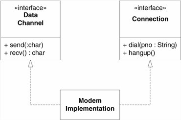
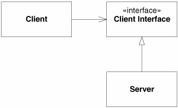
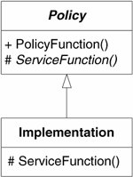
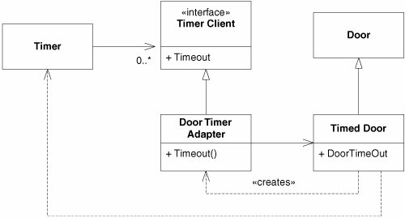
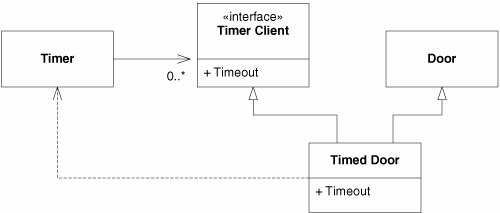
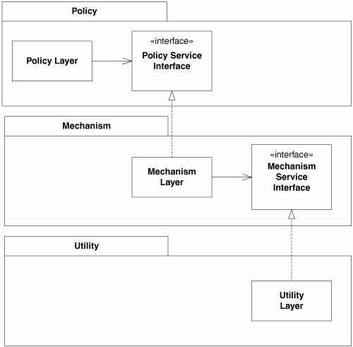

> 2009-09-06

类级别设计原则
==================

## SRP 单一职责原则
- Single-Responsibility Principle，就一个类而言，应该仅有一个引起它变化的原因

> 这条原则曾在Tom DeMarco(结构化分析提出人)和Meilir Page-Jones的著作中描述，称之为 __内聚性__(cohesion)，SRP将内聚性和引起一个模块或类改变的作用力联系了起来

如果一个类承担的职责过多，等于把这些职责耦合在了一起。一个职责的变化可能会削弱或抑制这个类完成其他职责的能力。这种耦合会导致脆弱的设计，当变化发生时，设计会遭受到意想不到的破坏

### 示例
下图的设计，`Retangle`类具有两个方法，一个方法把矩形绘制在屏幕上，另一个方法计算矩形的面积

有两个不同的应用程序使用`Retangle`类，一个是有关计算几何学方面的，但从来不会在屏幕上绘制矩形；另一个是有关图形绘制方法的，也许会计算几何，但肯定会在屏幕上绘制。

> p.s. 其实暗含"不应该强迫客户依赖于它们不用的方法"

该设计就违反了SRP，盖因`Retangle`类具有两个职责。导致了一些严重问题：

1. 必须在计算几何应用程序中包含进GUI代码。如果是C++，就必须把GUI代码链接进来，而浪费编译时间、链接时间以及内存占用。如果是Java或C#，GUI的库必须部署到目标平台
1. 如果`GraphicalApplication`的改变原因导致了`Rectangle`的改变，这个改变会迫使我们重新构建、测试以及部署`ComputationalGeometryApplication`，如果忘记了这样做，后者可能会不可预测的方式失败

较好的设计是把这两个职责分离到两个完全不同的类中

> p.s. 实为使用"合成+委托"进行解耦

### 什么是职责
在SRP中，我们把职责定义为 __变化的原因__，多于一个动机去改变一个类，那么这类就具有多于一个职责。有时，我们很难注意到这一点，我们习惯于以组的形式去考虑职责。下面是一个`Modem`接口

<!--language: csharp-->

    public interface Modem{
        void Dial(string pno);
        void Hangup();
        void Send(char c);
        char Recv();
    }

然而，该接口却显示出两个职责：连接管理(`Dial`,`Hangup`) 和 数据通信(`Send`,`Recv`)

但是，这两个职责应该被分开吗？__依赖于应用程序变化的方法__。如果应用程序的变化会影响连接函数的签名(signature)，那么这个设计就具有僵化性的臭味，因为调用`Send`,`Recv`方法的类必须要重新编译、部署，而这个过程的次数常常会超过我们希望的次数。更好的设计是如下：

另一方面，如果应用程序的变化方式总是导致这两个职责同时变化，那么就 __不必分离它们__

### 持久化时耦合

这是一种常见的违反SRP的情形，`Employee`类包含了业务规则和对持久化的控制。这两个职责大多数情况下不应该混合在一起。业务规则往往会频繁的变化，而持久化的方式却不会，并且变化的原因也是完全不同的。

## OCP 开放-封闭原则
- Open/Closed Principle，软件实体（类、模块、函数等）应该是可以扩展的，但是不可修改

> Ivar Jacobson(用例发明人，UML三友之一)说过，"任何系统在其生命周期中都会发生变化。如果我们期望开发出的系统不会在第1版本后就被抛弃，就必须牢牢地记住这一点"。但如何做不断推出新版本？Bertrand Meyer(Eiffel编程语言的创造者，DBC提出者)在1988年提出了该原则

如果程序中的一处改动就会产生连锁反应，导致一系列相关模块的发动，那么设计就具有僵化性。OCP建议我们应该对系统进行重构，这样以后对系统再进行那样的发动时，就会导致更多的修改，只需添加新的代码，而不必改动已经正常运行的代码。

### 描述
遵循OCP原则设计出来的模块具有两个主要特征：

1. "对于扩展是开放的"(Open for extension)，意味着模块的行为是可以扩展的。当应用的需求改变时，我们可以对模块进行扩展，使其具有满足那些改变的新行为。
1. "对于更改是封闭的"(Closed for modification)，对模块的行为进行扩展时，不必改动模块的源代码或二进制代码。模块的二进制可执行版本，无论是可链接的库、DLL或者.jar都无需改动

### 关键是抽象

在OOP语言中，可以创建出固定却能够描述一组任意个可能行为的抽象体，称为 __抽象基类__，而这一组任意个可能的行为则表现为可能的派生类。模块可以操作一个抽象体，由于模块依赖一个固定的抽象体，所以它对于更改是关闭的，同时通过这个抽象体派生，也可扩展此模块的行为。

__策略模式__ 与 __模板方法__ 是满足OCP的最常用的方法，应用它们可以把一个功能的 __通用部分和实现细节__ 部分清晰的分离开来。

- STRATEGY pattern

- TEMPLATE METHOD pattern

#### 预测变化和贴切的结构
如果我们预测了变化，那么就可以设计一个抽象来隔离它。即必须对于他设计的模块应该对哪种变化封闭做出选择，先猜出最有可能发生的变化种类，然后构造抽象来隔离那么变化。这就需要设计人员具备 __应用领域的经验__。但这不容易做到，甚至猜测错误，还不如发生变化后采取行动（重构得到架构）

> 除了设计层面的原则，在语言实践方面，可参考C#中的扩展方法，以及Ruby中的monkey patch

## LSP Liskov替换原则
- Liskov Substitution Principle，子类型必须能够替换掉它们的基类型

> Barbara Liskov(2008年图灵奖得主，2004年约翰·冯诺依曼奖得主)在1988年说到："这里需要如下替换性质：若对每个类型S的对象o1，存在一个类型T的对象o2，使得在所有针对T编写的程序P中，用o1替换o2后，程序P的行为功能不变，则S是T的子类型"

某些情况会使我们创建的类层次结构掉进不符合OCP的陷井中，这些正是LSP要解答的问题

### 运行时类型辨别
对于LSP违反常常会导致明显违反OCP的方式，使用运行时类型辨别(RTTI)，如向下转型得到对象的具体类型再进行操作

### 契约式设计
另一个经典例子，正方形是一种矩形，但行为并不一样，如果将正方形传递给需要矩形的地方，有可能产生错误，这就违反了LSP。

当然本例主要是对OO中`is-a`的未精确定义引起的，面向对象中的继承，并不对现实世界的一一对应，继承更关注的是行为契约，而不是类型的匹配。所以与其说是`is-a`或`is-a-kind-of`的关系，不如说 __`behaves-like-a`__ 或`is-substitutable-for`的关系

### 示例
有一个第三方的Set库，含有`BoundedSet`和`UnboundedSet`，为了不使自己的应用代码依赖于这些第三方的库，提炼出一个抽象`Set`，并做个适配层：

<!--language: cpp-->

    tempate <class T>
    class Set{
        public:
            virtual void Add(const T&) = 0;
            virtual void Delete(const T&) = 0;
            virtual void IsMember(const T&) = 0;
    };

接下来想在该层中加入`PersistenSet`，即把集合中的元素写入流，但提供该功能的第三方容器类不是一个模板类，相反它只接受虚基类`PersistentObject`的派生对象，所以改进设计如下：

`PersistenSet`包含了一个第三方持久性集合的实例，它把所有方法都 __委托__ 给该实例。其实隐藏着一个别扭的设计，加入第三方持久性集合的元素必须从`PersistentObject`派生，所以`PersistenSet`中的元素也必须从`PersistentObject`派生，但`Set`接口没有这样的限制。

<!--language: cpp-->

    void PersistentSet::Add(const T& t){
        PersistentObject& p = dynamic_cast<PersistentObject&>(t);
        itsThirdPartyPersistentSet.Add(p);
    };

如果任何客户企图向`PersistenSet`中添加不是从`PersistentObject`派生的对象，将会发生运行时错误，但是抽象基类`Set`的所有现存客户都不会预计到调用`Add`时会抛出异常，所以对类层次做的改动，违反了LSP原则

> 用契约式设计语言来说，先验条件被 __强化__ 了

所以`PersistenSet`和`Set`之间并存在`is-a`关系，更合适的方式是如下，__提取公共部分的方法代替继承__：

### 结论
OCP原则应用得有效，应用程度就会具有更强的可维护性、可重用性，但LSP是OCP成为可能的主要原则之定，正是子类型的可替换性才使得基类型表示的模块在无需修改的情况下可以扩展

> 光`is-a`不足以使用继承，还得看是否满足`behaves-like-a`，如果仅仅为了重用，考虑使用 __私有继承__(C++)或 __合成__

## ISP 接口隔离原则
- Interface Segregation Principle，不应该强迫客户依赖于它们不用的方法。接口属于客户，不属于它所在的类层次结构

这个原则用来处理"胖"接口所具有的缺点，如果类的接口不是内聚的，表示该类具有"胖"的接口

如果强迫客户程序依赖于那些它们不使用的方法，那么这些客户程序就面临由于这些未使用的方法改变所带来的变更。

### 接口污染
有`Door`负责开关门，`Timer`类如下，用于超时通知

<!--language: cpp-->

    class Timer{
        public:
            void Register(int timeout, TimerClient* client);
    };
    class TimerClient{
        public:
            virtual void TimeOut() = 0;
    };

现在需要一个`TimedDoor`，如果门开着时间过长，它就会发出警报声。下面是容易想到一种方案

`Door`依赖了`TimerClient`，可并不是所有种类的`Door`都需要定时功能。一方面创建无须定时功能`Door`的派生类时，必须提供`TimeOut`方法的退化(degenerate)实现，这违反了LSP；另一方面，即使程序不使用`TimerClient`类的定义，也必须要引入它，进行编译与部署

### 分离客户就是分离接口
`Door`接口和`TimerClient`接口是完全不同的客户程序使用的，__既然客户程序是分离的，所以接口也应该保持分离__，因为客户程序对它们使用的接口施加有作用力

### 类接口与对象接口

#### 使用委托分离接口
一个解决方案是创建一个派生自`TimerClient`对象，并把该对象的请求委托给`TimedDoor`

当`TimedDoor`想要向`Timer`对象注册一个超时请求时，它就创建一个`DoorTimerAdapter`并且把它注册给`Timer`，当后者发送`TimeOut`消息给`DoorTimerAdapter`时，它把消息委托给`TimedDoor`

#### 使用多重继承分离接口

当然C++中也可用模板来解决

## DIP 依赖倒置原则
- Dependency-Inversion Principle
    1. 高层模块不应该依赖于低层模块，二者都应该依赖于抽象
    1. 抽象不应该依赖于细节，细节应该依赖于抽象

### 层次化
如下图，__依赖关系是传递的__，低层模块的修改为直接影响到高层模块，并且不同上下文中，重用高层模块变得非常困难

而下面是一个更合适的模型，每个较高层次都为它所需要的服务声明一个抽象接口中，较低的层次实现了这些抽象接口中。每个高层类都通过该抽象接口使用下一层。从而高层就不依赖于低层，低层反而依赖于高层中声明的抽象服务接口

### 倒置接口所有权
这里的倒置不仅是依赖关系的倒置，也是接口所有权的倒置，当应用了DIP时，往往是客户拥有抽象接口中，而服务者则从抽象接口派生

也是Hollywood原则，"Don't call us, we'll call you"

> 个人感觉Hollywood原则更应该是控制反转，应用于框架中，实现基础模块调用应用模块

### 依赖于抽象
启发式规则建议不应该依赖于具体类，程序中所有依赖关系都应该终止于抽象类或者接口

- 任何变量都不应该持有一个指向具体类的引用
- 任何类都不应该从具体类派生
- 任何方法都不应该重写它的任何基类中的已经实现了的方法

当然，对于那些虽然具体但却稳定的类来说似乎不太合理。

### 示例

`Button`对象感知外部环境的变化，`Lamp`对象当接收`TurnOn`时显示某种灯光，当接收`TurnOff`消息时，它把灯熄灭。

<!--language: csharp-->

    public class Button {
        private Lamp lamp;
        public void Poll() {
            if (/*some condition*/)
                lamp.TurnOn();
        }
    }

这个方案违反了DIP，应用程序的高层策略没有和低层实现分离，更好的方式是如下：

### 动态多态与静态多态
在完成依赖关系的倒置过程中，除了使用动态的多态，即抽象类或接口的对象，在运行时指定实现了它们的具体类的实例。

此外还有，C++中的模板编程（泛型），允许在编译期间实例化，没有动态绑定的运行开销，也没有接口实现的要求，只要求泛型对象具有指定方法即可，缺点是运行时不能更改。

包级别设计原则
==================
前3个原则关注包的 __内聚性__，这些原则能够指导我们对类组包；后3个原则关注包的 __耦合性__，

## REP 重用发布等价原则
重用的粒度就是发布的粒度

## CCP 共同封闭原则
包中的所有类对于同一类性质的变化应该是共同封闭的。一个变化若对一个包产生影响，则对该包中的所有类产生影响，而对于其他的包不造成任何影响

## CRP 共同重用原则
一个包中的所有类应该是共同重用的。如果重用了包中的一个类，那么就要重用包中的所有类

## ADP 无环依赖原则
在包的依赖关系图中不允许存在环

## SDP 稳定依赖原则
朝着稳定的方向进行依赖

## SAP 稳定抽象原则
包的抽象程度应该和其稳定程序一致

