> 2009-01-30

绪论
=======
> 个人感觉ICONIX过程，强化了健壮性分析，但少了表示流程的活动图（用序列图代替），而领域建模的技能还需要DDD与四色建模来补充

## ICONIX过程各个阶段
### 从用例到代码

如何尽可能短的时间从A点直接到达B点，可将A点看作，__系统必须包含的功能已经确定__，因此需要编写一些用例，而B点看成一些 __完整的、经过测试和调试的代码__，它们实际完成用例需要执行的功能。

### 工作起点(原型完成)
下图有三种假设：一些原型化工作已经完成；确定了用户界面；已经开始确定系统的一些场景或用例
> 是否理解为需求分析已结束？

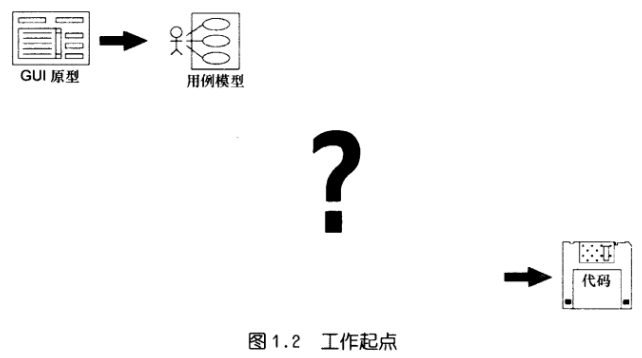

### 类图规定了代码结构
在面向对象的系统中，代码的结构是由类定义的，需要一个或多个类图来指出系统中所有类

建立一个设计级图表，即其中类与源代码中类一一对应
> 为什么不是源代码即设计？

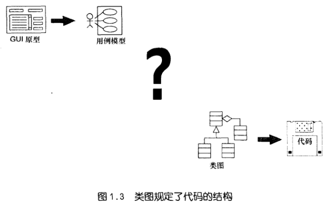

### 时序图将操作分配给类
在面向对象系统中，最困难的工作之一是分配行为，就需要就每个要建立的软件函数做出决策，对于每个函数，必须决定要将其放在哪个类中，必须分配系统的所有行为
> 类图与序列图应相互影响吧？否则如何重构？

在这方面，时序图是非常有用的图，帮助做出行为分配决策的理想工具

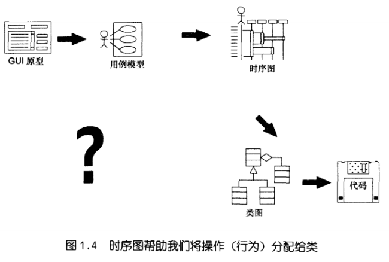

### 健壮图性架起需求和详细设计间桥梁
现在，用例和代码之间差距缩小了，需要根据用例来获得时序图

用例是系统的需求级视图，而时序图是非常详细的设计视图，需要使用 __健壮性图(robustness diagram)__ 来填充之间的鸿沟

需要哪些对象，这些对象将执行哪些函数，首先进行猜测（初步设计），得到的结果称为健壮性图，然后对猜测进行改进，形成详细设计，结果为时序图。对于要构建的每个场景，都需要绘制一个时序图

使用健壮性图，用例到时序图的工作将比较顺利：

- 发现首次猜测系统中有哪些对象时遗漏的对象
- 在跟踪健壮性图的数据流时，还可将属性入加到类中
- 绘制健壮性图时，将更改并改进用例文本

现有仍然有一个问号，与发现首次猜测时遗漏的对象有关，意味着我们需要在某一点进行首次猜测

> 此处假设，讨论用例时，心中有一个明确的目标，根据它们来驱动软件设计，而 __不是__ 将用例作为一种探测抽象需求的技术(许多其它方法论却是 __用例驱动作分析、领域驱动作设计__)

### 域模型(首次需猜测)
域模型（domain model），将问题空间的名词称为域对象（domain object），在分析和设计工作的开始，将创建一个域模型
> 难度有点大！！！

在健壮性图中，也将使用边界(boundary object)，包括诸如系统屏幕之类的东西，在用例文本中，也将显式的引用域对象和边界对象，我们将编写诸如用户如何与屏幕交互，以及屏幕如何同域对象交互等内容。
> 域对象常常同一个数据库相联，而后者可能位于系统OO部分的后面

在域建模过程中，需要确定最重要的抽象集，描述了任务要创建的系统的问题空间或问题域
> DDD技术或四色建模的用武之地？

域模型基本上是一个类图，但省略大量细节，不列出属性和操作，重要的是关联
> 职责、角色、协作？

域模型更像一个全局总结级类图，这是对类图的首次 __猜测__，完全侧重于要创建的系统的问题域，然后完成用例的所有细节，并对系统视图进行改进

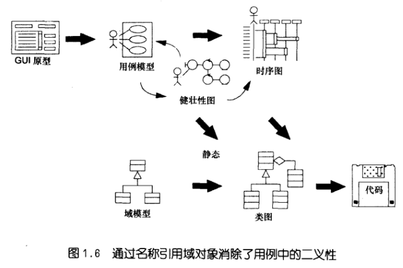

上半部分是动态模型，对行为进行了描述，下半部分是静态模型，对结构进行了描述

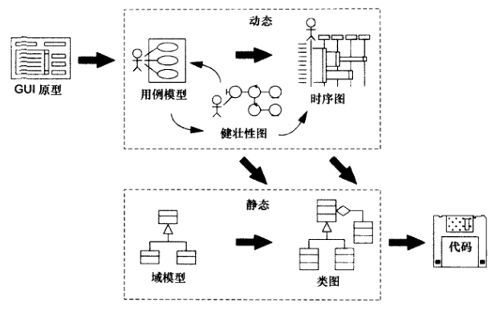

## ICONIX过程的重要特征
该过程基于找到有关系统的一些基本问题的答案：

- 谁使用系统（__参与者__），他们想做什么？
- __问题域__ 对象是什么，有何 __关联__？
- 每个 __用例__ 需要哪些对象？
- 在每次用例交互过程中，对象之间是如何 __协作__ 的？
- 我们将如何处理 __实时__ 控制的问题？（边界？）

## 过程的里程碑
- 确定要创建的系统的所有 __使用场景__，并对它进行描述
- 对参与多个场景的 __可重用抽象__ 已经进行了认真的考虑
- 对 __问题域__ 进行了考虑，确定了属于该域的类
> 考虑了在该系统之外的可重用性，毕竟也许有多个软件系统共享一个问题域
- __核实__ 了在设计中考虑到了系统所有的 __功能性__ 需求
- 仔细考虑了将 __系统行为分配__ 给确定的抽象，并考虑了优秀的设计原则

## 过程概述
该过程的三个重要原则：从内到外、从外到内、从上到下：

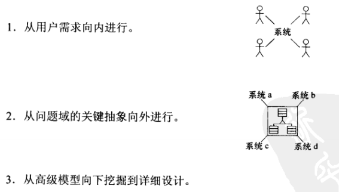

### 需求分析
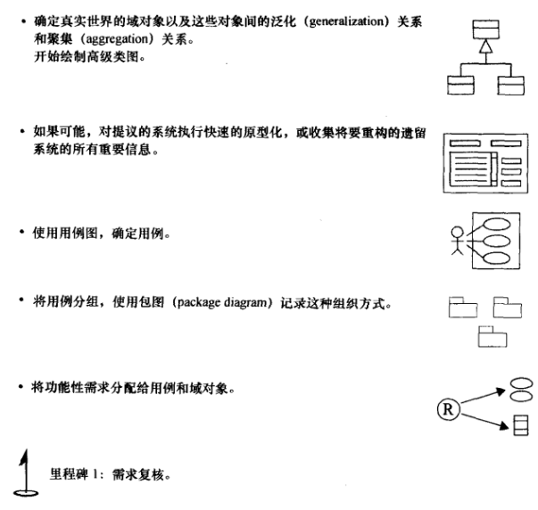

### 分析和初步设计
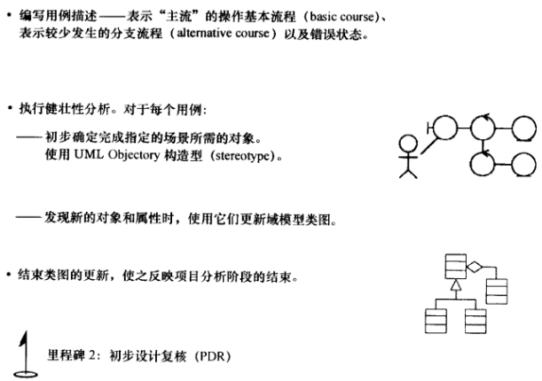

执行健壮性分析时，需要依次分析每一个用例，并及时更新域模型

### 设计
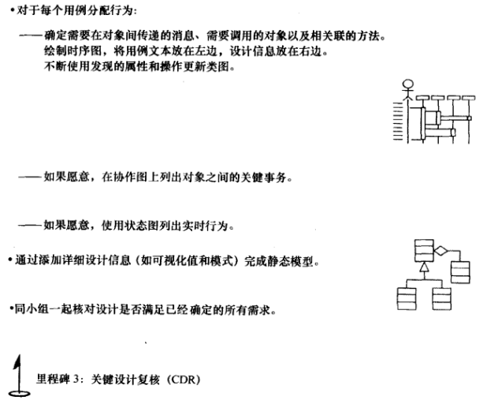

### 实现
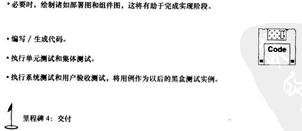

域建模
=======
## 概述
域建模是UML模型中静态部分的基础，首先确定真实世界中的抽象，即系统中将涉及的主要的概念性对象

将不会从抽象的、纯粹的用户角度去编写用例，而是在对象模型的环境中进行用例编写，这样能够将模型的动态部分和静态部分结合起来

开始建立域模型时，不要花太多时间来找出属性和操作，而是将这样的工作放在以后改进和充实模型静态部分时完成，建立域模型时，重点是 __确定对象以及它们之间的关系__。

对象建模技术一种由内向外的建模过程，从系统的核心对象开始，由内向外工作，确定这些对象将如何参与要构造的系统，用例驱动是一种由外向内的方法，应该使这两部分在中途相遇，而不应让它们不相连。

## 10种常见错误
1. 过早的执行“模式化”，导致根据同用户问题毫无关系的模式创建解决方案
> 模式通常在健壮性分析时才能发现，有两种策略可用于发现同用例相关的模式：屏幕控制、用例控制器。设计模式对时序图和设计级类图很有用，但域建模期间不应该考虑模式问题

1. 在域和关系型数据库表之间建立一对一的映射
> 数据库表可能是很好的域类名称来源，但不要将它们完全照搬到静态模型中

1. 直接进入到实现结构，如友元关系和参数化类
> UML提供了大量东西到类图中，包括直接来自C++的结构，这些东西与解决方案空间相关，而与问题域不相关

1. 将类命名为难以理解的名称（`cPortMgrIntf`），而不是直观的名称(`PortfolioManager`)
> 数据库表可能是很好的域类名称来源，但不要将它们完全照搬到静态模型中

1. 未对问题空间进行建模之间，就假定一种具体的实现策略
> 改进域模型时，应删除所有明显陈述动作而不是依存性的内容以及同实现相关的内容，不应引及涉及到具体技术的内容，如关系型数据库或特定的服务器

1. 对于每个“部分关联”，就使用聚集成不组合，而争论不休
> 按引用拥有关系是聚集，而按值拥有关系是一种组合。在域建模期间，喜欢简单的聚集，使用聚集还是组合是一个详细设计方面的问题

1. 在确保已满足用户需求之前，对代码进行优化以提高重用性
> 在完成高级类图期间，将过多的精力用于提供类的可重用性是不明智的。

1. 不对用例和时序图进行研究，就将操作分配给类
> 不应该在域建模期间将任何操作分配给类，此时还没有足够的信息，无法做出正确的决策，进入交互建模后，将有足够的信息

1. 对名词和动词做过度分析，而背离初衷
> 动名词用来发现对象，而不要沉溺其中，还有其它许多技巧来发现对象，如DDD/四色建模使用的方式

1. 立即给关联指定多重度，确保每个关联都有明确的多重度
> 这将占用大量时间，导致分析瘫痪

## 网上书店的域模型
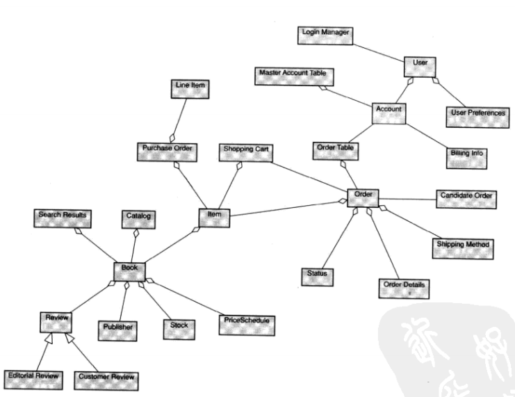

用例建模
========
## 概述
所有开发工作必须回答的基本问题：用户想做什么？我们的重点是确定用户将执行哪些操作，而系统将如何进行响应（通常同屏幕和用户界面相关）

项目一开始，便应建立用例模型和域模型，__对象模型的整个动态部分都是直接由用例模型驱动的，而静态模型由动态模型驱动的，所以整个过程就是 *用例驱动* 的__

## 用例建模的要素
首先确定尽可能多的用例，然后不断地编写和改进描述这些用例的文本，在这一过程中，将发现新的用例和通用情况

确定用例时，一个重要原则是：它们必须同系统用户手册中的材料密切相关，必须从用户的角度来设计系统

参与者（actor）和潜在的域对象应易于确定，发现新对象后，还应 __对域模型进行更新__，加深对以前发现的对象的理解。

## 推荐用例模板
1. 创建一个用例模板，其中包含标有“基本流程”和“分支流程”的区域，不要将其他内容放在用例文本中，只会分散注意力
2. 提出问题“将发生什么？”，进入基本流程
3. 理出问题“然后将如何？”，不断的提出这样的问题，直到获得基本流程的有关细节
4. 提出问题“否则将如何？”，是否还可能发生其他情况？确定吗？不断地提出这些问题，直到记录下来大量分支流程为止

> 这里的目标不是建立完美无缺的用例模型，而是考虑用户可能执行的各种操作，在需求复核期间还将对这些材料进行检查。

可使用泛化、包含、扩展关系，来确定一组用例通用的地方，将在绘制时序图时节省大量的时间

推荐将用例分组成包，包为小组之间分配工作提供了逻辑边界

## 10种常见错误
1. 花一个月的时间来决定使用包含结构还是扩展结构
> 不需要为了确定通用性而需要使用多种机制的情况，使用UML的包含结构还是OML的调用和优于机制并不重要，使用一种就好

1. 不将重要放在用例的内部，而是放在如何到达这里或以后将发生的情况
> 冗长、复杂的用例模板，通常包含前置条件和后置条件，太过浪费时间

1. 不描述操作的分支流程文本
> 如果延迟到编码才被发现，程序员可能以对自己最方便的方式进行处理，对项目是有害的

1. 只描述用户交互，而忽略系统做出的响应
> 用例中叙述应是面向事件－响应的，遗漏系统响应，也就忽略了软件行为

1. 不从用户角度进行编写，并使用被动语态
> 用例文本只有使用主动语态才给人深刻印象

1. 不给边界对象提供明确的名称
> 边界对象（boundary object）是参与者与之交互的对象，通常包括窗口、屏幕、对话框、菜单，为了包含足够的细节，并明确指出用户的导航情况，必须在用例文本中明确地对边界对象命名。另在健壮性分析阶段，将对这些对象的行为进行研究，及早的命名有助于消除二义性

1. 让自己同用户界面完全脱离
> 如果不知道用户将在屏幕上执行什么样的操作，用例驱动将无从谈起，用例文本中无需说明屏幕上字段及其它细节（原型提供了），但对那些能让用户告诉系统做什么的界面，必须做出说明

1. 编写的用例过于简洁

1. 描述属性和方法而不是使用情况
> 用例说明的是系统将如何完成工作，而不是系统怎么完成工作

1. 编写功能性需求，而不是编写使用场景文本

## 网上书店的用例图
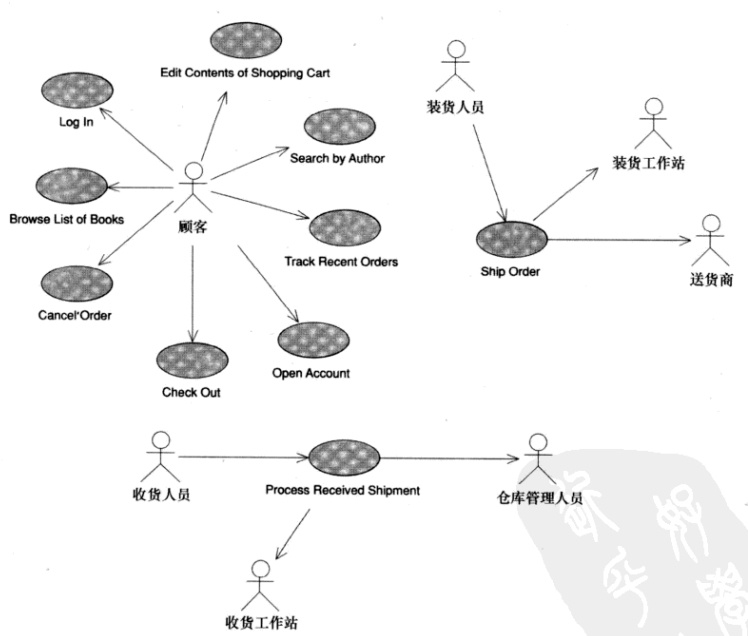

需求复核
=======
需求复核旨在确保用例和域模型一道满足客户的功能性需求

## 需求复核的要素
各方之间就已有的用例、域模型和原型元素达成基本一致，以确定系统的功能需求，确保交流沿正确的轨道进行，并记录结果和议程。

关键词是可跟踪性（traceability），必须清楚每种需求是如何转换为一个或多个用例的，以及域模型的一个或多个类和一个或多个原型元素如何同这些用例协同工作，从而实现需求

同时探讨GUI和系统行为通常很不错，用例的文本应与相应的GUI元素相符
> 该观点与MDA方法论相一致，但也有一些OO杰出人士认为，不应在用例文本中对GUI细节进行描述

## 10种常见错误
1. 不管用例是否占4页篇幅
> 一定要避免使用过长的用例模板，而包含多余的内容

1. 不管用例是滞用被动语态书写的
> 仅当执行操作者未知时，才应使用被动语态，而这种情况在用例文本中是不会发生的

1. 不质疑每个用例是否考虑了所有的分支流程
> 应对基本流程中每句话提出质疑。可以发生什么错误？参与者是否还会执行其他的操作？系统是否会以其他方式进行响应？系统大部分有趣行为都将在分支流程而不是基本流程中反映出来

1. 不质疑不包含任何分支流程的用例
> 90%以上好的用例都包含至少一个分支流程，用例文本中的“检查”、“确保”、“验证”、“核实”等表明，至少有一个分支流程和一个相应的错误状态。

1. 不确保用例文本参考域对象
> 之所以在讨论用例建模之前讨论域建模，在于建立一个术语表，供用例文本使用，对确保用例的具体化很有帮助，同时有助于关注跟踪性，因为用例和类图将协同工作，将来在健壮性分析中也容易很多

1. 不确保域模型准确地反映真实世界的概念性对象

1. 用例高度抽象，让不懂技术的客户就像看天书

1. 不使用任何GUI原型或屏幕模型来帮助验证系统行为
> 如果没有任何可视化框架供参考，用户界面设计人员创建的东西可能同用例描述的用户需求不符

1. 不确保用例文本符合所需的系统行为
> 确定系统应具备什么功能（what），从而驱动分析、设计、测试和实现（how）。如果用例文本与用户期望功能不一致，系统将是不合适的

1. 根本不进行需求复核，让编码人员随心所欲地编码
> 涉众都应该参与进来

健壮性分析
=========
有两个问题可以帮助我们将动态模型和静态模型关联起来

- 每个用例需要哪些对象？将使用健壮性分析来帮助回答
- 分配行为，使用时序图

使用三种图标来表示三种不同的对象：

- 边界对象（boundary object）：参与者使用它来同系统交互
- 实体对象（entity object）：通常来自域模型中的对象
- 控制对象（control object）：将边界对象和实体对象关联起来（通常被称为控制器，因为它们通常不是真正的对象）

在分析（what）和设计（how）之间架起了一座至关重要的桥梁

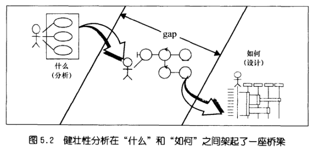

在初步设计阶段，应仔细考虑各种可供选择的设计策略和技术体系结构，它们将随用于构造系统的技术而异。

此时，应开始找出与系统性能相关问题，如两个对象之间面要大量通信，但两个对象却是通过网络远程连接的

在健壮性分析期间，将以需求级用例文本为基础，做一些初步设计方面的假设

## 健壮性分析的要素
- 帮助确保用例文本的正确性，且没有指定不合理或不可能的系统行为，从而提供了健康性检查，这种改进使用例文本的特性 __从纯粹的用户手册角度变为对象模型上下文中__ 的使用描述
- 帮助确保用例 __考虑了所有必需的分支流程__，从而提供了完整性和正确性检查，在绘制健壮性图上花费的时间，将可在绘制时序图时节省更多时间
- 能够 __发现在域建模时遗漏的对象__，发现对象命名矛盾的情况，从而避免导致严重的问题
- 缩小了分析和详细设计之间鸿沟，完成了初步设计

## 三种构造类型
- 边界对象是新系统中参与者（如用户）与之交互的对象，通常包含窗口中、屏幕、对话框和菜单，如果有GUI原型，将知道许多主要的边界对象是什么
- 实体对象常对应于数据库表和文件，这些数据库表和文件中存储了执行用例所需的数据，有些实体对象是临时的（如搜索结果），当用例结束后将消失，很多实体对象来自域模型中
- 控制对象包含了大部分 __应用程序逻辑__(非业务逻辑)，它们在用户和存储的数据之间架起了桥梁，控制对象中包含经常修改的业务规则和策略，这样修改只需在这些对象中进行，而不会涉及用户界面和数据库模式（？？最好将应用逻辑与业务逻辑分开），大部分时间内，控制器只一个占位符，用于避免遗漏用例要求的任何功能和系统行为

使用规则只有4条：

1. 参与者只同边界对象交互
2. 边界对象只能同控制器和参与者交互
3. 实体对象只能同控制器交互
4. 控制器可同边界对象、实体对象以及其它控制器交互，但不能同参与者交互
> 名词不能同其他名词交互，而动词可同名词或动词交互

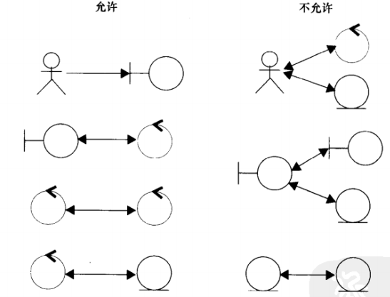

复核健壮性图的人员应该阅读用例文本中操作流程，并用手指指向图中相应的内容，看图文是否一致，在这过程中，可能需要重新编写用例文本，以消除模糊的地方，并明确的引用边界对象和实体对象

还应不断的改进静态模型，将新的发现的对象加入类图。

## 10种常见错误
1. 不更新静态模型
> 只有更新域模型后，健壮性分析才算完成，才能进入使用时序图的交互建模阶段

1. 不在用例文本和健壮性图之间进行可视化跟踪
> 强烈建议手指跟踪方法，没通过可视化跟踪，用例不能算完成

1. 试图在健壮性图上完成详细设计
> 应在序列图中完成，如果花时间太长，将失去快速的健康性检查的益处

1. 试图使健壮性图十全十美，而花费过多的时间

1. 包含的控制器过多或过少
> 每个用例的控制器应包含2~5个控制器，太少说明用例没有描述足够的行为，太多要考虑将用例分解

1. 给健壮性图的类分配属性
> 应在序列图中完成

1. 不使用健壮性分析来确保类图和用例文本中的类名一致
> 要建立有用的时序图，必须使用该规则，对于每个用例，只需简单的将该用例中对象放在时序图顶端即可

1. 健壮性图中不包含分支流程
> 健壮性分析还有助发现新的分支流程，诸如“核对”和“验证”等标签的控制器

1. 不使用健壮性分析来帮助在用例文本中采用一致的格式
> 边界对象－控制器－实体对象，对应主语－谓语－宾语，确保用例文本的文体尽可能一致，提高可读性

1. 违反一种或多种健壮性分析规则
> 使用文本格式名词－动词－名词，并防止在获得足够的信息之前将行为分配给对象。针对边界对象制定的规则是为了确保明确的指定了边界对象，用例涉及到的参与者位于这些边界对象的外面

## 示例
### LogIn

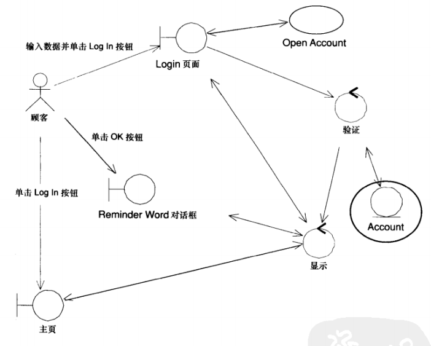

### Search By Author
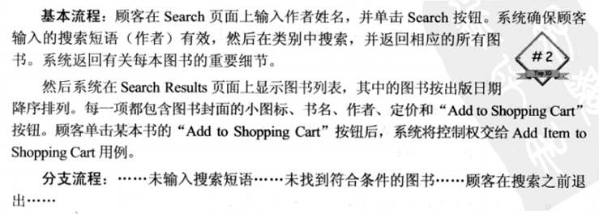

### Exit Contents Of Shopping Cart

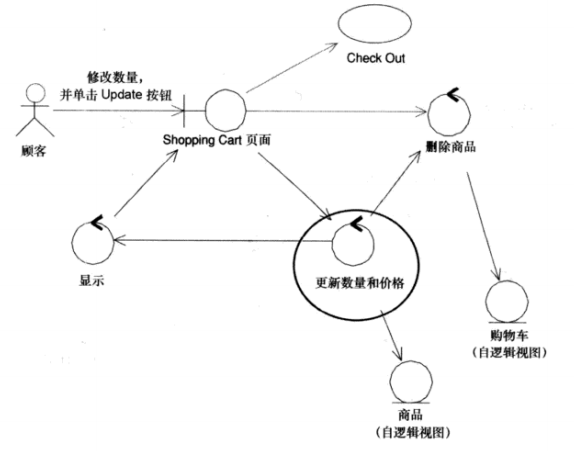

### Ship Order
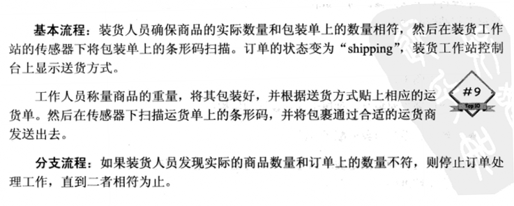

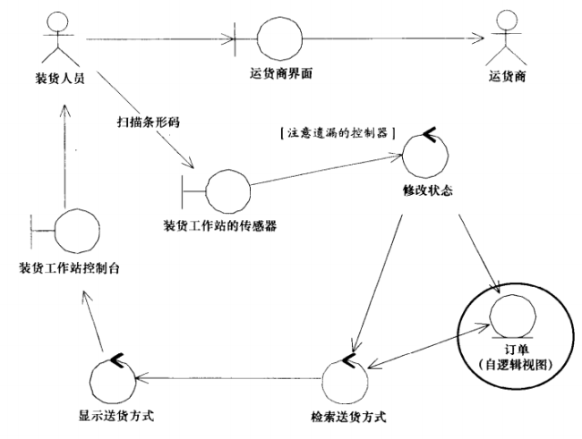

### Take Recent Orders
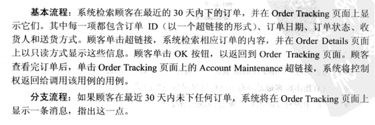

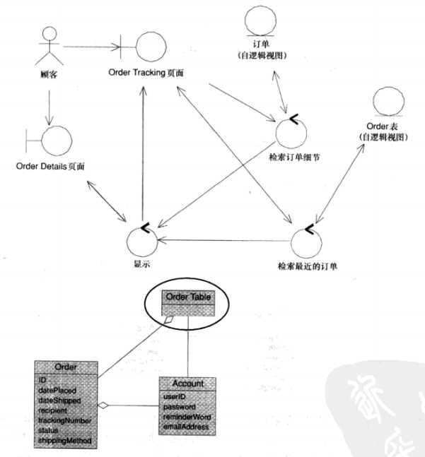

### 所有类图

初步设计复核
===========
初步设计复核指的是对要构建的每个场景的健壮性图和用例文本进行复核，确保它们一致，并完整、正确地表示了期望的系统行为；同时确保域模型和健壮性图一致。

还需要确保给这些实体类分配了属性，使我们能够通过实体类，在系统屏幕之间跟踪数据流，并可能进入到存储了永久性数据的底层数据库表。

## 初步设计复核的要素
这是客户修改其需求的最后机会，对于每个用例，每位复核人员都应该：

- 阅读每一种操作流程
- 用手指指向相应健壮性图中对应的内容
- 确保图文一致

以控制对象（控制器）的方式来描述用例中的所有行为，从用户的角度，确定所有必须发生的逻辑功能，然后将用例文本中的叙述转换为简明的 __名词－动词－名词__ 格式

之所有控制器只是占位符，是因为我们 __还没有将其表示的行为分配给对象做好准备__，因为还没有足够的信息。在静态模型中，就将哪些方法分配给边界对象和实体对象以及哪些控制器应成为真正的对象做好决策，还为时过早，这种决策将在绘制时序图时做出

在交互建模中，设计模式对时序图和高级类图很有用处，但 __不应该在健壮性图中就开始绘制设计模式__，只需考虑在详细设计中使用它们即可

在健壮性图中，必须对 __有关技术体系结构方面的决策__（编程语言、框架）有所反映，选择的技术体系结构是否管用，而健壮性图复核将变为对该体系结构“做(do)能力”的检查

时序图适合来完成详细设计，__健壮性分析必须快速完成要构建的所有场景__，以给项目提供最大的价值。

能够考虑用例模型的重用性，然后再将用例用于设计，只有更新静态模型后，健壮性分析才算完成。

## 10种常见错误
1. 仔细复核健壮性图中每个箭头的方向，而不是进行快速跟踪以核实是否考虑了所有行为
> 控制对象与实体对象之间的双向箭头表明它们相互进行读写，健壮性图中箭头表示的并非软件消息，而只是通信关联。花大量时间去确保箭头方向的正确性是浪费时间

1. 期望健壮性图中包含完整的详细设计而不是概念设计
> 用例、类图和时序图是永久性的，__而健壮性图不是__，不应考虑详细设计，试图让健壮性图完美是浪费时间

1. 不对健壮性分析的名词/动词规则进行复核
> 在时序图中，名词同其它名词是可以交互的，但健壮性图中不行，但它能帮助确保用例被正确地表达，即名词－动词－名词的格式

1. 要求在初步静态设计中大量使用设计模式

1. 不再次向客户重申，用例文本是开发人员和客户间的契约

1. 期望初步设计复核时已经将操作分配给了类
> 控制器用作功能和系统行为的占位符，不应在此时将方法分配给类

1. 不考虑域的属性
> 对一组用例进行健壮性分析时，应获得域模型中类的完整属性集，属性的很大一部分对应于边界对象中的元素，如窗口或屏幕上的字段；其他属性则与系统内部的功能有关，如果绘制时序图之前，没有找出这些属性，分配类的方法时将会信息不足。
> 
> 进行OO设计时，通常将函数放在数据所在的位置，然而我们方法中，采取两步来完成这些决策：首先在初步设计期间对数据进行分配；然后在详细设计期间分配函数时，再次查看数据分配情况

1. 不确保将新的实体对象加入到域模型中
> 健壮性分析的目的之一是加速初始问题空间域模型到最级解决方案空间类模型的演进过程

1. 不确保用例文本和健壮性图之间的一致性
> 该过程就是消除模糊性的，如果图文不一致，则必须重新编写用例文本、重新绘制健壮性图或这两件事都要做

1. 不确保客户知道这是他们修改行为的最后机会

时序图
=======
时序图，它是详细设计的核心元素，至少是对象模型的动态部分的核心元素

## 时序图的要素
在交互建模期间，要实现三个主要目标：

1. 在边界对象、实体对象和控制对象之间分配行为。在健壮性分析期间，确定了实现用例指定的行为所需的一组对象（至少是做出了有根据的猜测），同时将行为分解为离散的单元，并为每一个行为单元创建了占位符控制对象。现在，要决定哪些对象负责哪些行为。
2. 列出用例涉及的对象之间随时间的变化进行的详细交互。在运行阶段，对象是通过彼此发送消息来进行交互的，消息相当于刺激源，促使对象执行某种操作。用例中每个行为单元，都必须确定所需的消息/方法
3. 最终确定类间的操作分配，__完成健壮性分析后，静态模型中必须定义了大部分属性__，在时序图上展示对象的详细行为时，应该已经确定了各个属性和操作的正确归宿。在进行动态建模时，将更新并扩展静态模型，则无疑会加深对新系统将如何工作的理解

---
时序图包含4种元素：

1. 描述操作流程的用例文本
2. 对象
3. 消息
4. 方法（操作）

## 时序图初步
1. 复制用例规范中的用例文本，将其粘贴到页面的左侧。通过文本不断提醒需要做什么，当进行设计时，__总能够看到要求的系统行为__。如果还没有编写出每个用例的所有相关分支流程，则不应该开始绘制时序图，否则时序图将不会包含所有的特殊情况，也就无法揭示用例的所有行为，将不会发现对象所需的所有方法
2. 加入健壮性图中的实体对象，这些对象都是表示静态模型的类图中类的实例，这些对象的大部分属性已经确定，其中很多属性将用作其他对象的数据。绘制时序图时，可能发现遗漏的属性，需要加入到静态模型中
3. 加入健壮性图中的边界对象和参与者，没要求将边界对象加入到域模型中，因为这属于 __解决方案空间__，而域模型针对是 __问题空间__。在时序图中考虑边界对象时，这两种空间集成起来了

将方法分配给类时，需要将健壮性图中的控制器转换为一组执行所需行为的方法和消息，以健壮图为核对清单，以确保时序图考虑了要求的所有系统行为，只需要时序图上绘制相应消息，核对每个控制对象即可

当图解法表示不同对象之间的交互时，一些设计模式将非常合适，大部分OOD发生在这里

## 10种常见错误
1. 不为每个用例绘制本地类图，以更新静态模型
> 在纯粹的域模型中，确保其中域类“清洁”很不错，但绘制“本地化”静态类图，以列出解决方法空间对象也是一个不错的主意。一个指导原则是，对于每个用例包，绘制一个本地类图，找出脚手架或其他基础结构，也应放在静态类图

1. 通过绘制消息箭头来分配行为时，不遵循 __职责驱动__ OOD这一基本原则
> 方法分配给该对象是否是最合适的，该方法完成的任务是滞同该对象明显相关

1. 不仔细考虑消息箭头的起点（即特定时间内，哪个对象拥有控制权）
> 对象之间的消息将调用相应类的操作，时序图中应该正确绘制它们

1. 不将重点放在实际的软件行为上，而是放在get/set函数上

1. 将时序图绘制成流程图，而不是使用它们在对象间分配行为
> 时序图进行行为分配决策的主要工具，将时序图来将操作分配类给，__不应该使用格式随意的文本来标记消息箭头，而应将消息名和类的操作名关联起来__

1. 不说明对象间的通信管道，让时序图表示高级抽象
> 健壮性图上，对象间是通信管道，但时序图不是

1. 不在用例文本和消息箭头之间提供可视化跟踪
> 应该在用例文本中每个句子和句子片段之间加上一定空白，__使其同对应的消息位于同一条水平线上__，有助于阅读时序图，明白系统将如何完成用例描述的行为

1. 不首先在健壮性图上确定所有必须的对象
> 如果绘制时序图时有困难，则可能是编写的用例不正确，且没完成健壮性分析

1. 不将用例文本添加到时序图中
> 提供了可视化需求跟踪，时序图必须同相应用例的叙述式流程一致

1. 不为每个用例绘制一个时序图
> 只有每个用例中所有事件流程绘制交互图后（时序图），才能确定找出系统要求每一个对象扮演的角色，即每个对象的职责

### 所有静态模型
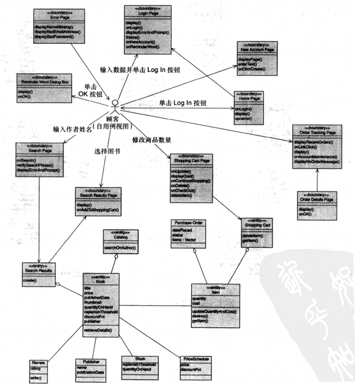

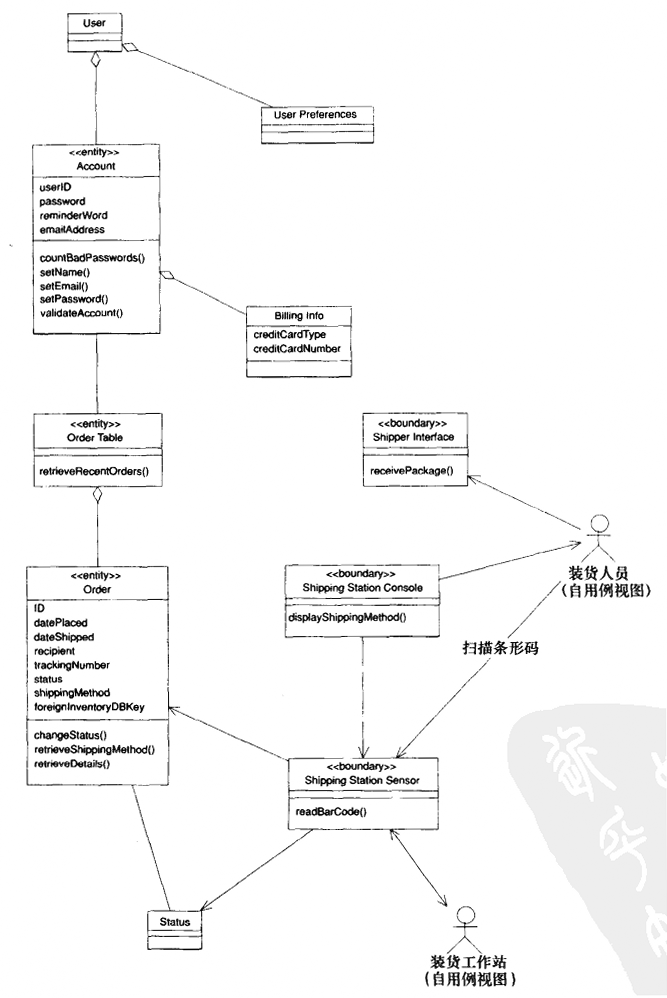

关键设计复核
===========
旨在确保时序图和相应的类图等详细设计的“如何”同用例指定的“什么”完全一致：同时确保详细设计足够详细，并可根据它来编写代码。

此时，可能还需确保设计符合单位内部的一系列标准，如决定在整个项目内使用工厂来创建对象实例，或有一种同底层关系型数据库交互的标准访问机制

## 关键设计复核的要素
仅当为每一个用例的所有基本流程和所有分支流程绘制时序图后，才能确保发现了每一个对象的所有职责

考虑消息的连贯性，必须确保时序图中消息箭头的方向是正确的，同时控制流程必须明确。在任何时候，哪个对象获得控制权必须是显而易见的，如果发现对象之间有跳跃，而它们之间又没有消息，应消除这种跳跃

## 10种常见错误
1. 编写代码之前不关心细节，认为重构代码可以修复所有问题

1. 不复核当前版本中要构建的所有场景的时序图
> 很可能遗漏一个或多个对象应执行的行为，职责也可能不是最佳的

1. 允许漠视诸如DCOM或EJB等实现技术的总体时序图的存在
> 此时应考虑具体实现的技术了

1. 不考虑设计模式在设计中是否有用

1. 不考虑细节
> 应考虑永久性存储、分布分层方面的细节

1. 不根据“高品质类”标准对静态模型进行复核

1. 复核时序图时，不仔细考虑Halbert/O'Brien标准
> 可重用性、适用性、复杂性、实现知识

1. 不仔细检查每个时序图中所有消息箭头的起点和终点
> 时序图必须指出哪个对象获得了控制权

1. 不对照时序图仔细地检查用例文本

1. 邀请不懂技术的客户参与这种设计复核

