> 2009-06-03

概述
==========
从PIM-2开始，属于系统分析的部分，值得一看，而前面部分则不如徐锋的需求分析描述有条理与深度

## MDA开发程序

MDA(Model-Driven Architecture)，作为系统分析员进行分析工作，以及生成UML模型的依据，分为下列三个阶段：

- CIM(Computation Independent Model)：聚焦于系统环境及需求，但不涉及系统内部的结构与运作细节
    - 试图表达信息系统的应用环境，而非信息系统本身。以银行的基金系统为例，CIM表达的对象是银行的基金业务及组织动作，而PIM与PSM则表达支持银行基金业务的信息系统
    - 关切的是与企业相关的营运目标、实现条件及运作流程等
    - 建立与业务人员之间的沟通方式及默契，让业务人员可以参与系统的开发
- PIM(Platform Independent Model)：聚焦于系统内部细节，但不涉及实现系统的具体平台
    - PIM重视信息系统里重要的运作与结构，CIM旨在记录企业领域的重要需求与概念
    - 设计必须无关乎或独立于任何一个特定的平台
- PSM(platform Sepcific Model)：聚焦于系统落实于特定具体平台的细节
    - 必须要能够真正落实及适合某一特定的平台

## MDA的主张
- 欲解决的问题：如何应对企业与技术的快速变化？
- 提出的解决方案：将企业及应用系统与实现技术平台分离，且以统一建模语言UML来表达与平台无关的PIM，然后再设计出适用于特定平台的模型PSM。分隔且封装了企业与技术两方面的变化。

## MDA在芯片设计的应用
虽然MDA应用起源于一般的商用信息系统，但在其他领域也的应用，如芯片设计：

- CIM：聚焦于芯片系统环境及需求，但不涉及芯片系统内部的结构与运作细节
- PIM：聚焦于芯片系统内部细节，但不涉及芯片系统的具体平台
- PSM：聚焦于芯片系统落实于特定具体平台的细节，如Java,C/C++,SystemC,Verilog等

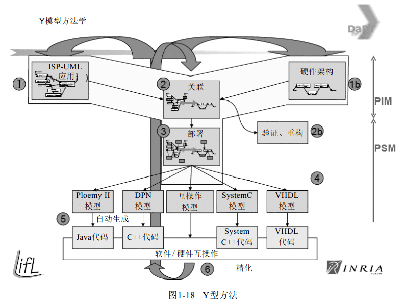

CIM
=======
聚焦于系统环境及需求，但不涉及系统内部的结构与运作细节。类比需求获取与需求分析

## CIM-1:定义业务流程(业务用例)

定义及分析业务流程是为了尽快理清 __系统范围__，以便估算开发成本及时间，__不是为了改造业务流程__

定义业务流程（业务用例模型），有下列两项：

- 业务用例图：主要组成是业务用例和业务执行者，每一个业务用例代表一条业务流程，业务执行者则代表位于业务组织外但会启动或参与业务流程的人。

- 业务用例简述

> ps. "业务用例"并非Ivar Jackbson提出，更好的业务建模可能TOGAF之类的工具更适合

## CIM-2:分析业务流程(活动图)

针对每一个业务用例，开始分析它的工作流程，并且绘制 __活动图__(Activity Diagram)与业务人员取得共识。随后到了CIM-3时，才能够依此定义出系统可以协助之处，并且规划出系统范围

选择活动图分析业务流程，能够聚焦在流程内部的一连串工作，有些可能是纯人工操作，另一些工作项目背后可能有系统的协助，找出可信息化的工作项目，并以此定义出系统未来可以提供的服务项目，也就定义出初步的系统范围了

针对同一条业务流程，也经常分析出不同的流程细节，所以需要一些 __切分准则__：

- 依时间间隔切分工作项目
    - 耗时的主因通常是因为工作项目之间有时间间隔，代表可以不连续，具可切分性
    - 例生成的单据有时间间隔，适合切分成两项工作
- 纯人工/可信息化的工作项目
    - 人工操作与信息化分开，后者可自动化
    - 如寄发投资对账单，切分为"打印投资对账单"和"邮寄投资对账单"
- 记录系统上线之后的工作项目
    - 考虑未来系统的改进情况下工作项目的合并与切分，设计好高层的接口
- 每项工作只有一位负责人
    - 有多人负责时，需要进行切分
- ...

> ps. 有泳道来表示角色更好，关注的是'事到事'的行为脉落

## CIM-3:定义系统范围(系统用例)

- CIM-2活动图中的每一个动作，都可能成为CIM-3的系统用例。
- CIM-1中的业务执行者，以及CIM-2中的动作负责人，都可能成为CIM-3的系统执行者

在CIM-3中，分析CIM-2生成的所有活动图，定义出一堆系统用例，待挑选出一批系统用例，作为首期发布的系统用例

本阶段主要生成：

- 系统用例图
    - 每一个系统用例最好只有一个启动者
    - 系统用例执行期间，如果有联机其他系统，将它们列为支持者
    - 遇到定时启动的系统用例，可定义成“定时启动者”的虚拟启动者
- 系统用例简述

> ps. 该"用例"是Ivar Jackbson提出的，更多是站在用户视角看系统

> ps. 个人感觉，范围的划分的产物应是构建图，而且它的产生应在活动图之前

PIM
===========

聚焦于系统内部细节，但不涉及实现系统的具体平台。类比系统分析与系统设计

产生方式与CIM不同，该阶段将所有系统用例挑出首期系统范围，同时按领域知识进行用例的相关性分组，每一组进行PIM1到PIM4的分析

## PIM-1:分析系统流程(系统用例叙述)

- 针对每一个系统用例，分析其内部细节，并编写成系统用例叙述(UC Description)
- 根据一些模板，定制适合的项目的UCD。[示例模板](../../data/PIM-1.doc)
- 识别出包含与扩展用例，如果不会共用，无须单独划出包含用例
- 替代流程会接回主流程，而例外流程不会

与业务人员沟通：

- 列出业务人员现行的执行步骤
- 期望系统怎么做，以改善现行操作的不足
- 提供相关的UI原型
- 列出相关业务规则和计算公式

> ps. 这应该是操作层关注的，是"人->事"的角度

## PIM-2:分析业务规则(状态图)

### 什么是业务规则
企业通过一组业务规则(Business Rules)来控制整体的运作，包括人员、流程、系统、概念的运作，皆受制于业务规则，所以在PIM-1的过程中就要求记录下业务规则

企业领域中任何一项必须遵守的条件(Conditions)、约束(Constraints)或政策(Policies)都算是业务规则

参考《Advanced Object-Oriented Analysis and Design Using UML》中对业务规则的分类结构

业务规则散落四处，需要重新组织且呈现：

- PIM-1的系统用例叙述，以系统流程为主，记录 __约束流程__ 的业务规则
- PIM-2的状态图，以对象行为为主，记录 __刺激对象反应__ 的业务规则
- PIM-1的类图，以静态结构为主，记录 __约束对象种类或关联关系__ 的业务规则

### 业务规则分类

- 约束规则(Constraint Rules)，主要来约束对象结构和行为
    - 刺激/反应规则(Stimulus/Response Rules)
    - 操作规则(Operation Constraint Rules)
    - 结构规则(Structure Constraint Rules)

- 衍生规则(Derivation Rules)，主要是推论约束或计算公式
    - 推论规则(Inference Rules)
    - 计算规则(Computation Rules)

### 刺激/反应规则
当某个重的外界事件发生，并且对象如果恰好处于某种状态下时，那么 对象就会做出某种事先约定好的行为。简言之为：__*WHEN*__(事件) and __*IF*__(状态)条件成立时，就会有 __*THEN*__(新状态并执行其中动作 or 执行动作并成为新状态)的反应

<!--language: plain-->

    WHEN 约定日到(事件发生)
    IF 正常扣款状态(对象现处状态)
    THEN 自动扣款(转换到另一状态，并执行其中的动作)

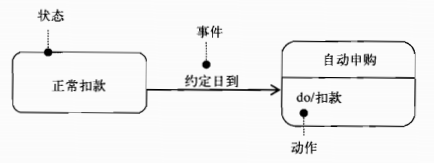

#### 活动与转换

- 对象有两种执行动作的方式，一种是 __do活动__ 对象进入状态之后，执行状态内部指定的动作，如上图中的"扣款"动作，另一种是 __转换动作__，对象在转换状态的瞬间，执行一项 __不可中断__ 的动作，如上图中的"累计失败次数"动作，转换瞬间动作，标示在`/`之后，而事件标示在`/`前面

- 当动作的结果会决定转换时，会明确地采用转换动作

#### 伪状态

- 扣款失败的事件发生且引发瞬间转换，对象会执行“累计失败次数”动作，而该动作的结果会影响对象选择下条转换，进入不同的状态，可抽象出一个 __选择伪状态__，进入伪状态后，没有任何指定的活动需要执行，仅需做一项多选一的选择，选择一个转换至另一个状态

#### 入口动作与出口动作

#### 起点与终点

#### 状态转换表STT

<!--language: table-->

    |当前状态      |事件         |动作        |新状态        |
    |--------------|-------------|------------|--------------|
    |正常扣款      |约定日期到   |扣款        |自动申购      |
    |自动申购      |扣款成功     |-           |正常扣款      |
    |自动申购      |扣款失败     |累计失败次数|失败次数伪状态|
    |失败次数伪状态|失败次数`<3` |-           |正常扣款      |
    |失败次数伪状态|扣款失败`>=3`|-           |终止扣款      |

> ps. 采用状态转换表描述，方便程序的设计，如表驱动、状态模式的采用

### 操作规则
用来 __保证操作会正确执行__，通常又为分 __操作前规则__ 及 __操作后规则__

> ps. 有点像事务，保证ACID时的一种分割做法。操作后规则有点像断言，可用于测试用例设计

<!--language: plain-->

    Execute 自动申购
    ONLY IF 交易状态 = 正常扣款
        and 扣款账户的余额 >= (申购金额 + 手续费)

    Execute 自动申购 IS CORRECTLY COMPLETED
    ONLY IF 扣款账户最新余额 = 余额 - (申购金额 + 手续费)
        and 基金最新库存单位数 = 库存单位数 + (申购金额 / 申购净值)

操作前规则：只要(__*ONLY IF*__)在交易状态为正常扣款，且(__*and*__)扣款账户余额大于或等于交易金额(申购金额 + 手续费)的情况下，执行(__*Execute*__)"自动申购"这项操作

操作后规则：执行(__*Execute*__)"自动申购"这项操作正确完成(__*IS CORRECTLY COMPLETED*__)之后，扣款账户最新余额只会是(__*ONLY IF*__)先前的余额扣减交易金额(申购金额 + 手续费)，且(__*and*__)基金最新库存单位数只会是先前的库存单位数加上本次申购单位数(申购金额 / 申购净值)

### 结构规则
用来约束 __对象种类__ 或 __关联关系__ 必须永远遵守规则，在 __类图__ 里比较容易表达

<!--language: plain-->

    IT MUST ALWAYS HOLD THAT
      任一笔申购交易只能发生于某一个基金账户底下

通常会记录在类图的 __多重性__ 处

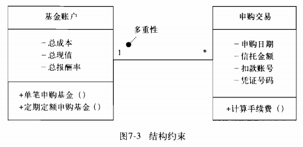

### 推论规则
指出某事实(Facts)为真(True)时，结论(Conclusion)可被推论得出

<!--language: plain-->

    IF 扣款不成功
    THEN 单笔申购交易不成立

### 计算规则
一般所谓的计算公式，在PIM-1的系统用例叙述格式中，有一个业务规则的字段，可供记录

<!--language: plain-->

    交易款项 IS COMPUTED AS FOLLOW
        申购金额 + 手续费

    手续费 IS COMPUTED AS FOLLOW
        申购金额 * 基金管理费 * 银行折扣

## PIM-3:定义静态结构(类图)
通过类图，记录约束对象种类或关联关系的业务规则，表达系统内部的静态结构。 PIM-2的状态图和PIM-4的序列图，对类图，有不可或缺的贡献

> ps. 此说法不赞同，此时的类图应是领域层的，应只有属性，并无操作，与序列图中贡献的"操作/方法"无太大关系

### 类的关系
- 关联关系

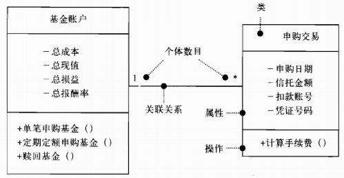

- 泛化关系

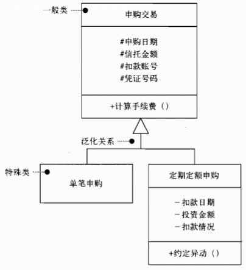

- 聚合与组合

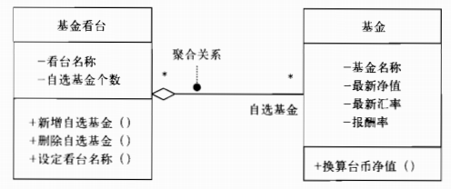

### 交易模式
交易(Transaction)通常是一项很重要的业务概念，而且一旦交易发生，经常需要保存相关的交易数据。通过交易模式(Transaction Patterns)，找到相关的领域类

- 参与者-事务
Participant-Transaction，如投资人-定期定额申购

- 地点－事务
Place-Transaction，如银行分行-定期定额申购

- 特殊项－事务
SpecificItem-Transaction，如基金账户-定期定额申购

- 事务－事务单项
Transaction-TransactionLineItem，如定期定额申购-单期交易

- 项目－事务单项
Item-TransactionLineItem，如基金-单期交易

对应的基金项目套用交易模式得到的图：

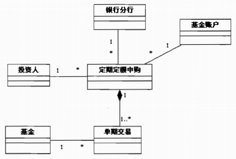

> ps. 更详细的描述见Peter Coad的《Object Models: Strategies, Patterns, and Applications》。其实Peter Coad在其后的《Java Modeling in Color with UML》对如何建立领域模型形成了方法论

## PIM-4:定义操作及方法(序列图)
根据状态图中所有动作，考虑为操作，状态图中使用到的数据，考虑为属性。再通过序列图，找到更多的操作。

序列图用来表达，系统内部一群对象合为完成某一个系统用例时，执行期间的交互情形

一群对象交互所引发的操作，则可以反馈给类图，定义出更多的操作及属性，甚至发现之前未发现的其他类及关系（所以要迭代）

### 主要组成元素

序列图主要组成元素有：对象、调用消息、执行规格和生命线

- 调用消息与对象

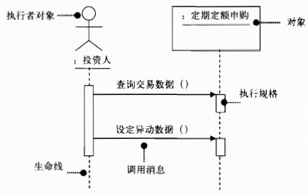

- 自我调用

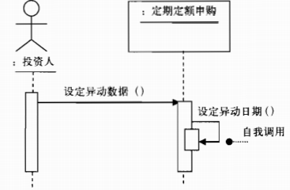

- 同步/异步消息

- 创建消息

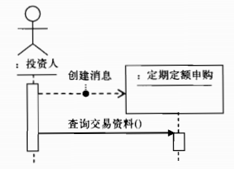

- 销毁消息

### 注意点

- 主要流程与其他流程分置于不同的序列图中，千万别在一张序列图里表达多条流程，避免图面过于复杂
- 扮演启动者的执行者对象放置于序列图最左方；扮演支持者的执行者对象放置于序列图的最右方，消息方向尽量由左指向右
- 自有消息转化为类图的私有方法

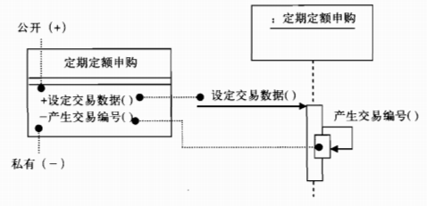

- 对象之间优先通过静态关联传递消息，其次于操作中建立暂时性的关系
- 显示消息序列号
- 当组合关系时，我们只需对whole对象操作，不能直接使用part对象

如果"定期定额申购"与"单期交易"是整体与部分的关系：

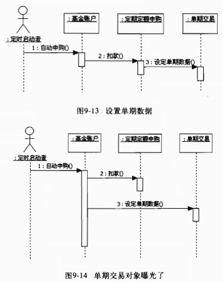

- 传送对象，而非属性，维持对象封装性

PSM
=====
聚焦于系统落实于特定具体平台的细节。类比代码的实现。不再细述。

附件
=====
- [基金模拟项目.uml](../../data/基金模拟项目.uml)（需要StarUML打开）
