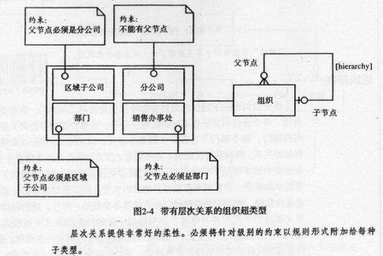
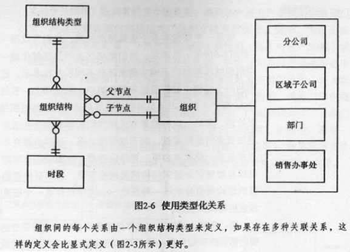
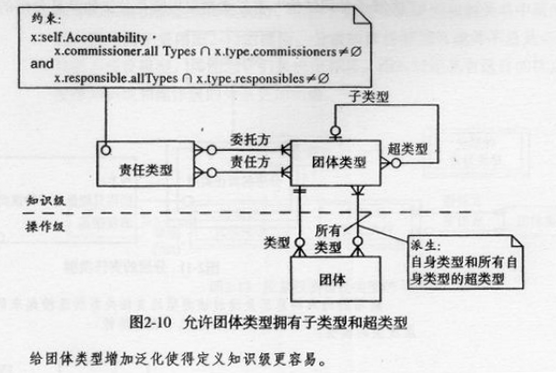
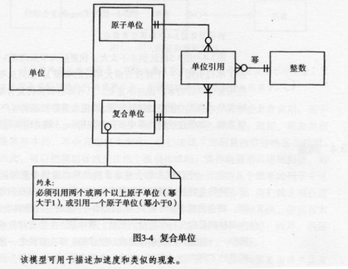
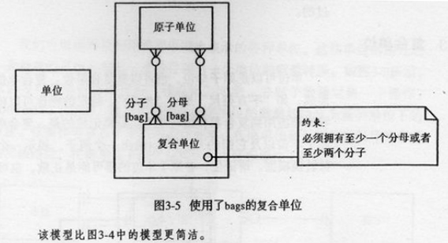
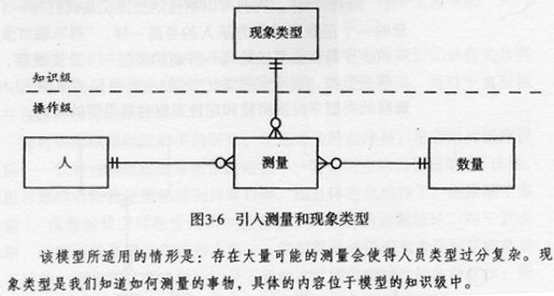

> 2016-08-07

责任模式
========

`团体模式`（人和组织的超类型）和`组织层次模式` 组合在一起构成 `责任模式`，它可以处理团体之间的许多关系，包括组织结构、患者同意、服务协议、雇佣关系、专业机构注册等

当用责任模式时，描述可形成哪种类型的责任模式，以及这些责任模式的约束规则，可用`责任知识级`的类型实例来描述

责任模式定义了团体的职责，可通过`操作范围`模式来定义，当这些职责增多时，让它们隶属特定的`职位`模式（而不是隶属该职位的人）

## 团体

## 组织层次

如果公司的组织发生变化，去掉区域子公司，就必须改变模型，而下图只需改变规则（改变规则比改变模型容易得多）

递归关系隐含某种危险，比如允许部门作为销售办事处的一部分，需要通过定义相应的子类型并对每种子类型施以一定的约束方式来处理这一问题

上图只支持单一的组织层次关系，如果是矩阵型的双重责任结构，简单情况下可使用，复杂时，考虑下述的`组织结构`

## 组织结构
如果一个模型有多个隶属层次，可用一种类型化的关系来表示，把 __层次化关联关系转化成一种类型__，通过使用组织结构类型的不同 *实例* 来区分不同的层次关系。用组织结构的两个实例（销售组织、服务组织）来处理上一节的场景，新产生的层次关系可通过简单的增加新的组织结构类型的方式来处理（不仅仅是矩阵型了）。另外，组织结构有时间周期，可有效记录组织结构的周期性变化

当组织结构类型数量增加，规则变得难以处理时，针对特定的组织结构的类型的所有规则被集中到一个地方，便于增加新的组织结构类型（如果很少改变组织结构类型，而经常增加新的组织子类型，则规则跟随组织子类型（图中右侧））

## 责任

责任的子类型可以提供一些额外的信息，比如所包括的具体工作内容以及在合同期内的执行次数

## 责任知识级
责任的类型比组织结构的类型要多得多，定义责任类型的规则将变得更加复杂。这种复杂性可通过引入知识级来管理：

- 操作级：包括责任、团体以及它们之间的关联关系
- 知识级：包括责任类型、团体类型以及它们之间的关联关系

在操作级，模型记录该领域每天所发生的事件；在知识级，模型记录控制着结构的各种 __通用规则__（元模型？），知识级的实例支配着操作级实例的具体配置。如患者许可被定义成`责任类型`，其中委托方是患者，责任方是医生

操作级是参与责任的实际团体，知识级是参与责任类型的可能的团体类型，用多值的知识映射来表示单值的操作映射的可能类型的方式是很常见的

## 团体类型泛化

## 层次型责任

分层的责任类型捕获团体的责任关系并组成一个层次型的模型，而分级的责任类型用于捕获其中具有固定次序的团队责任关系

## 操作范围

要用很抽象的方式来概括操作范围是非常困难的，在特别复杂的实例中，可能在知识级放置有操作范围类型

## 职位

不应该在所有时候都使用职位，它引入了更多的间接关系，会增加操作级的复杂性，只有职位中体现了一些稳定的重要职责，而人员经常变换职位的情况下才使用职位概念

观察和测量模式
==============
## 转化率

转化率可以用在许多地方，但不是万能的，如摄氏温度与华氏温度需要更复杂的运算来实现

如果多个单位存在转换关系，使用多维单位转换阵列或梯形单位转换阵列

对于币值，转换率并不固定，可通过给转换率指定可用的时间范围来解决

## 复合单位

## 测量
将所有可以被测量的不同事物（身高、体重、血糖水平）作为测量对象，并引入一个`现象类型`的对象类型

操作级中的对象会经常发生变化，它们的配置由很少发生变化的知识级来约束。

如果某个类型拥有多种相似的关联，可以为这些关联对象定义一个新的类型，并建立一个知识级类型来区分它们

## 观察
一些定性的描述，如血型、性别等，引出一个新的类型`分类观察`

可以认为性别是`现象类型`的实例，而“男”和“女”是`分类`的实例，在刻画一个性别为男性的人，可以创建一个观察对象，分类是男性，现象类型是性别

将分类与现象类型之间形成单值映射是一种强制性的行为时，将分类信息转移到知识级中，并重命名为现象

## 观察方案
观察方案能够确定一个测量的精确度与灵敏度，建模时也需要考虑（处于知识级）

## 双时间记录

## 被否决的观察
应该是四色中 `事务->后续事务` 模式

针对公司财务的观察模式
====================
其实在讲一个星型的多维数据库的设计

## 企业片断
N个维度的组合体，称为企业片断。这里所观察的不再是患者，而是企业片断的销售情况

`星型模式`

利用所定义的企业片断，就可以构造出不同类型之间的关系模型，可以将维度元素连接成为维度元素层次结构

缺点是没有确切的定义维度和维度级别的概念，其次添加一个新的维度就会导致模型的改变

## 定义维度
维度来自焦点事件（需要业务分析人员业来定义），即星型模型中的`事实表`

维度不需要可测量的最低级别，不值得也不可能分析到单个销售者的销售区域

## 维度的属性以级企业片断
除了通过业务结构定义的维度以外，另一个常用的维度是时间，而且也是有层次的（根据月份收入计算出年度收入）

企业片断生成操作是一个查找创建的过程，存在就返回，不存在就创建再返回

## 测量方案
这些测量不是手工记录的，通常是一个多个数据库加载而来，我们要记住是如何获得这些测量的，即用于创建测量的具体方案是什么。

### 保证计算的有效性
计算测量方案包括所使用的计算公式，这是一个独立的实例方法，利用解释器，并将公式刻画成电子表格形式

### 比较和因果测量方案
通常用户不在乎收入的具体数字，更想了解是实际的和计划的数字之间的差异或者是对今年收入与往年收入的比较

典型的比较是实际值和前段值或计划值之间的比较

### 状态类型：定义计划的和实际的状态

