> 2016-08-17

概览
========
- 需求：卖的视角、具体、产品当项目做
- 设计：做的视角、抽象、项目当产品做

- 从需求直接映射设计，会导致功能分解，得到重复代码
- 从设计出发来定义需求，会得到一堆假需求，变得无卖点

## 建模过程
由无意识到有意识，将隐性知识转化成显式知识

- 组织要解决什么问题，需要 __业务建模__，思考组织内系统之间如何协作，使得组织可以对外提供有价值的服务
    + 原景
    + 选定组织
    + 业务用例图
        * 
    + 现状业务序列图
        * 
    + 改进业务序列图
- 为了解决组织的问题，待开发系统应提供什么功能和非功能(性能，安全，扩展)，需要 __需求__，思考系统边界，强迫从“卖”的角度思考涉众，严防“做”污染“卖”，需求制品-需求规约是“卖”和“做”的衔接点
    + 系统用例图
        * 
    + 系统用例规约
        * 
- 为了提供功能，系统内部应该有什么样的核心机制，需要 __分析__，思考系统内核心域
    + 分析类图
        * 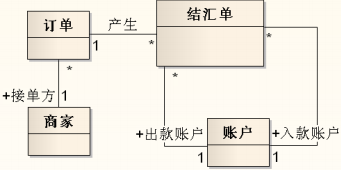
    + 分析序列图
        * 
    + 分析状态机图
- 为了满足非功能(性能，安全，扩展)，系统的核心机制如何用选定的平台实现，需要 __设计__，思考内域之间
    + 建立数据层
    + 精化业务层
    + 精化表示层

愿景
=========
在 __目标组织负责人（老大）__ 看来，引进某 __系统__ 给该组织带来的 __改进指标__

## 不同情况下找老大
- 定制系统（项目）/一个人
    + 他就是老大
- 定制系统（项目）/正式组织
    + 确定组织范围，再定位老大
- 非定制系统（产品）/正式组织
    + 确定组织范围，再定位目标组织，再定位老大
- 非定制系统（产品）/人群
    + 定位目标人群，再定位老大

组织的具体化，由所有抽象，到少数具体的过程

- 医院 哪家医院最像所谓“医院”？
- 公司 哪家公司最像所谓“公司”？
- 车间 哪个车间最像所谓“车间”
- 食客 哪群食客最像所谓“食客”？

不要从功能直接推导，不要图方便，一定要找出典型的

爆炸法：对方不感兴趣立即引爆

老大的头脑—和对手拼杀的战场

## 愿景
是给组织带来改善的指标，不是做某事

- 可以是
    + 减少采集数据所花费的时间
    + 提高制作动画的速度
    + 缩短订单的处理周期
- 不可以是
    + 建立一个CRM系统
    + 提供在线订机票功能
    + 能够进行风险评估
- 系统上马之后，老大怎样才会高兴？
- 如果没有此系统，会付出什么代价？ 

### 愿景vs功能

### 问题分解
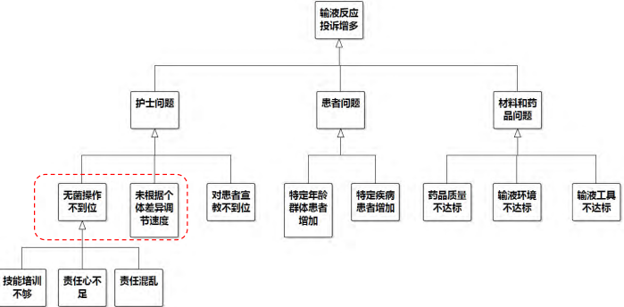

### 性能需求不是愿景
- 愿景目标 度量对象是组织 领域相关 缩短办证的平均周期
- 性能需求 度量对象是系统 领域无关 3秒内返回结果

## 涉众
- 剧本只有一份，观众却是多种
- 同一件事情，不同的利益视角
    + 卖房子
        * 委托人担心价钱过高，没有人买；担心价钱过低，自己吃亏。希望中介能根据掌握的信息卖出最优价格。
        * 经纪人希望能少花时间，多得佣金。（佣金增长/投入时间）达到最大值
- 系统需求就是涉众利益之间的最佳平衡点（台上演什么戏？由台下各种人角逐而定）
- 排序是否正确直接影响需求

## 起名
- 品类诞生初期：可用直接命名
    + IBM、 Microsoft、 UMLChina
    + 小灵通、全球通、支付宝、财付通、 *付*
- 品类成熟：隐喻式命名
    + 小米、锤子
    + 知乎、 果壳
    + 饿了么、滴滴

业务建模
===============
（待开发的）系统是组织的零件

- 没有把系统放在组织中来看
- 假的“需求变更”－－来路不正
- 得到的系统不符合组织需要

## 选定组织
愿景波及的需要改进的组织

- 可以是整个组织，也可以是组织的一部分
- 组织可以正式可以非正式（公司 车友 某部门 政府组织 球迷）

### 太大或太小

- 绝大多数工作流不相干－－太大
- 很多要改进的地方未涉及－－太小

当涉及多个组织时应寻找更大的组织

### 组织是名词

### 网站不是组织

### 外部看是价值的集合(业务用例图)

### 内部看是系统的集合(业务序列图)

## 业务用例图
### 业务执行者
在组织之外和组织交互的 __人群或组织__(不能是系统、时间)

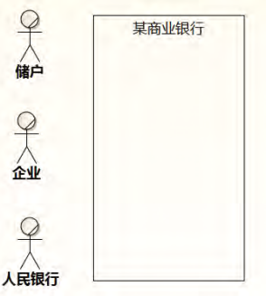

### 业务工人

业务执行者（Business Actor）在组织外面，业务工人（Business Worker）在组织里面

### 业务实体
业务实体取代其他工人或实体的责任

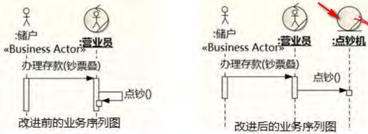

- 我想开发一个新系统来改善现有工作
- 转化为
- 我想开发一个新的业务实体取代现有业务工人或业务实体的一些责任
- 所以
- 待开发系统：组织的新业务实体

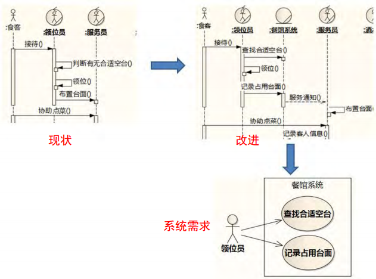

### 业务用例
组织为业务执行者提供哪些价值？

- 
- 是相对稳定的，时光倒流300年也适用
- 代表从组织视角看问题的高度
- 业务流程是业务用例的实现
- 
- 从价值出发重新构造业务流程
- 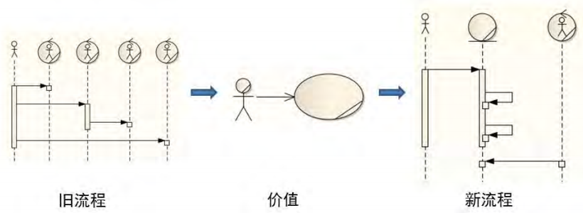

### 常见错误
- “管理型” 业务用例，和愿景混淆，指标还是动作？
- 
- 错误：这个佣金系统的业务用例是。。。
- 应为：目前财务部为经纪提供的“发放佣金” 业务用例，实现流程有很多不足之处，所以向引进佣金系统来改进业务用例的实现。。。

## 现状业务序列图
- 可选方式：文字、活动图、序列图
- 
- 活动图只关注人，没有系统存在，不方便对其进行改进
- 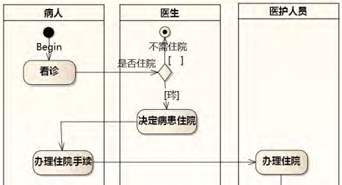
- 序列图把人当系统
- 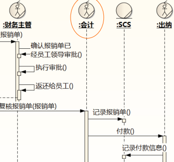
- 活动图往往只表现动作
- 
- 序列图强迫思考背后目的
- 
- 现状必须是具体的，不要抽象
- 找出最值得改进的场景，先改进

### 绘制要点
- 消息名字代表责任和目的
- 
- 
- 涉及到可能改进点的要画细一些
- 
- 有的改进点可能在扩展路径中
- 
- 不要围着待开发系统拼凑业务流程
- 
- 不要露出系统内部的组件
- 
- 不要表达交互步骤
- 
- 只画领域相关的系统
- 
- 分清责任
- 
- __时间__ 看作特殊的业务实体，时间不等于定时器，时间处于系统外，而定时器是本系统和外系统的接口
- 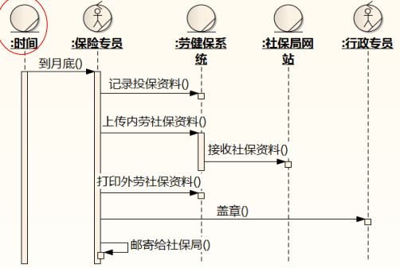

## 改进业务序列图
- 物流变成信息流
- 
- 
- 改善信息流转
- 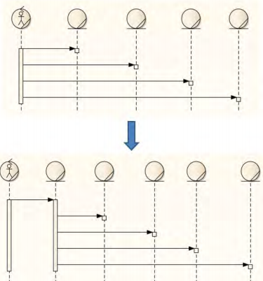
- 
- 封装领域逻辑
- 
- 
- 迅雷（改善信息流转+封装领域逻辑）
- 
- QQ泡妞改进，业务逻辑由人脑转到系统中
- 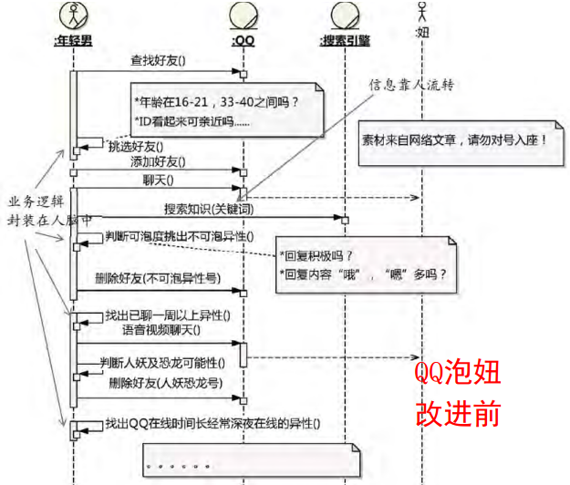
- 
- 麻将机
- 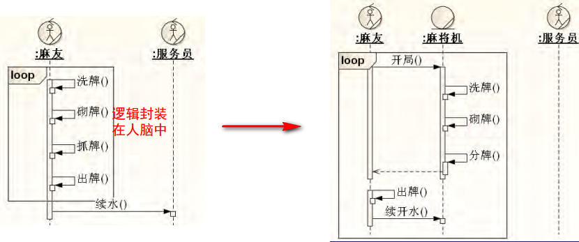
- __阿布思考法__
    1. 假设有足够的资源去解决问题，得到一个完美的方案；
    2. 用手上现有的资源去山寨这个完美方案。

