> 2018-02-22

实现领域驱动设计
================

- 本书更多的阐述是DDD有什么（聚合、实体、值类型、工厂、资源库、应用服务、领域事件...），在某些情况下，为职责划分提供了依据
- 以及与持久化、与消息机制、与外部系统集成等阻抗失配时的解决方案
- 但采用某DDD框架并不能解决领域复杂性，功底还在建模上（聚合怎么写、实体怎么写、职责是什么、怎么协作...）
- 代码：https://github.com/VaughnVernon/IDDD_Samples

## 目录
<!-- MarkdownTOC depth=3 -->

- 领域、子域和限界上下文
    - 领域
    - 子域
    - 限界上下文
        - 限界上下文不仅仅只包含模型
- 上下文映射图
    - 自治性
- 架构
    - 分层
    - 六边形架构（端口与适配器）
    - SOA服务设计原则
    - REST关键方面
    - 命令和查询职责分离`CQRS`
    - 事件驱动架构
        - 管道和过滤器
        - 长时处理过程（Saga）
        - 事件源
        - 数据网织和基于网格的分布式计算
- 实体
    - 发现实体及其本质特征
    - 角色和职责
    - 验证
- 值对象
    - 最小化集成
    - 值对象表示标准类型
    - 持久化值对象
- 领域服务
    - 什么是领域服务
- 领域事件
    - 建模领域事件
    - 从领域模型中发布领域事件
    - 向远程限界上下文发布领域事件
        - 消息设施的一致性
        - 自治服务
        - 容许时延
        - 事件存储
    - 转发存储事件的架构风格
        - 基于REST资源的方式
        - 基于消息中间件的方式
    - 实现
    - 事件消重
- 模块
- 聚合
    - 原则：在一致性边界之内建模真正的不变条件
    - 原则：设计小聚合
    - 原则：通过唯一标识引用其他聚合
    - 原则：在边界之外使用最终一致性
    - 打破原则的理由
    - 避免依赖注入
- 工厂
    - 聚合根中的工厂方法
    - 领域服务中的工厂
- 资源库
    - 面向集合的资源库
    - 面向持久化的资源库
    - 管理事务
    - 类型层级
- 集成限界上下文
    - 通过REST资源集成限界上下文
    - 通过消息集成限界上下文
        - 长时处理过程
- 应用程序
    - 用户界面
        - 将领域对象渲染到用户界面的显示中
        - 将用户操作反映到领域模型上
    - 应用服务
    - 组合多个限界上下文
    - 基础设施
- 聚合与事件源：A+ES
    - 应用服务内部
    - 读模型投射

<!-- /MarkdownTOC -->


领域、子域和限界上下文
====================

## 领域
- 在DDD中，一个领域被分为若干子域，领域模型在限界上下文中完成开发，而非创建一个全功能的模型

## 子域
- 核心域：战略层上，企业应该在核心域上胜人一筹
    + 对于小型零售商而言，预测引擎可能是一个核心域
    + 京东在库存物流上的核心竞争力
- 支撑子域：创建或购买某个限界上下文来支撑业务的，重要但不是核心，专注于业务某个方面
- 通用子域：用于整个业务系统

## 限界上下文
- 从 __问题空间__ 角度看待问题
- 许多隐式的领域模型没有被很好的分离出来，被融合成一个软件模型，这是不幸的。它将承受大而全的电子商务模型所带来的负面影响

- 不同的子域对同一个术语，也有不同含义
    + 在浏览产品目录时，“顾客” 被放到了先前购买情况、忠诚度、可买产品、折扣和物流方式这样的上下文中
    + 在下单时，“顾客” 上下文包括名字、产品寄送地址、订单总价和一些付款术语


- 论坛和“谁可以发表帖子，还有什么条件下可以发表”其实没有多大关系，只需要知道“有作者正在发表帖子，或者有作者曾经发表过帖子”。换句话话，用户与权限不是它关心的，它关心的是角色

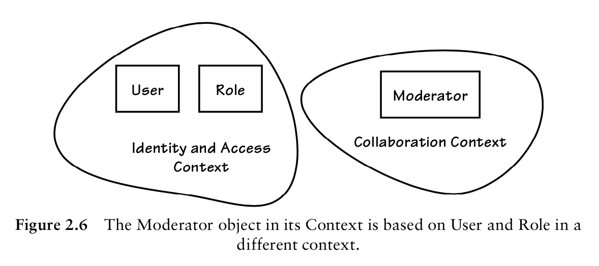

- 在上下文边界之外，通常不会使用该上下文之内的对象，但可以彼此关联的对象可能共享一些状态

- 一个概念不属于你的通用语言，那么一开始就不应该将其引入到模型中

### 限界上下文不仅仅只包含模型
- 还包括：数据库Schema
- 用户界面，但注意反模式
- 应用服务


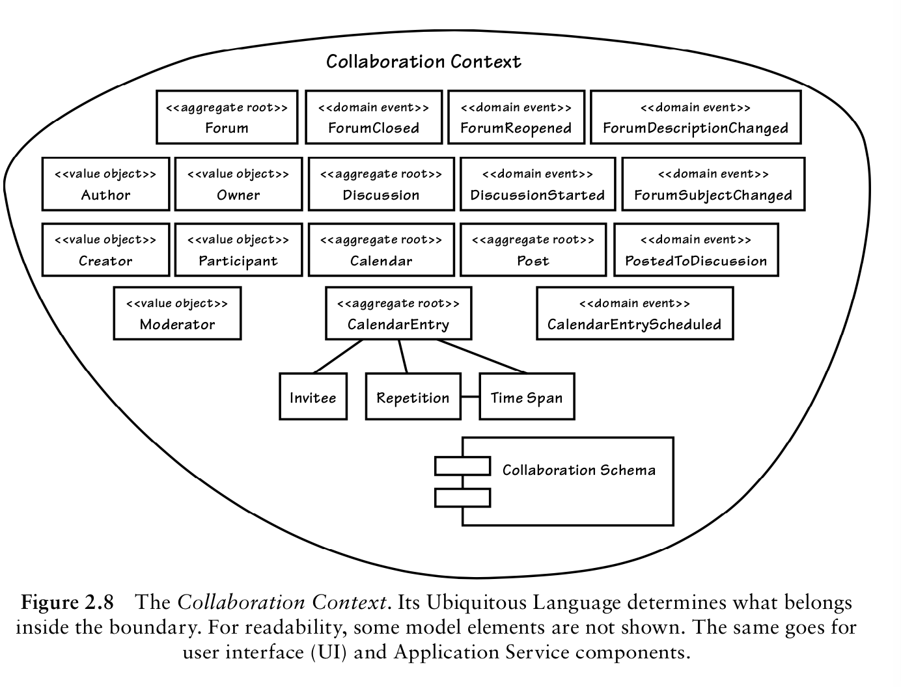


上下文映射图
====================
- 上下文映射图帮助我们从 __解决方案空间__ 角度看待问题
- 通过框图表示两个或多个限界上下文之间映射关系，或集成限界上下文
- 集成限界上下文，采用技术：
    + 开放主机服务OHS：REST/RPC/MQ
    + 发布语言PL：XML/JSON/ProtolBuffer/某种媒体格式
    + 防腐层ACL：值对象

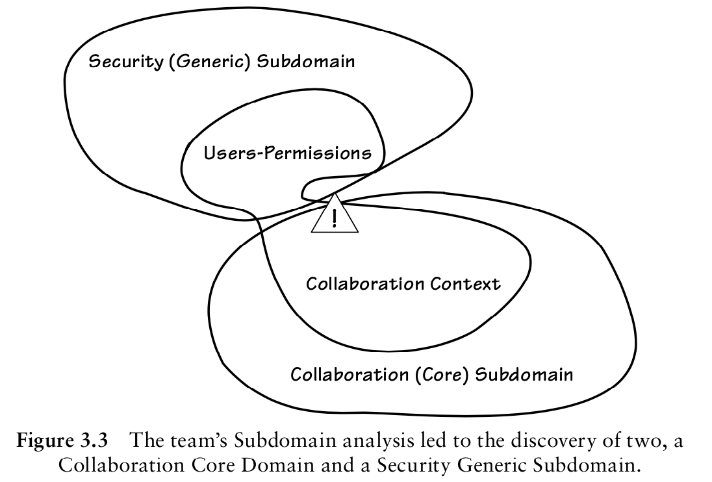

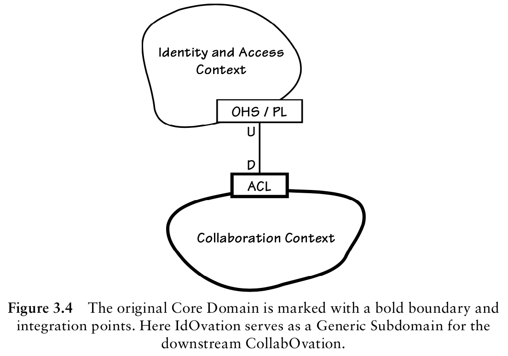


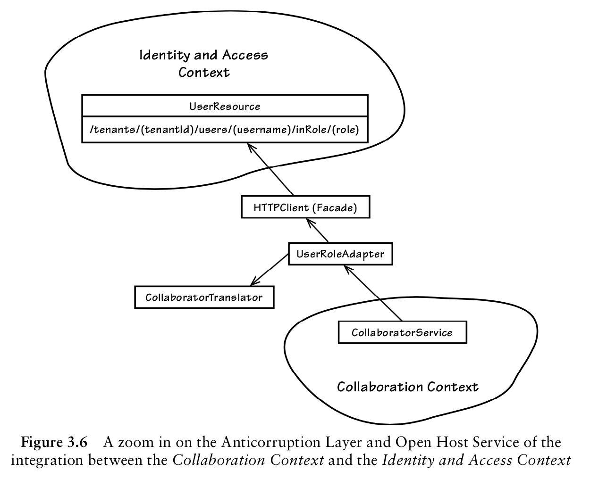

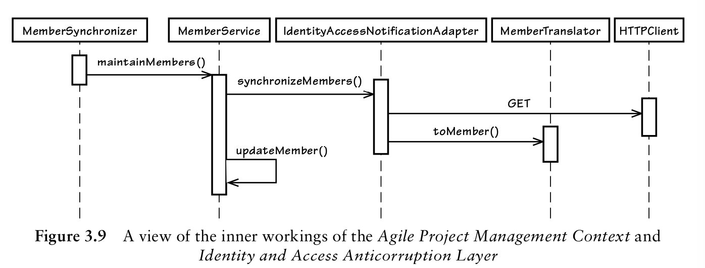

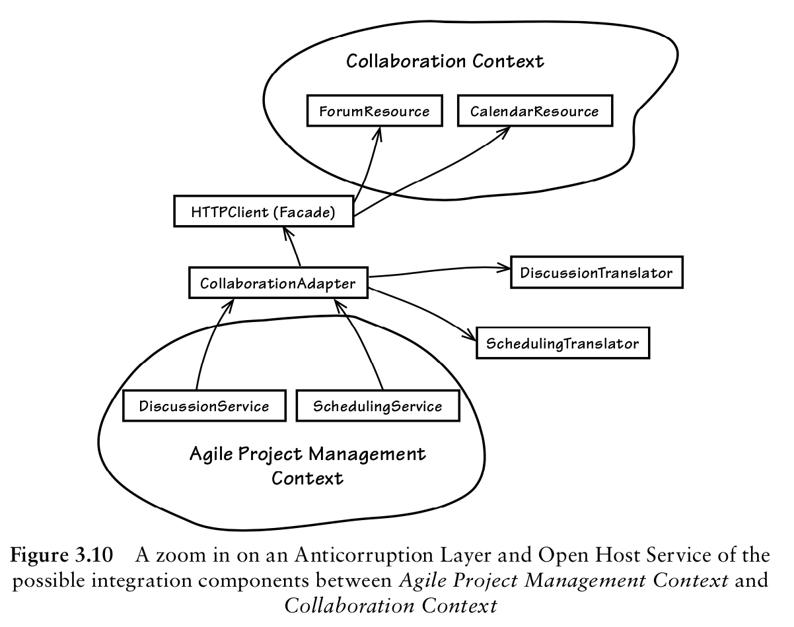

## 自治性
- 高度实时依赖远程服务，则不具备自治性，当RPC/REST目标系统不可用时，用户对你系统的请求也将失败
- 尽量选择异步请求或事件处理方式，系统所依赖的状态（本地模型的最小属性集）已存于本地，初始化这些对象，只需有限的RPC/REST请求
- 使用MQ，还能将同步的主动请求，转化为被动的消息处理

- 反过来说，为了达到自治，必须不能实时依赖第三方服务，或者必须通过某种办法，解除这种强依赖

架构
====================
- 六边形架构为基础架构，用来支持系统中其它架构

## 分层
- 每层只能与位于其下方的层发生耦合，较低层需要通知较高层时，只能采用`Observer`或`Mediator`模式
- 用户界面处理用户显示和用户请求， __不应该__ 包含领域或业务逻辑
- 用户界面所进行的验证和对领域模型的验证是 __不同的__
- 用户界面使用了领域模型中的对象，__仅限于__ 数据的渲染展现，可使用`展现模型Presentation Model`对其解耦
- 应用服务和领域服务是不同的，领域逻辑 __不应该__ 出现在应用服务中
- 应用服务可用于控制持久化事务和安全认证，或向其他系统发送基于事件的消息通知，但并 __不处理__ 业务逻辑，它是是轻量的
- 应用服务通常：接收来自用户界面的输入，通过`资源库`获取`聚合`实例，然后执行相应的命令操作
- 应用服务可以调用领域服务来完成领域相关的任务操作，但此时的操作是 __无状态__ 的
- 应用层可以订阅领域事件，并对事件进行存储和转发
- 领域事件发布器也应该轻量化，__不依赖__ 消息机制的基础设施
- 基础设施层，包含持久化和消息机制，领域对象不应该直接依赖，通过`DIP`模式解耦（依赖注入、服务工厂、插件）
- 如果在分层架构中采用`DIP`，就不存在分层概念，无论高层还是低层，只依赖于抽象

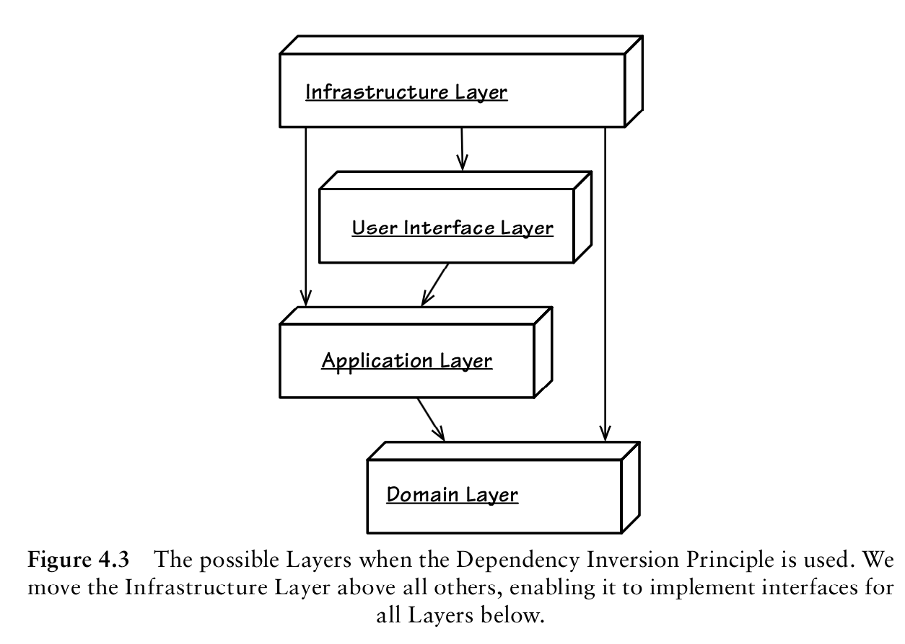

## 六边形架构（端口与适配器）

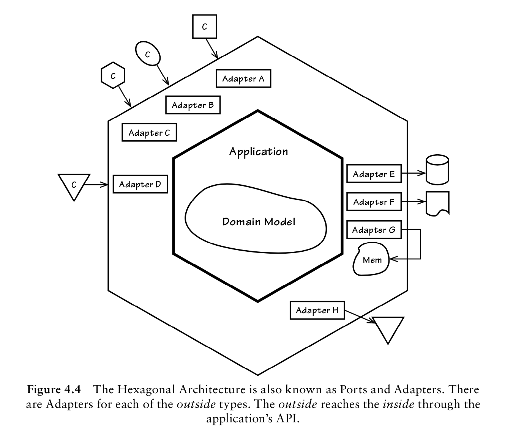

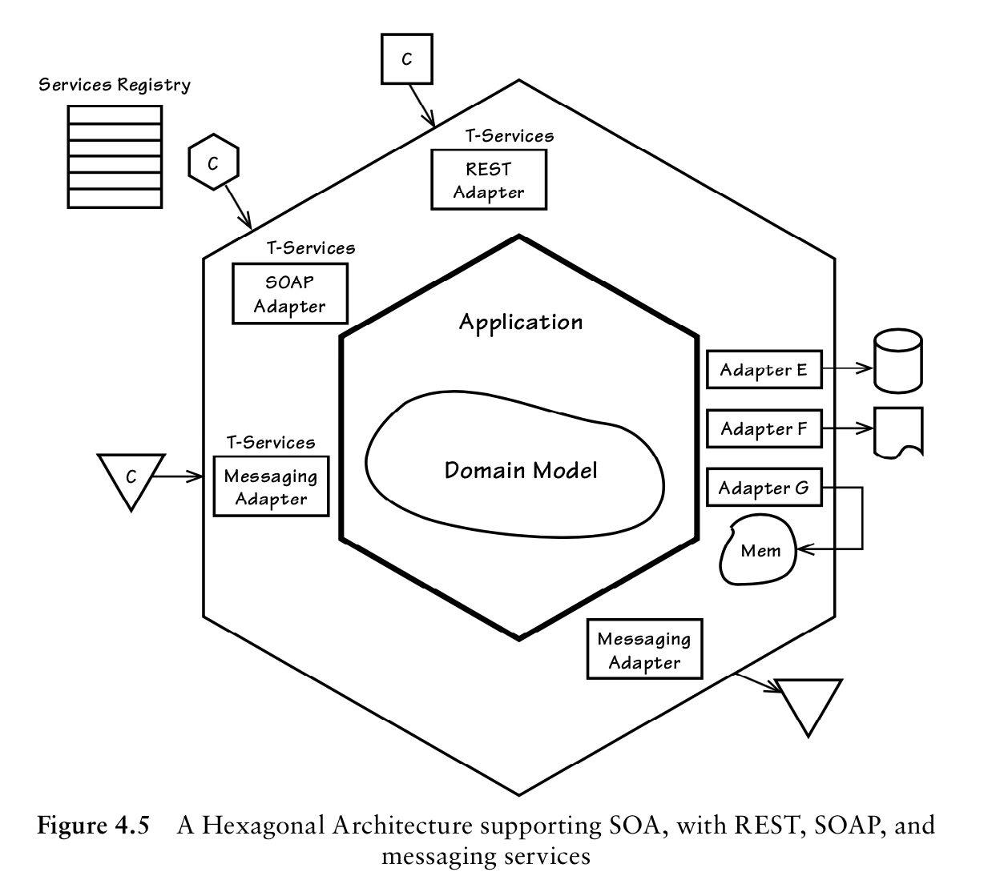

- 需要新客户时，只需添加一个新的适配器将客户输入转化为能被系统API所理解的参数就行了
- 系统输出，比如UI、持久化、消息等都可以通过新建适配器负责完成相应的转化功能
- 对于每种外界类型，都有一个适配器与之相对应，外界通过应用层API与内部进行交互
- 大多数情况，不必自己实现端口
    + 端口想成HTTP，则适配器是REST请求类
    + 端口是消息机制，则适配器是消息监听器
- __应该__ 根据应用程序的功能需求来创建API，__而不是__ 客户数量或输出机制
- 易测性，方便开发测试用的适配器，整个领域模型和应用程序可以在没有客户和存储机制的条件下进行设计开发

## SOA服务设计原则
- 服务契约
- 松耦合
- 服务抽象
- 服务重用性
- __服务自治性__
- __服务无状态性__
- 服务可发现性
- __服务组合性__

## REST关键方面
- 决定哪些有意义的资源暴露给外界，并给这些`资源`一个唯一的`URI`
- 无状态通信，采用具有自描述功能的消息
- 可操作资源的方法是固定的，就是HTTP动词，但每个动词都有一个明确的定义
- 使用超媒体（Hypermedia），rest的客户端可以沿着某种路径发现应用程序可能的状态变化（`HATEOAS` Hypermedia as the Engine of Application State）

- REST与DDD，系统接口层单独创建一个限界上下文，通过适当策略来访问实际的核心模型（而不是直接访问领域模型）；或使用标准媒体类型来表示，如日历ical

## 命令和查询职责分离`CQRS`
- 一个方法要么是执行某种动作的命令，要么是返回数据的查询，不能两者皆是
- 一个方法只有在具有参考透明性时才能返回数据，此时方法不会产生副作用


- 同一个模型将一拆为二：
    + `Command Model`命令模型：add()/save()...，仅有一个fromId()，以聚合身份标识为参数，返回聚合实例，方便后续命令的发送
    + `Query Model`查询模型：query...()，专门解决数据显示复杂性问题，如查询聚合、属性过滤等

- 命令处理器，客户端提交的命令将被命令处理器所接收
    + 分类风格：从个命令处理器位于同一个应用服务中，根据命令类别来实现应用服务，每一个应用服务有多个方法，每个方法处理某种类型命令
    + 专属风格：每个命令都对应单独的类，且只有一个方法
    + 专属风格可发展为消息风格：每个命令通过 __异步__ 的消息发送到某个命令处理器，每个命令处理器可以处理某种特殊的消息类型，可增加单独处理器数量来缓解消息负载
    + 无论何风格，应该在不同处理器间解耦，一种处理器的重新部署 __不会__ 影响其他处理器

- 命令处理器只完成有限的功能，如从资源库获取聚合实例，再调用该实例的方法
- 当命令处理器执行结束后，一个聚合实例将被更新，同时领域模型将发布一个 __领域事件__（也许需要更新查询模型）
- 事件订阅器更新查询模型，该更新是 __同步还是异步__？取决于系统负荷、存储位置、数据的一致性约束等

## 事件驱动架构
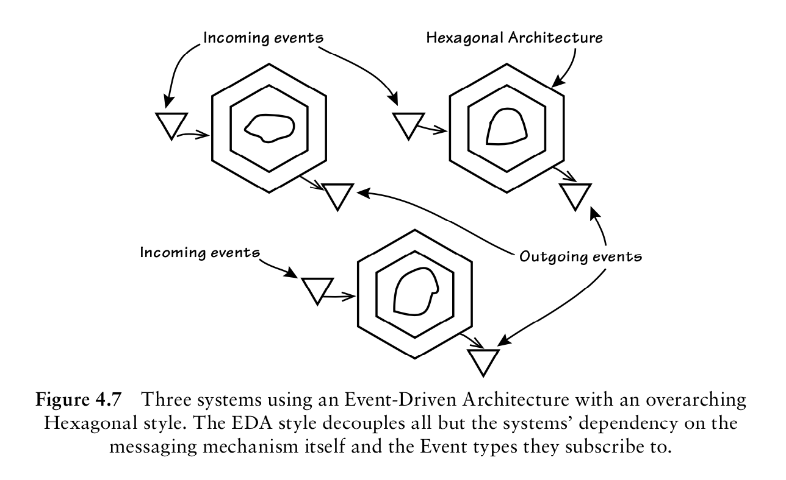

### 管道和过滤器
- `cat phone_number.txt | grep 303 | wc -l`
- 每个过滤器相对独立参与处理过程，处理器组合可通过配置完成
- 可重新组织处理器的执行顺序
- 消息过滤器可从不同管道中读写数据，并行处理
- 并行同类型过滤器，解决负荷问题

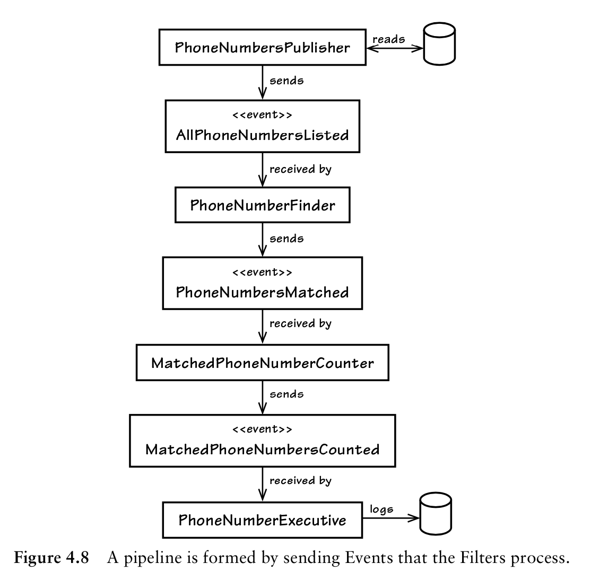

### 长时处理过程（Saga）
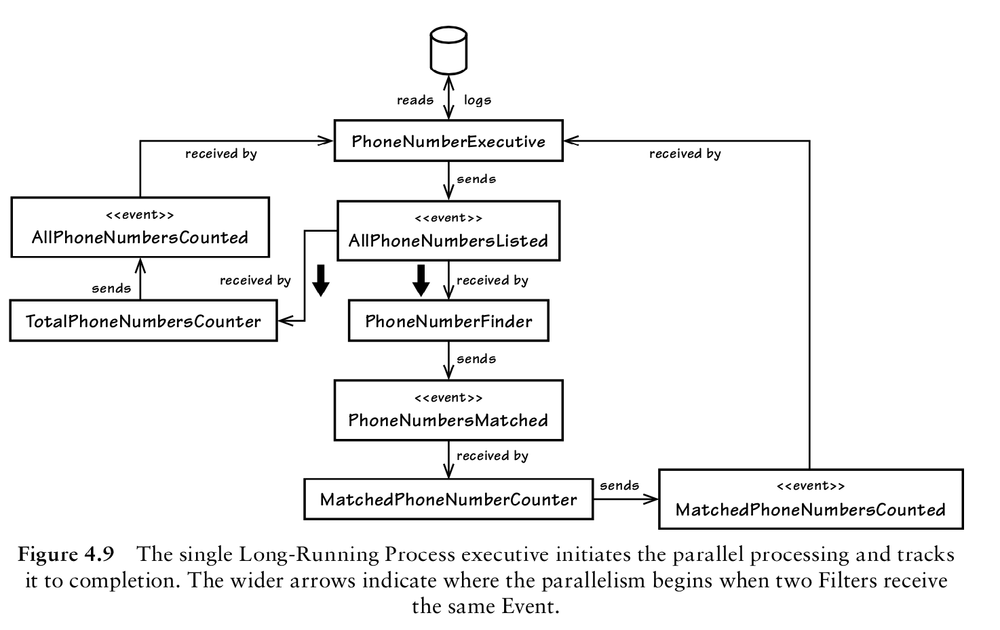

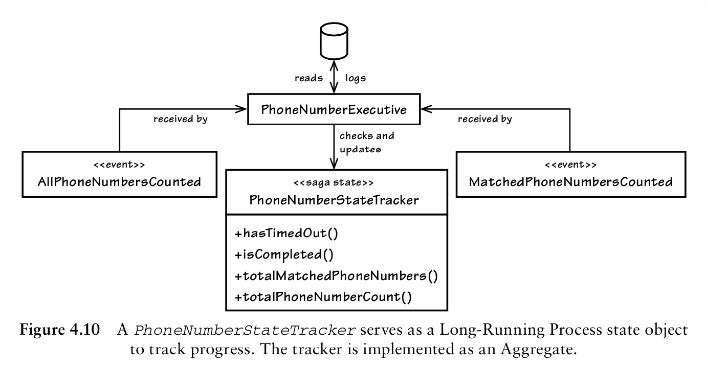

- 设计长时处理过程三种方法：
    + 将处理过程设计成一个组合任务，使用一个执行组件对任务进行跟踪，并对各个步骤和任务完成情况进行持久化
    + 将处理过程设计成一组聚合，这些聚合在一系列的活动中相互协作。一个或多个聚合实例充当执行组件并维护整个处理过程的状态
    + 设计一个无状态的处理过程，其中每一个消息处理组件都将对所接收到的消息进行扩充（加入额外数据信息），然后再将消息发送到下一个处理组件。这种方法，整个处理过程的状态包含在每条消息中
- 长时处理过程的状态实例通常有一个名为`isCompleted()`的方法，每当某个执行流程执行完成，其对应的状态属性也随之更新，随后执行器将调用`isCompleted()`，检查所有的 __并行__ 执行流是否全部运行完毕，如果是，则发布 __最终的领域事件__
- 长时间处理程序，当一个完成事件到达时，将检查相应的状态属性，如果已被设值，代表是多次投递，可以忽略该事件，达到消息传输的幂等性
- 长时间处理程序，需要考虑时间敏感性，调用`hasTimeOut()`，如果执行流的处理时间超过是最大允许处理时间（主动或被动检查），状态跟踪器将被标记为 遗弃 状态，并发布一个处理失败的领域事件
- 长时间处理通常和分布式并行处理联系在一起（但并不是分布式事务），达到最终一致性，在处理过程失败时，应能够采取适当的修复措施

### 事件源
- 由聚合发布的事件被保存到事件存储中，同时这些事件被用于跟踪模型的状态变化。资源库从事件存储中读取事件 __重放__，就能达到聚合状态的 __重建__
- 通过聚合状态`快照`的方式进行优化（重建对系统压力太大），对聚合状态进行序列化，结合最新事件的 __重放__，达到最新状态

### 数据网织和基于网格的分布式计算
- GemFire，Geode 是 GemFire 的开源版本，比redis更适合金融领域


实体
====================
- 一个实体是一个唯一的东西，可以对实体进行多次修改，但拥有相同的身份标识`identity`(值对象则不一样，它是不可变的`immutable`)
- 委派标识`surrogate identity`为ORM所使用，并作为外键与其它表关联，但它不同时身份标识`identity`，它是领域概念，不需要成为数据库的主键（可做唯一约束）

## 发现实体及其本质特征
- 应根据软件需求，而 __不是__ 用例或用户故事（只能反映一个视图，是不完善的），对实体进行理解
- 关注目前限界上下文，防止分析瘫痪：
    + 在`注册上下文`中，Tenant只需要一个身份标识+name，也许在`售后支持上下文`、`付账上下文`、`客户关系管理上下文`，会加上类似`租户联系人`、`付款账号`等，但在此时，这些属性均没有用，将来可通过`tenantid`去关联。
- 一个`Tenant`为激活或禁用状态

```java
public class Tenant extends Entity{
    private boolean active;
    public void setActive(boolean isActive){
        //todo:
    }
}
```

但这是一个贫血模型，方法不能表达意图，参数才能（定义时意图不明，导致调用方需要太多知识），改成

```java
public class Tenant extends Entity{
    public void activate(){
        //todo:
    }

    public void deactivate(){
        //todo:
    }

    public boolean isActive(){
        //todo:
    }
}
```

## 角色和职责
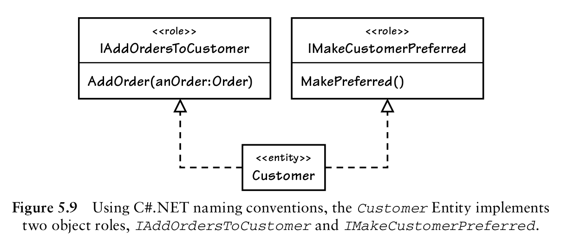

```java
public interface IAddOrdersToCustomer{
    public void AddOrder(Order anOrder);
}

public interface IMakeCustomerPreferred{
    public void MakPreferred();
}

public class Customer implements IAddOrdersToCustomer, IMakeCustomerPreferred{
    //todo:
}
```

- 向一个客户添加订单，与，使客户成为优先客户，是两个完全 __不同职责__，如果没有接口（表示职责的），全部实现在`Customer`类中，则导致该类职责不清。
- 采用上面设计，则不同场景下，__获取策略也许是不同的__：

```java
IMakeCustomerPreferred customer = session.Get<IMakeCustomerPreferred>(customerId);
customer.MakPreferred();

IAddOrdersToCustomer customer = redis.Get<IAddOrdersToCustomer>(customerId);
customer.AddOrder(order);
```

## 验证
- 将验证逻辑购入到实体中，但有时，验证逻辑比领域对象变化快，导致领域对象承担太多职责
- 验证类可以实现规范模式或策略模式，当发现非法状态时，将通知客户方或记录下来，验证过程应该收集 __所有__ 验证结果，而不是一开始遇到非法状态就抛出异常


值对象
====================
- 当值对象不能满足时，才考虑实体
- 可作为 __不变量__
- 当度量和描述变化时，可以用另一个值对象予以 __替换__
- 试图将多个属性加在一个实体上，就是需要考虑将相互关联的属性组合在一个值对象中了，每个值对象都是一个 __概念整体__，如货币(double money;string currency)
- 可以和其它值对象进行 __相等性__ 比较
- __不__ 会对协作对象造成 __副作用__：
    + 函数不会修改对象的状态，只会返回一个新的值对象
    + 如果只使用基本值对象，而不使用特定的值对象，将无法完成领域特定的无副作用函数
    + 放弃语言允许我们向基本值对象添加新行为的诱惑（如ruby[当然设计框架时例外]）
- 值对象应该不去理解实体

```java
float priority = businessPriority.priorityOf(product);

//VS

float priority = businessPriority.priority(product.businessPriorityTotals());
```

另一个问题，为什么不`product`自己去计算`priority`，职责划分，这是领域服务的职责

## 最小化集成
- 使用不变的值对象使得我们做更少的职责假设
- `身份上下文`中`User`和`Role`是实体，但到了`协作上下文`中，`Moderator`完全可以是值对象，上游的对下游的影响最小化了，上游虽然需要处理许多对象属性，但到了下游只包含了通用语言的关键属性，而且没必在使它与上游保持同步
- 尽可能使用值对象完成限界上下文之间的集成

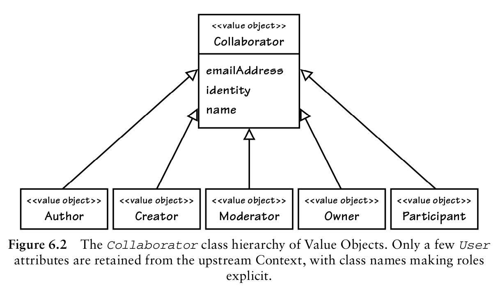

```java
//值对象
abstract class Collborator{
    String identity;//为了关联
    String name;
    String email;
}

class Author extends Collborator{}
class Creator extends Collborator{}
class Moderator extends Collborator{}
class Owner extends Collborator{}
class Participant extends Collborator{}
```

只有少数几个属性来自上游上下文，而且本上下文中，类名已能表现出角色概念了

## 值对象表示标准类型
- 如行业标准
- 如状态
- 值对象在整个系统中不是变的，缓存机制也更简单和安全

## 持久化值对象
- 有些时候，需要用实体的方式来存储值对象，但不这影响它在领域模型中为值对象
- 或者，做为实体对象的某些列而存在，注意命名规则

```sql
CREATE TABLE `backlog_item`(
    --...
    `business_priority_ratings_benefit` int NOT NULL,
    `business_priority_ratings_cost` int NOT NULL,
    `business_priority_ratings_penalty` int NOT NULL,
    `business_priority_ratings_risk` int NOT NULL,
    --...
)
```


领域服务
====================
- 领域中的服务表示一个无状态的操作，用于实现特定于某个领域的任务
- 以前倾向于使用聚合根上的静态方法来实现这些操作，但这是一种坏味道

- 示例

```java
public class Product extends Entity{
    private Set<BacklogItem> backlogItems;
    public BusinessPriorityTotals businessPriorityTotals(){
        //todo:
    }
}

```

- 如果`Product`对象过于庞大，`BacklogItem`本身就应该是一个聚合。
- `Product`不在包含`BacklogItem`集合，是不是应该用资源库`BacklogItemRepository`，一个原则是：__避免聚合中使用资源库__
- 改成如下，将方法改成静态，并将`BacklogItem`集合作为参数传入呢？
 
```java
public class Product extends Entity{
    public static BusinessPriorityTotals businessPriorityTotals(Set<BacklogItem> backlogItems){
        //todo:
    }
}

```

- `Product`是创建该静态方法的最佳位置吗？由于该方法只使用了每个`BacklogItem`中的值对象，将该方法放在`BacklogItem`上似乎更合适
- 但，这里计算所得的业务价值却是属于`Product`的，该方法放在合适的位置并不是一件容易的事
- 这时，应该用一个单一的建模工具：领域服务 了

## 什么是领域服务
- 它不是应用服务，应用服务不会处理业务逻辑，但领域服务就是处理业务逻辑的
- 它不是一件东西，当某个操作过程或转换过程不是实体或值对象的职责时，就该考虑领域服务了
- 它是无状态的
- 考虑领域服务：
    + 执行一个显著的业务操作过程
    + 对领域对象进行转换
    + 以多个领域对象作为输入进行计算，结果产生一个值对象
- 但过度使用领域服务，将导致贫血模型
- __避免聚合中使用资源库__，但是领域服务则没有问题啦


领域事件
====================
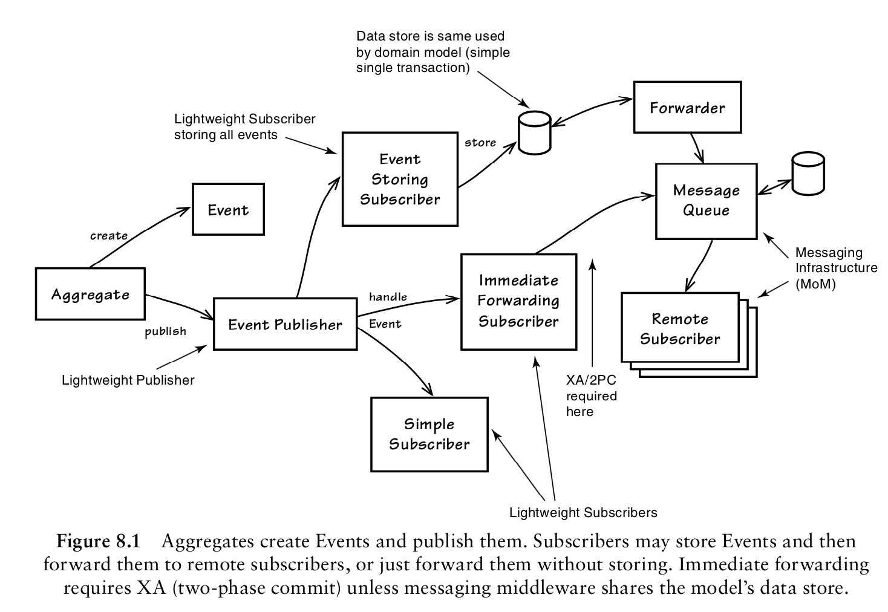

- 通过领域事件的监听，能有效减少批处理
- 聚合中，在单个事务中，只允许对一个聚合实例进行修改，由此产生的其他改变必须在单独的事务中完成。利于消除两阶段提交（全局事务）

## 建模领域事件
- 命令方法：`BacklogItem#commitTo(Sprint aSprint)`，对应事件输出：`BacklogItemCommitted`

```java
public interface DomainEvent{
    public Date occurredOn();
}

public class BacklogItemCommitted implements DomainEvent{
    private Date occurredOn;
    private BacklogItemId backlogItemId;
    private SprintId committedToSprintId;
}
```

- 领域事件通常被设计成不变的，它所携带的属性能反映该事件的来源
- 事件发布时，订阅方法可以用监听该事件

```java
MessageConsumer.instance(messageSource, false)
    .receiveOnly(
            new String[] {"BacklogItemCommitted"},
            new MessageListener(Typte.TEXT){
        @Override
        public void handleMessage(
            String aType, 
            String aMessageId, 
            Date aTimestamp, 
            String aTextMessage, 
            long aDeliveryTag, 
            boolean isRedelivery) 
        throws Exception{
            //todo: 解析aTextMessage
            //如果需要处理逻辑，需交给 应用服务，后者再委托 领域服务 去调用业务逻辑
        }

  });
```

- 监听的处理逻辑，最好设计成 __幂等__ 操作，多次投递不会产生错误
- 由什么组件向领域事件注册订阅呢，通常是 __应用服务__，有时也由 __领域服务__ 来完成
- 不要在 __事件通知过程中__ 修改另一个聚合实例，这样破坏了 __在一个事务中，只对一个聚合进行修改__（聚合实例之间的最终一致性必须通过异步的方式予以处理）

## 从领域模型中发布领域事件
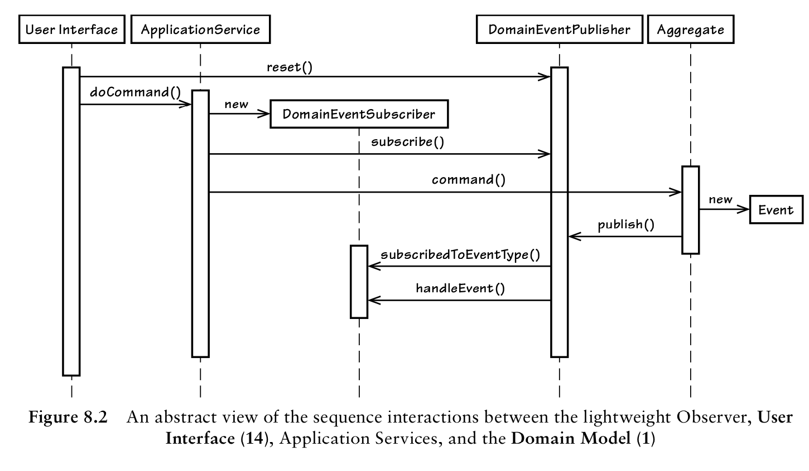

## 向远程限界上下文发布领域事件
### 消息设施的一致性
- 保证领域模型存储和事件存储之间的一致性：
    + 领域模型和消息设施共享持久化存储，优点是性能点，局限是必须是同一存储
    + 领域模型的持久化存储和消息持久化由全局XA事务（两阶段提交）所控制，缺点是，不一定所有存储机制都支持全局事务，性能差
    + 在领域模型的持久化存储中，创建一个特殊的存储区域，用于存储领域事件，类似第一条，但该区域不同由消息机制所拥有和控制，而是限界上下文，同时再创建一个消息外发组件将事件存储的所有消息通过消息机制发送出去

### 自治服务
- 通过使用领域事件，减少了RPC的调用依赖，得到更高的独立性--自治性

### 容许时延

### 事件存储
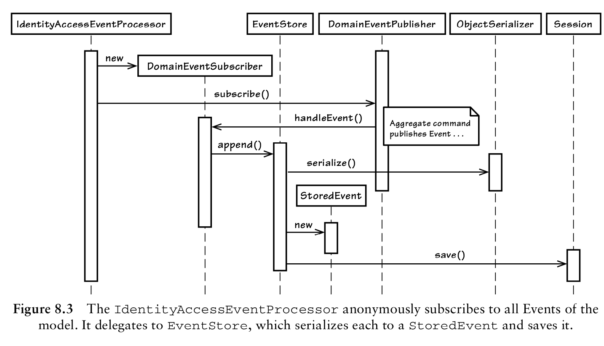

- 将事件存储作为消息队列来使用
- 检查由模型的命令方法所产生的所有结果的历史记录，可跟踪bug（包括客户方中的）。
- 充当审计日志
- 使用事件存储中数据来进行业务预测和分析
- 重建聚合实例
- 撤销对聚合的操作，或添加一些事件补丁或插入一些额外的事件来修复系统中bug

## 转发存储事件的架构风格
### 基于REST资源的方式
- 发布方不会持有注册的订阅方，它不会对事件进行推送，由客户端通过一个公认的URI来“拉”事件通知
- 基于`Atom`概念去理解这种发布方式，订阅源通知的工作机制：
    + 当前日志：客户方通过HTTP GET请求当前日志，所接收到的当前日志包含了若干数量的事件通知（通知数量不超过标准上限），客户方依次遍历当前日志中所有事件通知，找出没有被本地限界上下文所处理的事件通知，再按顺序对事件进行处理（根据实际业务需不需要顺序处理）
    + 存档日志：当前日志达到标准上限后，将被自动存档，如果前一个日志存档后，不再有事件通知，则新的当前日志将为空。存档日志不能被修改，这是给客户端的承诺（当前日志是可修改的）

- 当前日志httpheader，哪怕当前只有到65号事件，但self链接必须保持稳定；缓存可以短些

```
HTTP/1.1 200 OK
Content-Type: application/vnd.sassovation.idovation+json
...
Link: <http://iam/notifactions/61,80>; rel=self
Link: <http://iam/notifactions/41,60>; rel=previous
...
Cache-Control: max-age=60
...
```

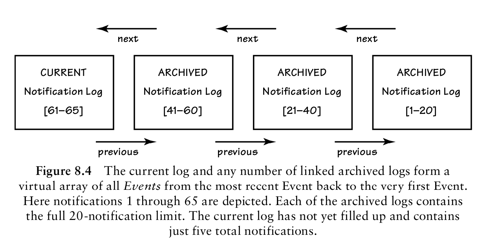

- 存档日志httpheader，缓存可以设置长些

```
HTTP/1.1 200 OK
Content-Type: application/vnd.sassovation.idovation+json
...
Link: <http://iam/notifactions/61,80>; rel=next
Link: <http://iam/notifactions/41,60>; rel=self
Link: <http://iam/notifactions/21,40>; rel=previous
...
Cache-Control: max-age=3600
...
```

### 基于消息中间件的方式
- RabbitMQ
- 对于消息系统来说，只确保对消息的投递，订阅方自己保证领域模型的正确调用

## 实现
- 发布事件通知的核心行为位于 __*应用服务*__，而不是领域服务，即使这些事件源来自领域模型
- P290 为RabbitMQ做了一层抽象

## 事件消重
- 设计幂等接收器
    + 设计领域对象幂等，不行，就将订阅方设计成幂等

模块
=============
- 项目
```
com.saasovation
```

- 模块
```
com.saasovation.identityaccess
com.saasovation.collaboration
com.saasovation.agilepm
```

- 领域：更低层模块的容器
```
com.saasovation.identityaccess.domain
com.saasovation.collaboration.domain
com.saasovation.agilepm.domain
```

- 领域模型：接口类和抽象类的容器
```
com.saasovation.identityaccess.domain.model
com.saasovation.collaboration.domain.model
com.saasovation.agilepm.domain.model
```

- 领域服务
```
com.saasovation.identityaccess.domain.service
com.saasovation.collaboration.domain.service
com.saasovation.agilepm.domain.service
```

- rest资源
```
com.saasovation.agilepm.resource
com.saasovation.agilepm.resource.view
```

- 应用层
```
com.saasovation.agilepm.application.team
com.saasovation.agilepm.application.product
```


聚合
=============
- 特别强调一个模块拥有什么，容易影响对聚合的设计，导致一个臃肿的聚合

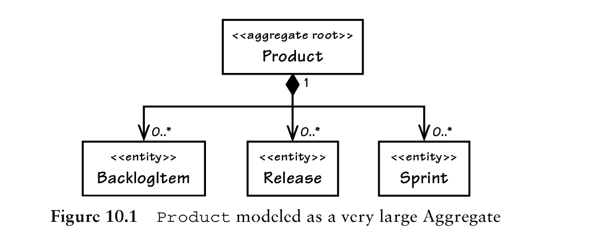

## 原则：在一致性边界之内建模真正的不变条件
- 了解模型中真正的不变条件，只有这样，才能决定什么样的对象可以放在一个聚合中
- 聚合边界之内所有内容组成了一套不变的业务规则，任何操作都不能违背这些规则，边界之外的任何东西与该聚合都是不相关的
- 设计聚合时，慎重考虑一致性，每次客户请求应该 __只在一个聚合实例上执行一个命令方法__
- 设计聚合时，关注的是聚合的一致性边界，而 __不是__ 创建一个对象树

## 原则：设计小聚合
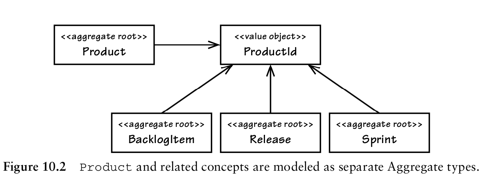

- 对于大聚合，即使可以保证事务的成功执行，它依然有可能限制系统的性能和可伸缩性
- 使用`Root Entity根实体`来表示聚合，其中包含 __最小数量__ 的属性或 __值类型__ 属性
    + 哪些属性呢：那些必须与其他属性保持一致的属性，拆分在不同聚合中是没有意义的，如name和description保持一致
- 聚合中，被包含的部分应该建模成一个实体时，考虑是否能被全部替换，而选择建模成值类型
    + 值对象可以随`根实体`一起序列化，无须联合查询

## 原则：通过唯一标识引用其他聚合
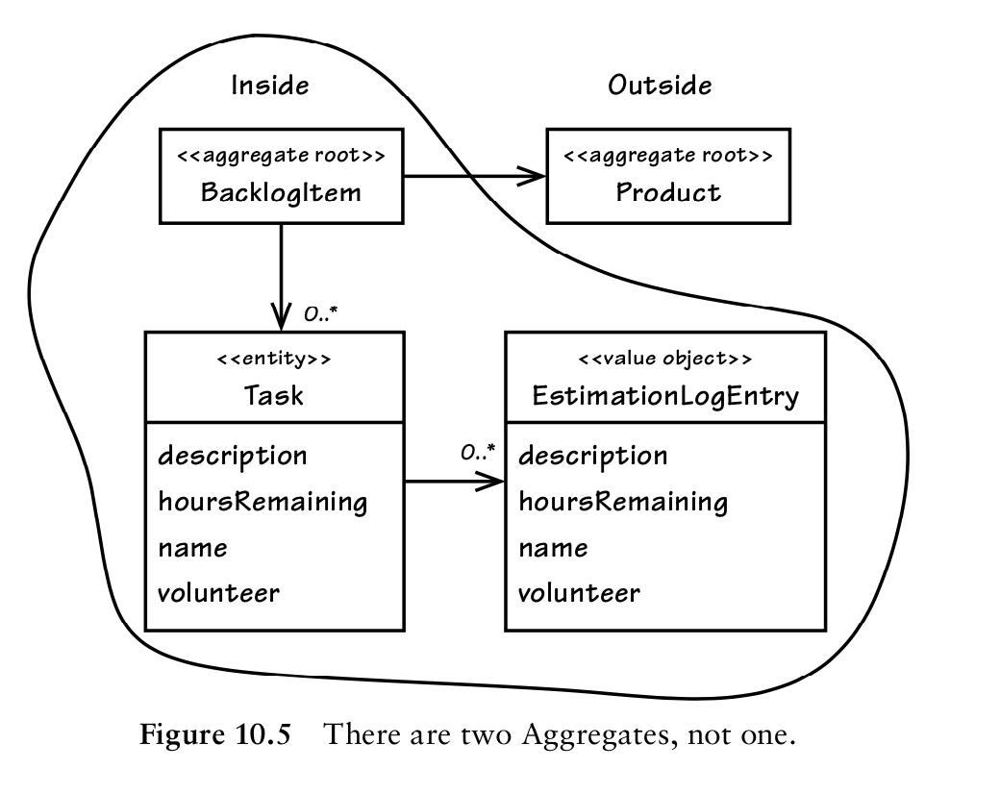

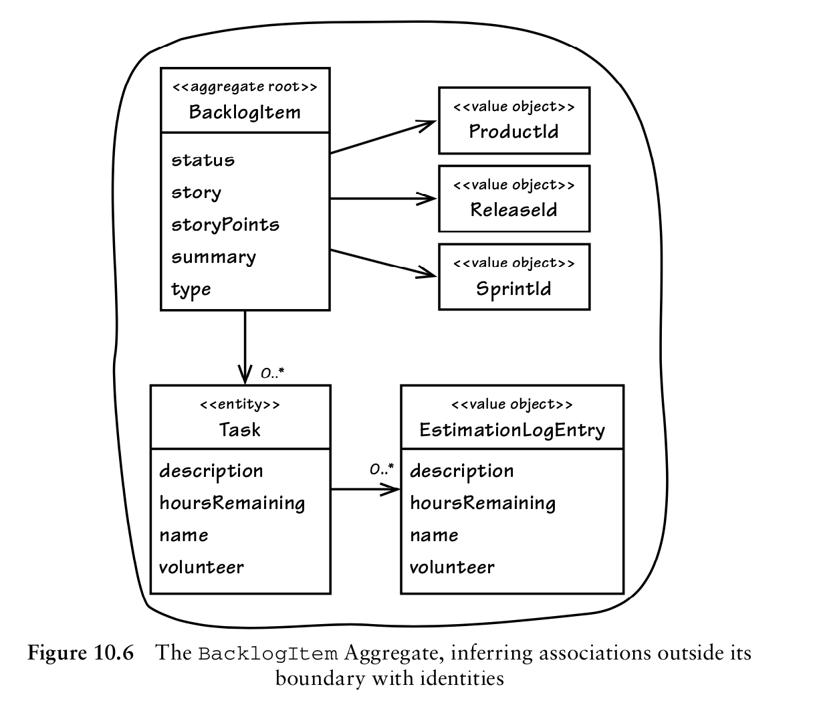

```java
public class BacklogItem extends Entity{
    private Product product;
}
```

- 引用聚合`BacklogItem`和被引用聚合`Product`不可以在同一事务中进行修改
- 试图在单个事务中修改多个聚合，意味着此时的一致性边界是错误的
- 应通过标识引用使多个聚合协同工作：

```java
public class BacklogItem extends Entity{
    private ProductId productId;
}
```

- 通过标识引用并不意味着失去了对象导航性，可使用资源库或领域服务来获取所需要的对象（通过应用服务来处理依赖关系，避免在聚合中使用资源库）
- 赢得了可伸缩性和分布式（针对不同聚合采用不同的持久化技术）

## 原则：在边界之外使用最终一致性
- 任何跨聚合的业务规则都不能总是保持处于最新状态，通过 __事件处理__、__批处理__ 或其它更新机制，我们可以在 __一定时间之内__ 处理好他方依赖
- 当在一个聚合上执行命令方法时，如果还需要在其他的聚合上执行额外的业务规则，请使用最终一致性
- 对于一个用例，是否应该由执行该用例的用户来保证数据的一致性，如果是，请使用事务一致性
- 如果需要其他用户或系统保证数据一致性，请使用最终一致性

## 打破原则的理由
- 方便用户界面
- 缺乏技术机制，没有消息机制、定时器、后台线程
- 需要全局事务
- 查询性能
- 但，总之，遵循原则对项目是更有益处的

## 避免依赖注入
- 聚合中注入资源库或领域服务是有害的
- 可以向应用服务中注入

工厂
=============
- 领域模型中的工厂，只用于创建某种聚合的对象，并不会拥有其他的职责，不会被看作是模型的一等公民
- 考虑创建过程中的一些重要细节，避免所创建的聚合处于不正确的状态
- 方便了客户端，只需要传入值对象，就能得到聚合实体

## 聚合根中的工厂方法
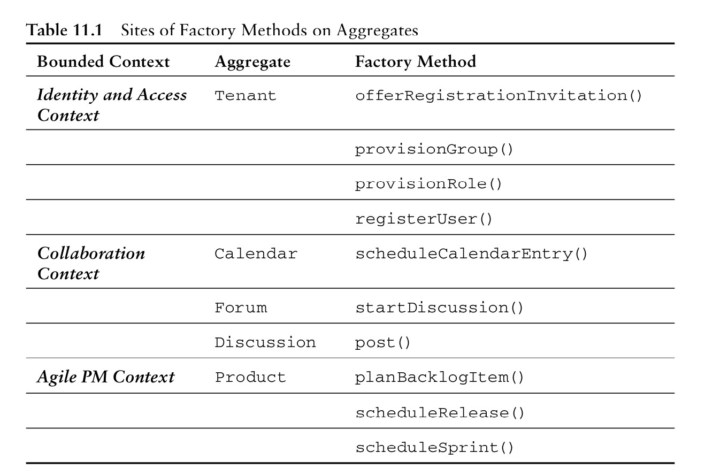

- 聚合根实体中都存在工厂方法

```java
public class Product extends Entity{
    public BacklogItem planBacklogItem(...){
        //...
    }
}
```

- 减少客户端创建对象所需准备的参数
- 事前必要的创建逻辑检查，事后发布相关消息

## 领域服务中的工厂
- 一般有集成限界上下文相关，集中在防腐层、发布语言(标准媒体格式)和开放主机服务的集成上

```java
public interface CollaboratorService{
    public Author authorFrom(Tenant aTenant, String anIdentity);
    public Creator creatorFrom(Tenant aTenant, String anIdentity);
    public Moderator moderatorFrom(Tenant aTenant, String anIdentity);
    public Owner ownerFrom(Tenant aTenant, String anIdentity);
    public Participant participantFrom(Tenant aTenant, String anIdentity);
}
```

- 客户将用户和角色翻译成自己上下文中的协作对象（防腐层）

```java
public class UserRoleToCollaboratorService implements CollaboratorService{
    @Override
    public Author authorFrom(Tenant aTenant, String anIdentity){
        return (Author)UserInRoleAdapter.newInstance()
                                        .toCollaborator(
                                                aTenant, 
                                                anIdentity, 
                                                "Author", 
                                                Author.class);
    }
}
```

资源库
=============
- 严格来讲，只有聚合才有资源库。
- 如果一个限界上下文没有使用聚合，只有随机的、直接的获取和使用实体，而不用考虑聚合的事务边界，那么也可以不考虑使用资源库


## 面向集合的资源库
- `java.util.Collection`
- `java.util.HashSet`
- 对类库的集合类型再次封装成需要的类型（组合优于继承）
- 如果需要提供持久化机制，因为不存在`save()`方法，需要隐式跟踪发生在每个持久化对象上的变化
- 资源库接口一个重要方面是查找方法，提供全局唯一标识

```java
public interface CalendarEntryRepository{
    public void add(CalendarEntry aCalendarEntry);
    public void remove(CalendarEntry aCalendarEntry);

    public CalendarEntry calendarEntryOfId(Tenant aTenant, CalendarEntryId aCalendarEntryId);
    public Collection<CalendarEntry> calendarEntriesOfCalendar(Tenant aTenant, CalendarId aCalendarId);

    public CalendarEntryId nextIdentity();
}
```

- 实现该接口的类，存放在何处

```java
package com.saasovation.collaboration.domain.model.calendar.impl;
public class HibernateCalendarEntryRepository implements CalendarEntryRepository{
    //...
}
```

```java
package com.saasovation.collaboration.infrastructure.persistence;
public class HibernateCalendarEntryRepository implements CalendarEntryRepository{
    //...
}
```

- 后一种方式放在基础设施层（位于所有层之上），向下单向引用领域层，使用依赖倒置，达到领域层对实现完全无依赖（前一种依赖hibernate，后一种根本不知道hibernate的存在）

- 实现时，__不__ 要依赖框架去实现 __级联删除__，而显示的手工删除
- 使用资源库来管理持久化，而不是聚合

## 面向持久化的资源库
- 针对mongodb/gemfire等持久化设施
- 需要手工的进行save/put，而不是unit of work帮助save或update了(如hibernate)
- p386对mongodb的使用示例

## 管理事务
- 事务管理（针对关系型数据库）不应该放在领域模型和领域层中，它们是细粒度的操作，它们也不应该意识到事务的存在
- 通常事务放在 __应用层__，为每组相关用例创建一个门面

```java
public class SomeAppServiceFacade{
    public void doSomeUseCaseTask(){
        Transaction transaction = null;
        try{
            transaction = this.session.beginTransaction();
            //使用领域模型
            //...
            transaction.commit();
        } catch(Exception e){
            if(transaction != null){
                transaction.rollback();
            }
        }
    }
}
```

- 对领域模型的修改添加到事务中，必须保证资源库实现与事务使用了相同的Session或Unit of Work

## 类型层级
- 使用单个资源库来保存和获取层级中的不同聚合类型（继承自共同基类），客户端无须知道它们的实际类型，里氏替换原则
- 但聚合子类较少时，不同聚合类提供单独的资源库，只有聚合子类多时，同时它们又完全可互换时，才共享一个资源库

集成限界上下文
==============
## 通过REST资源集成限界上下文
- 当一个限界上下文以URI的方式提供了大量的REST资源时，便可称其为`开放主机服务`
- 分析：将身份访问上下文以REST方式显露出来，可以获取一个租户，然后访问其中用户、用户群和角色等，这是一种好方式吗？这使得消费方与身份访问上下文紧耦合起来，称为遵奉者，而不是开放主机服务，应从集成方所需用例来看待问题：集成方真正关心的是用户是否扮演某个角色

```
GET /tenants/{tenantId}/users/username/inrole/{role}
```

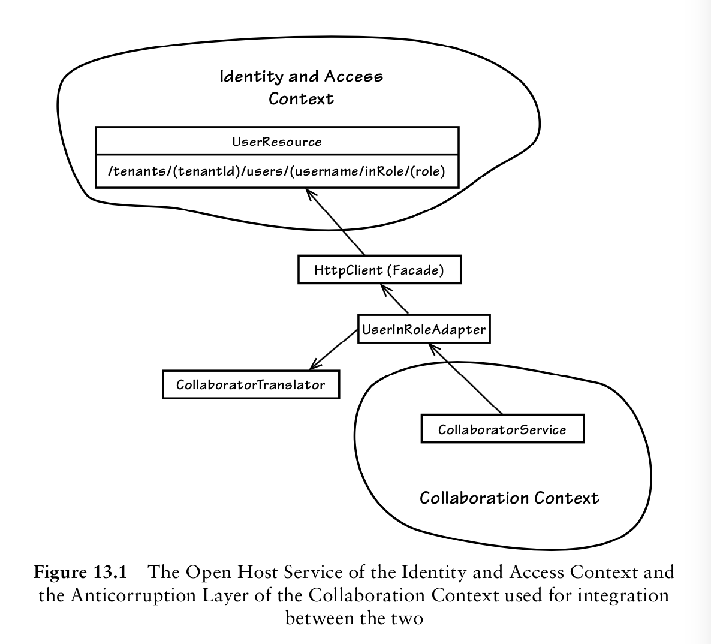

## 通过消息集成限界上下文
- 如何解决事件接受顺序并不是发送顺序的问题？消息上加上时间戳，并且消息中含有最终状态，先前事件后续到达则抛弃
    + REST Atom的方式则不存在这个问题

### 长时处理过程
p439


应用程序
============
## 用户界面
### 将领域对象渲染到用户界面的显示中
- 用户界面通常需要 __渲染多个__ 聚合实例中的属性，但往往只会 __修改其中一个__ 聚合实例
- 渲染多个聚合实例时：
    + 可使用数据传输对象DTO
    + 使用调停者模式（双分派+回调），客户端实现调停者接口，并把实现对象传给聚合，聚合双分派给调停者以发布自身状态
    + 通过领域负载对象渲染聚合实例，与DTO不同的是，该对象持有所有聚合实例的引用
    + 用例优化资源库查询，在资源库（不会直接与数据库打交道）中创建一些查询方法，返回所有聚合实例属性的超集，查询结果放到一个值对象中（特别为当前用例设计的）
- 基于用例来创建状态展现（视图模型），而不是聚合实例  

### 将用户操作反映到领域模型上
- 展现模型代表视图向应用服务提供一个最小化门面；简单的将处理逻辑委派给更复杂、更重量级门面-应用服务

## 应用服务
- 应用服务中方法签名可以只出现原始类型，或DTO，或`命令对象`：将一个请求封装到一个对象中，还支持撤销操作
- 系统内部使用的应用服务，需要声明式的安全授权
- 将输出写到端口中，不是由聚合实例的方法直接返回的，而是调用方法后，会发布领域事件，事件发布便是端口输出（异步模式）

## 组合多个限界上下文
- 上游模型中的概念被集成到下游模型中，采用的方法是将上游概念翻译下成游模型中术语
- 由于是应用层来管理用例，最简单的方法是创建一个单一的应用层，并使用应用层来组合多个模型

## 基础设施
- 应用服务依赖于领域模型中资源接口，而接口实现位于基础设施中（依赖倒置），资源库的查找可通过依赖注入或服务工厂隐式的完成

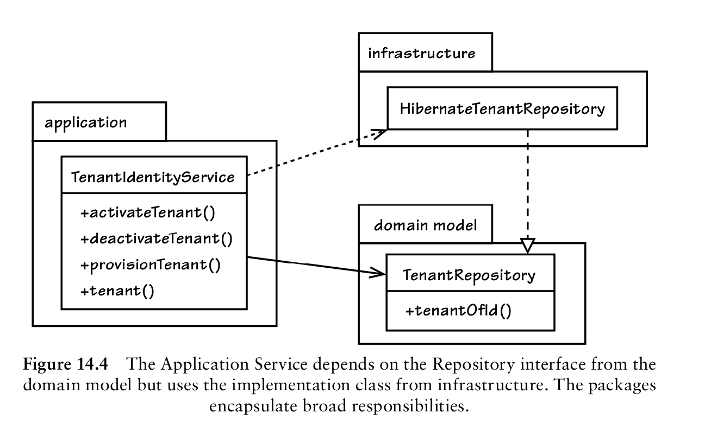


聚合与事件源：A+ES
==================
- https://github.com/jimitndiaye/lokad-iddd-sample


- Aggregate + Event Sourcing
- A+ES中，事件既被用于聚合的持久化，又被用于不同系统之间通信
- 优势在于：
    + 事件源确保每次聚合改变的原因都不会丢失（传统序列化聚合到数据库方式时，总会覆盖先前的序列化状态，并无法被恢复）
    + 只追加特性，使事件源具有很高的性能，并且支付不同的数据复制方案
    + 关注点集中于通用语言所表达的行为上，并不存在ORM中的阻抗失配
- 缺点在于：
    + 需要对业务领域有很深的了解，只有复杂模型才配得上这样的付出
    + 必要需要命令查询职责分离，并很难对事件流进行查询

## 应用服务内部

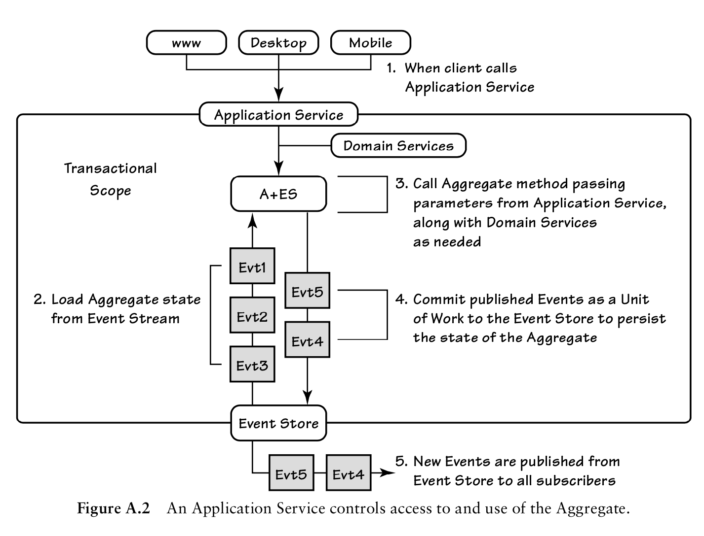


- `Mutate()`方法可以重放各个事件，用于重建聚合（可方便重建到某个状态，利于产品环境调试）
- 聚合重建好后，应用服务再把处理逻辑委派给聚合实例的一个方法，聚合实例将使用其当前状态以及领域服务来执行业务操作，随着行为执行，对聚合状态修改将通过新事件予以记录，之后每个新事件会传给聚合的`Apply()`方法
- A+ES实现分成两个类，一个状态类，一个行为类，行为对象持有状态对象，保证状态只能通过事件进行修改


- 聚合行为产生的新事件被发布给订阅方

## 读模型投射
- 事件源并没有提供一个简单的方式回答“最近一个月所有客户的订单总量是多少”，这时使用读模型投射，用一组简单的领域事件订阅方来生成和更新读模型（对应传统开发中的数据表）
- 读模型只是一个DTO，针对不同应用服务产生相应的读模型
- 读模型完全可以替换丢弃，再通过事件流重建

