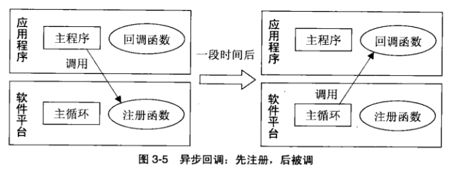
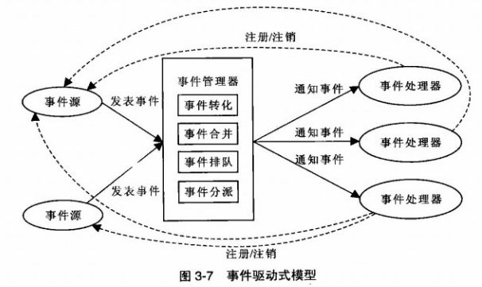
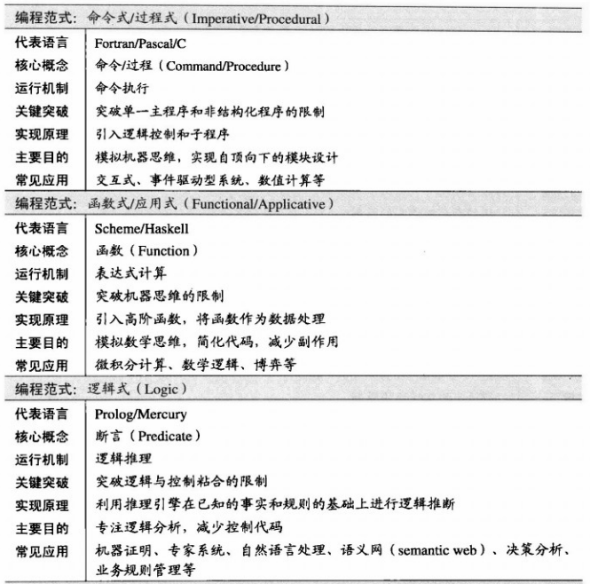
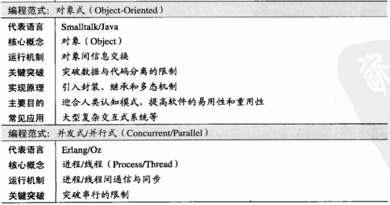
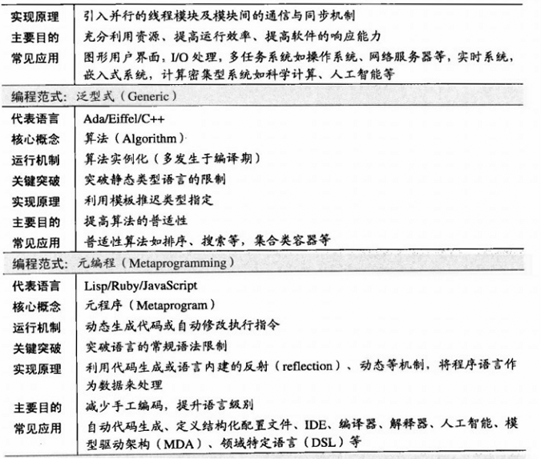
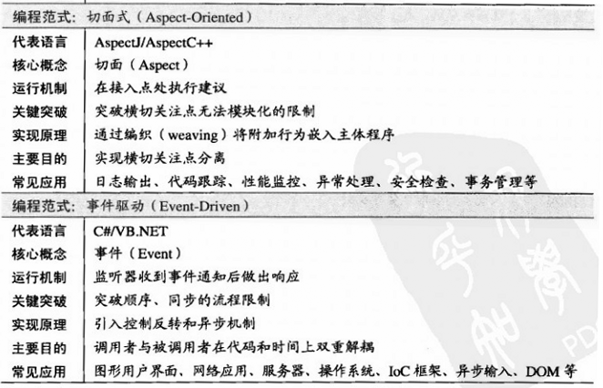
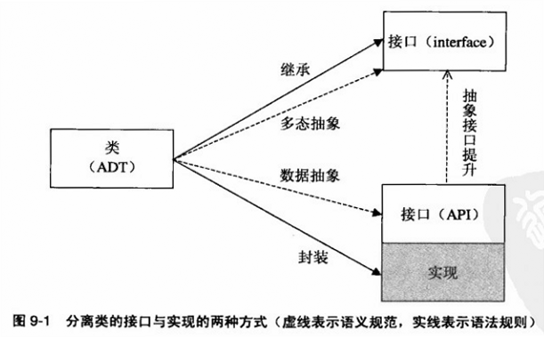
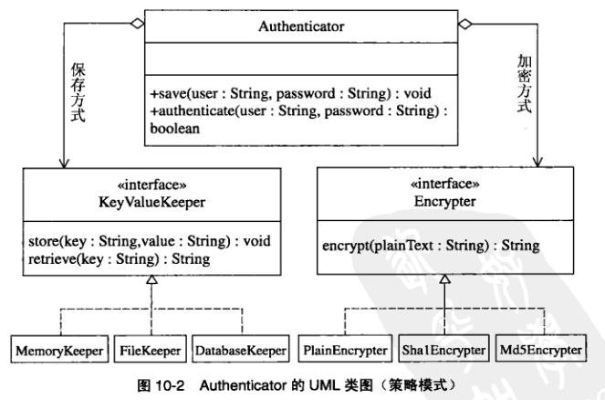

> 2012-07-21

概述
======

## 初识范式

所谓编程范式(programming paradigm)，指计算机编程的基本风格或典范模式，是编程者在创造虚拟世界时采用的 __世界观__ 和 __方法论__，编程是为了解决问题，而解决问题可以有 __许多种视角和思路__，其中普适且行之有效的模式被归结为范式。由于着眼点和思维方式不同，相应的范式自然各有侧重和倾向。

- 世界观：体现在语言的 __核心概念__ 中
- 方法论：体现在语言的 __表达机制__ 中

## 开发技术

- 任何概念和技术都不是孤立的，需要在 __纵向的时间__ 和 __横向的联系__ 中找准坐标
- 学习编程范式能增强编程语言的语感，否则一个惯用C语言的人只会写出'C式C++'，而不具备OOP的语感

### 库和工具包 vs 框架
- 库和工具包是为程序员带来 __自由__ 的，框架是为程序员带来 __约束__ 的
- __宏观管理__ 上选取一些框架以控制整体的结构的流程。利用控制反转(IOC)等机制实现对各模块的统一调度
- __微观实现__ 上利用库和工具包来解决具体的细节问题

### 设计模式 vs 架构
- 设计模式是软件的 __战术__ 思想，架构是软件的 __战略__ 决策
- 设计模式是针对某些经常出现的问题而提出的行之有效的设计解决方案，它侧重 __思想重用__，因此比框架更抽象，更普适，但多限于局部解决方案，没有框架的整体性。
- __惯用法(idiom)__，也是针对常发问题的解决方案，但 __偏重实现__ 而非设计，__与实现语言密切相关__，是一种更底层更具体的编程技巧
- 架构指一个系统的最高层次的 __整体结构和规划__，一个架构可能包含多个框架，而一个框架可能包含多个设计模式。

重要范式
=========

## 命令范式-一切行动听从指挥

### 命令式编程
命令式编程(imperative programming)是冯.诺伊谩机运行机制的抽象

- 世界观是：程序是由若干行动指令组成的有序列表
- 方法论是：用变量来存储 __数据__，用语句来执行 __指令__

> 语言的演化是渐进的，大多数语言追根溯源是汇编语言的升级，而作为与机器语言一一对应的汇编语言自然是命令式的，因而这种范式最为传统和普及。理论上说，完全可以有非命令式的机器语言存在，前提是计算机采用了特殊的硬件实现，比如非冯.诺伊谩结构的数据流机(dataflow machine)和规约机(reduction machine)，但这类计算机并未流行于市，相应的机器语言自然罕见

- 过程式编程(procedural programming)是指引入了过程、函数或子程序的命令式编程。现代语言命令式均具备此特征，故二者不加区分

### 结构化编程
结构化编程(structured programming，简称SP)，是在过程化编程的基础上发展起来的，本质是一种 __编程原则__，提倡代码应具有清晰的逻辑结构，以保证程序易于读写、测试、维护和优化。

> 在20世纪60年代首次软件危机中，它曾起中流砥柱。Pascal是遵循结构化编程原则设计而来的

- 微观上：主张 __循规守矩__，采用3种逻辑结构，限制goto使用
> goto语句可以跳到程序过程中的任一点，造成 _静态程序_ 与 _动态进程_ 之间的差异，影响程序可读性
- 宏观上：主张 __分而治之__，采用自项向下的设计
- 按结构化思想设计的流程图，每个模块大小适中、模块之间关系简明、模块内部线路清晰
- 根据结构化定理，任何程序都可以用顺序(concatenation)、选择(selection)和循环(repetition)等3种基本控制结构来表示。结构化编程就是在三种基本结构的基础上进行嵌套组合。

## 声明范式-目标决定行动
### 声明式与命令式区别
- 声明式编程由若干规范(specification)的声明组成，即一系列陈述句“已知这，求解那”，强调“__做什么__”，而非“怎么做”，声明式编程是人脑思维方式的抽象，利用数理逻辑或既定规范对已知条件进行推理或运算
> 声明式编程产生于人工智能的研究，主要包括 __函数式编程__(functional programming，简称FP)和 __逻辑式编程__(logic programming，简称LP)
- 命令式编程是 __行动导向__ 的，因而算法是显性而目标是隐性的；声明式编程(declarative programming)是 __目标驱动__ 的，因而目标是显性而算法是隐性的。

C(命令式)

<!--language: c-->

    int factorial(int n){
        int f = 1;
        for (; n > 0; --n) f *= n;
        return f;
    }

Lisp(函数式)

<!--language: lisp-->

    (defun factorial(n)
          (if (= n 0) 1
          (* n (factorial(- n 1)))))

Prolog(逻辑式)

<!--language: prolog-->

    // 0! 等于1
    factorial(0,1).
    // 若M等N-1且M!等于Fm且F等于N*Fm，则N!等于F
    factorial(N,F) :- M is N-1, factorial(M,Fm), F is N* Fm.

上述三种语言，C明确给出了阶乘的迭代算法，而Lisp仅描述了阶乘的递归定义，Prolog则陈述了两个关于阶乘的断言

> 当然C也可以递归实现，但 __命令式语言提倡迭代而不鼓励递归__，除尾递归(tail recursion)外，一般递归比迭代开销(overhead)大。相反 __声明式语言提供递归而不支持迭代__，迭代着眼微观过程，而递归放眼宏观规律

- 声明式编程让我们重回 __数学思维__：
    - 函数式编程类似代数的表达式变换和计算
    - 逻辑式编程则类似数理逻辑推理
    - 变量也如数学中一样，是抽象符号而非内存地址，没有赋值运算，不会产生变量被改写的副作用(side-effect)，也不存在内存分配和释放问题

- 声明式语言擅长于 __数理逻辑的应用__，如人工智能、符号处理、数据库、编译器等，对 __基于业务逻辑__ 的，尤其交互式或事件驱动型的应用，显然命令式语言更有用武之地

### 三种核心编程范式的比较

<!--language: table-->

    |范式  |程序    |输入    |输出    |程序设计|程序运行  |
    |------|--------|--------|--------|--------|----------|
    |命令式|自动机  |初始状态|最终状态|设计指令|命令执行  |
    |函数式|数学函数|自变量  |因变量  |设计函数|表达式变换|
    |逻辑式|逻辑证明|题设    |结论    |设计命题|逻辑推理  |

### 声明式的其它形式
- C#中attribute，java中annotation采用具有声明式特征的 __属性导向式__ 编程(Attribute-Oriented Programming，简称@OP)。
- 数据库语言SQL、样式语言XSLT、CSS、__标记语言__ HTML、XML、SVG、__规范语言__ IDL(Interface Description Language)等都是声明式的，它们大多是领域特定语言，且不少并非图灵完备。
- Prograph、SISAL等数据流语言，采用 __数据流编程__(Dataflow Programming)
- Oz、CHIP等支持与逻辑式编程相交的 __约束性编程__(Constraint Programming)

## 对象范式-民主制社会的编程法则
OOP(Object-Oritented programming)是一种计算机编程模式，它将对象作为问题空间的基本元素，利用对象和对象间的相互作用来设计程序，所谓对象，是实际问题中实体的抽象，具有一定的属性和功能。

- OOP虽然是在命令式的基础上发展起来的，但其核心思想可泛化为：__以数据为中心组织逻辑__，将系统视为相互作用的对象集合，并利用继承与多态来增强可维护性、可扩展性和可重用性
- 命令式、函数式和逻辑式互相平行，__而OOP与它们正交__：Clos成为OO版的Lisp，Prolog也有融入OO特征的扩充，如visual prolog
- OOP最适用于大型复杂的、交互式的，与现实世界密切相关的系统，小型应用、数学计算、符号处理等方面并无优势。
- 将可维护性、可扩展性和可重用性与OOP划等号，是只见树木，不见森林，因为那是所有范式和语言的共同目标。
    - C语言中，信息隐藏可用 __static__ 来实现，继承可用 __合成__ 来代替，多态可用 __函数指针__ 来实现。

### 过程式编程与OOP区别
- 过程式编程的理念是以过程为中心，自顶向下、逐步求精，类似数学证明中分析法，执果索因的逆推法；OOP则相反，以数据为中心，自底向上、逐步合并，类似数学证明中的综合法，执因索果的正推法。
- 过程式编程，树干改变容易导致树枝相应改变，一旦 __用户需求发生变化__，维护起来不易，而OOP从树叶开始设计，离用户需求较远，__抽象程序较高__，受波及程序较小，更易维护和重用
- OOP以对象为基本模块，使设计更人性化，接近人类的 __认知模式__：`牛.吃(草)` vs `吃(牛,草)`
- 与其说OOP重用性，不如说更具 __易用性__，C函数不像Java对象，本身没有状态，只有依靠参数传递或外部变量来维持相关函数之间的联系，而OOP就是将 __相关函数用数据粘合__，重新包装后再贴上对象标签。
- 过程式编程的模块以函数为单位，而OOP的模块以对象为单位，函数是被动的实体，对象是主动的实体
    - 过程式程序的世界是君主制，等级分明，听命于上级，对下级发号施令，最终为国王服务。
    - OO程序是民主制，所有对象独立而平等，有权保护自己财产与隐私，向他人寻求服务，有义务为他人提供承诺的服务，公民间通过信息交流来协作完成任务

### OO三大特性
- 封装：使公民拥有 __个体__ 身份，须对自己负责
- 继承：使公民拥有 __家庭__ 身份，须对家庭负责
- 多态：使公民拥有 __社会__ 身份，须对社会负责

## 并发范式-合作与竞争
真正的并发式编程(concurrent programming)，不只是调用线程API，使用`synchronized`、`lock`之类那么简单，从宏观架构设计，到微观的数据结构、流程控制乃至算法，比串行式编程都可能发生变化

- 并发式编程以 __进程为导向__ 、以 __任务为中心__ 将系统模块化
- 以 __资源共享与竞争__ 为主线，意味着程序设计将围绕进程的划分与调度、进程间的通信与同步等来展开
> 同步(synchronization)只在采用 __共享内存__(shared memory)的并发模型中需要，采用 __消息传递__(message passing)的并发模型中(如Erlang)并不需要
- 它同OO一样，与3大核心范式正交，并发式进程个数为1即为传统串行式编程，对象个数为0即传统的数据类型。

### 合理并发式设计的考量
- 软件易于重用、维护、测试
- 公平有效地利用资源，优化程序性能如增大吞吐量、减少响应时间、提高效率等
- 保障进程安全，防止竞态条件(Race Condition)
- 保持进程活性，避免死锁、饥饿、活锁、资源枯竭
- 减少锁开销，上下文切换等带来的性能损失
- 妥善处理多进程在算法、调试方面带来的复杂性

### 编程语言对并发的支持
- Ada、Java、C#在 __语言级别__ 上支持并发，在语法上对并发编程有一定的支持
- C、C++选择交由操作系统处理，除关键字`volatile`外，主要靠 __库函数__ 支持
- 专门为并发式而设计的，如Erlang

### 与OO区别
- 并发式以任务为单位，而OO以对象为单位
- 子系统中交流与合作时，并发式以竞争为主题，而OO以服务为主题

## 五种范式小结

<!--language: table-->

    |范式    |体系      |模块    |模块关系    |
    |--------|----------|--------|------------|
    |过程式  |君主体系  |过程    |授命与听命  |
    |函数式  |数学体系  |函数    |替换与合成  |
    |逻辑式  |逻辑体系  |断言    |归纳与演绎  |
    |对象式  |民主体系  |对象    |交流与服务  |
    |并发式  |生产体系  |进程    |竞争与合作  |

常用范式
=========
## 泛型范式-抽象你的算法

- 泛型编程(Generic Programming，简称GP)是 __算法导向__ 的，即以算法为起点和中心点，逐渐将其所涉及的 __概念__(数据结构、类)内涵模糊化、外延扩大化，将其所涉及的 __运算__(函数、方法、接口)抽象化、一般化，从而 __扩展算法的适用范围__。

- 基本思想是：将算法与其作用的数据结构分离，并将 __后者__ 尽可能泛化，这种泛化是基于模板(template)的 __参数多态__(parametric polymorphism)，相比OOP的基于继承(inheritance)的 __子类型多态__(subtyping polymorphism)，普适性更强，效率也更高。但用法稍微复杂一些，可读性稍差一些。

### 泛型实现机制
- C++和D采用类型模板(template)，最著名代表是STL(Standard Template Library)
- Java采用类型擦除(type erasure)
- C#采用类型具化(reification)

C++(泛型编程)

<!--language: cpp-->

    template <typename T>
    T max(T a, T b){
        return (a > b) ? a : b;
    }

C(宏定义)

<!--language: c-->

    #define max(a,b) ((a) > (b) ? (a) : (b))

在C中可用宏定义(macro definition)来实现，但无法保证类型安全，而C++模板兼顾类型安全和代码重用，并且由于在编译期间展开，效率上也不损失，且由于C++支持运算符重载，一切定义了`>`运算的数据类型均可调用`max`函数

### STL三要素
- __算法__(algorithm)：一系列切实有效的步骤
- __容器__(container)：是数据的集合，可理解为抽象的数组
- __迭代器__(iterator)：是算法与容器之间的接口，可理解为抽象的指针或游标

### STL示例
- 请问它们共同之处，能否共享代码
    - 从一个整数数组中随机抽取十个数，对其中的素数求和
    - 将一个无序整数集中所有的完全平方数换成其平方根
    - 从学生成绩表中，列出门门都及格且平均分在70分以上的学生名单
    - 在一个着色二元树中，将所有红色结点涂成蓝色
    - 将一个字符串从倒数第3个字符开始反向拷贝到另一个字符串中
    - 每从标准输入读取一个非数字的字符X，于标准输出打印"X不是数字字符"

- 只有抽象出表面的数据，算法的脊梁才能显现，以上几题运算泛型思维，可发现它们共性：对指定集合中满足指定条件的元素进行指定处理

<!--language: cpp-->

    template <class Iterator, class Act, class Test>
    void process(Iterator begin, Iterator end, Act act, Test test){
        for (; begin != end; ++begin)
            if (test(*begin)) act(*begin);
    }

比起前面`max`模板，这里连元素的数据类型T都没有，因为元素被容器封装了，只需通过它的迭代器参与算法：

- 泛化了 __容器__，可以是数组、列表、集合、映射、队列、栈、字符串等
- 泛化了 __元素__，可以是任何数据类型
- 泛化了 __处理方法和限定条件__，可以是任何函数，甚至是函子(functor)－－自带状态的函数对象，即除了泛化概念，还能 __泛化行为__
- 泛化了 __迭代器__，可以从前往后移动，也可以从后往前移动，可以来回移动，可以随机移动，可以按任意预先定义规律移动

以下为第6题实现：

<!--language: cpp-->

    #include <iostream>
    #include <vector>
    #include <fstream>
    #include <iterator>

    using namespace std;

    template <class Iterator, class Act, class Test>
    void process(Iterator begin, Iterator end, Act act, Test test){
        for (; begin != end; ++begin)
            if (test(*begin)) act(*begin);
    }

    bool notDigit(char c){
        return (c<'0') || (c>'9');
    }

    void printNondigit(char c){
        cout << c << " not digit" <<endl;
    }

    int main() {
        process(istream_iterator<char>(cin), istream_iterator<char>(), printNondigit, notDigit);

        return 0;
    }

完全看不到IO读取的过程，也看不到迭代循环，让人摆脱了底层编码细节，在更高 __更抽象__ 的层次上进行编程设计，用一种新的视角去审视问题。

## 超级范式-提升语言级别
元程序 __将程序作为数据对待__，能自我发现、自我赋权和自我升级，有着其他程序所不具备的自觉性、自适应性和智能性，是一种更高级的程序。

### 元编程
- 模板元编程(Template Metaprogramming)与泛型编程密切相关但自成一派，隶属于另一种编程范式－__元编程__(Metaprogramming，简称MP)

<!--language:!cpp-->

    #include <iostream>
    using namespace std;

    template <int N>
    struct factorial{
        enum { value = N * factorial<N-1>::value};
    };

    template <>
    struct factorial<0>{
        enum { value = 1};
    };

    int main(){
        cout << factorial<5>::value << endl;
        return 0;
    }

这里阶乘的值是在 __编译时__ 而非运行时计算出来的，是以模板形式通过编译器生成了新的代码，并在编译期间获得执行。

- Lex和Yacc编写编译器和解析器的工具
- 除上述在编译期间生成源代码的 __静态元编程__，还有在运行期间修改程序的 __动态元编程__，如JavaScript用字符串构建`Function`，Ruby提供了`define_method`、`instance_eval`等元编程方法

### DSL

- 领域特定语言DSL，灵活方便地处理客户逻辑，比通用语言更简单、更抽象、更专业、更接近自然语言和声明式语言，开发效率提高
- Hiberate中HQL就是典型的DSL，通过ANTLR来解析(ANother Tool for Language Recognition，能生成C,C++,Java,C#,Python等)
- 语言导向式编程(Language-Oriented Programming，简称LOP)，在建立一套DSL体系之后，直接用它们来编写软件

### 代码生成
- 各种IDE通过向导、拖放控件等方式自动生成源代码；UML建模工具将类图转换为代码；Servlet引擎将JSP转换为Java代码等
- 生成的代码，不需要被管理（小操作造成生成上差异很大，削弱版本控制意义），而元程序数据需要版本化，简明而直观
> 同理，没法记录的东西，不方便自动化与重放，比如调试，用单元测试与log取而代之
- 自动生成源代码的编程也属于另一种编程范式－产生式编程(Generative Programming)，只是它更看重代码的生成，而元编程看重的是生成代码的可执行性。

## 切面范式-多角度看问题

### 抽象与分解
- 不良代码的病征：
    - __结构混乱__，或聚至纠缠打结、或散至七零八落
    - __代码重复__，叠床架屋、臃肿不堪
- 有效方式是 __抽象与分解__：从问题中抽象出一些关注点，再以此为基础进行分解。抽象是 __前提__，分解是 __方式__，模块化是 __结果__
    - 将程序分别抽象为过程、函数、断言、对象和进程，就依次成为过程式、函数式、逻辑式、对象式和并发式
    - 抽象出算法后与数据分离，就成了泛型式
    - 切面式的AOP将程序抽象分解为 __切面__，以切面为模块
- 抽象与分解原则：__单一化，正交化__。每个模块职责明确专一，模块间相互独立，高内聚低耦合(high cohesion & low coupling)。
    - 此原则相当普适，是分析复杂事物的一种基本方法，在数学和物理中应用广泛：质因式分解、正交分解、谱分解
    - 在数学中互为正交的两个向量在彼此方向上投影为零，意味着彼此独立、互不影响

### Soc与DRY
Soc(Separation of Concerns)即关注点分离，DRY(Don't Repeat Yourself)即尽量减少重复代码。

### Aspect
- 切面Aspect，描述的是横切关注点(cross-cutting concerns)，是与程序的 __纵向主流__ 执行方向 __横向正交__ 的关注焦点。
- 调用某些对象的方法、读写某些对象的域、抛出某些异常等前后需要用到统一的业务逻辑，诸如日志输出、代码跟踪、性能监控、异常处理、安全检查、事务管理等，难以实现Soc与DRY时
- AOP将每类横切关注点封装到单独的Aspect模块中，将程序中的一些执行点与相应的代码绑定起来
    - 单个的执行点称为 __接入点__(join poing)，如调用某个对象的方法前后；
    - 符合预先指定条件的 __接入点集合__ 称为 __切入点__(pointcut)，如所有以set为命令开头的方法；
    - 每段绑定的代码称为一个 __建议__(advice)
- __接入点 vs 切入点__
    - 接入点是点，切入点是面，advice定义了切入点上，执行于接入点处，共享一段附加代码的接入点组成了一个切入点
    - 切入点一般用条件表达式来描述，不仅有广泛性，还有预见性（以后新增的代码如果含有满足切入点条件的接入点，advice代码便自动附着其上）

### AOP与OOP
OOP只能沿着继承树的纵向方向重用，而AOP则弥补了该不足，可以在横向方向重用，AOP不是OOP的分支，也不能说超越了OOP，而是一种补充，尽管AOP并不局限于OOP语言

### AOP实现机理
如果一个程序是一个管道系统，AOP就是在管道上钻一些孔，在每个孔中注入新的代码流。因此AOP的实现关键是将advice的代码嵌入到主体程序中，术语称 __编织__(weaving)。

- 静态编织，通过修改源码或字节码(bytecode)在编译期(compile-time)、后编译期(post-compile)或加载期(load-time)嵌入代码，可能用到元编程和产生式编程
- 动态编织，通过代理(proxy)等技术在运行期(run-time)实现嵌入
- 工具：扩展性语言AspectJ、AspectC++、Aspect#；框架AspectWerkz、Spring等

## 事件驱动-有事我叫你,没事别烦我
侦查事件与响应事件两项任务进行了正交分解，降低了软件的耦合度和复杂度。

### 流程驱动 vs 事件驱动

采用主动去轮询(polling)，行为取决于自身的观察判断，是流程驱动的，符合常规的流程驱动式编程(Flow-Driven Programming)的模式，采用被动等通知(notification)，行为取决于外来的突发事件，是事件驱动的，符合常规的事件驱动式编程(Event-Driven Programming，简称EDP)的模式

### 事件的类型
- 基于事件驱动的系统一般提供两类的内建事件(built-in event)：
    - 底层事件(low-level event)或称原生事件(native event)，在GUI系统中，这类事件直接由鼠标、键盘等硬件设备触发
    - 语义事件(semantic event)，一般代表用户的行为逻辑，是若干底层事件的组合，比如鼠标拖放多表示移动被拖放的对象，由鼠标按下、鼠标移动、鼠标释放三个底层事件组成
- 除此之外，还有一类用户自定义事件(user-defined event)，可以是在原有的内建事件的基础上进行的包装，也可以是纯粹的虚拟事件(virtual event)
- 除外界激发的自然事件(natural event)，有时程序员需要主动激发一些事件，比如模拟用户鼠标点击或键盘输入(createEvent,trigerEvent)，称为合成事件(synthetic event)

### Windows消息机制

<!--language: c-->

    ...WinMain(...){
        // 第一步，注册窗口别
        ...;
        windowClass.lpfnWndProc = WndProc; // 指定该类窗口的回调函数

        windowClass.lpszClassName = windowClassName;
        RegisterClassEx(&windowClass);

        // 第二步，创建一个上述类别的窗口
        CreateWindowEx(..., windowClassName, ...);
        ...;

        // 第三步，消息循环
        while (GetMessage(&msg, NULL, 0, 0) > 0) { // 获取消息
            TranslateMessage(&msg); // 翻译消息
            DispatchMessage(&msg); // 分派消息
        }
    }

    // 第四步，窗口过程（处理消息）
    ...WndProc(..., msg, ...){
        switch (msg){
            case WM_SIZE: ...; // 用户改变窗口尺寸
            case WM_MOVE: ...;
            case WM_CLOSE: ...;
            ...;
        }
    }

- 消息是Windows内部最基本的通信方法，事件需要通过消息来传递，是消息的主要来源，每当用户触发一个事件，系统将其转化为消息并放入相应程序的消息队列(message queue)中，先入系统消息队列，再放入应用程序消息队列。
- `DispatchMessage`如何联系到`WinProc`？`DispatchMessage`的消息参数含有事发窗口的句柄(handle)，从而可以得到窗口过程`WinProc`，`(WNDPROC)GetWindowLong(msg.hwnd, GWL_WNDPROC)`，而当初创建窗口时指定了窗口类别，后者又绑定了窗口过程。
- 编程者自己写的应用层函数`WinProc`，却不直接调用它，而是通过库函数间接调用，这类函数称为：回调函数(callback)
- 消息循环不依赖于应用程序，完全可提炼出来作为library一部分，MFC就作了此处理
，假设窗口过程由应用程序直接调用，那么消息循环中代码将不具独立性，__无法作为公因子分解出来__

### 回调机制

- 函数指针是C和C++用来实现callback的一种方式，此外抽象类、接口、C++中的泛型函子(generic functor)和C#中的委托(delegate)都可以实现callback

- 在软件模块分层中，低层模块为高层模块提供服务，并且不能依赖高层模块，以保证其可重用性；另一方面，通常被调用者(callee)为调用者(caller)提供服务，调用者依赖被调者，两者结合，决定了低层模块多为被调用者，高层模块为调用者，但并不总合适，低层模块为了追求更强的 __普适性和可扩展性__，有时也有调用高层模块的需求

<!--language: java-->

    String[] strings = {"Please", "sort", "the", "strings", "in", "REVERSE", "order"};
    Arrays.sort(string, new Comparator<String>(){
        public int compare(String a, String b){
            return -a.compareToIgnoreCase(b);
        }
    });

- callback使得Array.sort不再局限于自然排序，允许用户自行排序规则，大大提高了算法的重用性

### 同步回调 vs 异步回调
- 字符串数组排序中，callback作为参数传入低层的函数后，很快就在该函数体中被调用；而窗口程序中，callback则先被储存起来，至于何时被调用是未定之数。前者称为同步(synchronous)回调，后者称为异步(asynchronous)回调
- 都使用调用者，不再依赖调用者，将二者从 __代码上解耦__，异步调用更将二者从 __时间上解耦__

- 图中处于低层的软件平台是在win32 API基础上的改增，主循环沉淀下来，而且将存储callback的过程封装在一个注册函数中，整个流程的 __控制权__ 已从应用程序的主程序 __转移到底层平台__ 的主循环中，符合好莱坞原则(Don't call us, we'll call you)

### 控制反转
好莱坞原则中，经纪公司处于主导地位，艺人们处于受控状态，这便是控制反转(Inversion of Control，简称IoC)

- 一般库中用callback只是局部的控制反转
- 框架则将IoC机制用到 __全局__，程序员牺牲了对应用程序流程的主导权，换来的是更简洁的代码和更高的生产效率。
- 框架的可扩展性，通过 __插件__(plugin)体系达到

### 依赖反转与依赖注射
- __依赖反转__ 原则(Dependency-Inversion Principle，简称DIP)更加具体
    - 高层模块不应依赖低层模块，它们都应依赖于抽象
    - 抽象不应该依赖于细节，细节应依赖抽象

- __依赖注射__(Dependency Injection，简称DI)，动态地为一个软件组件提供外部依赖
- 控制反转、依赖反转和依赖注射的 __主题是控制与依赖，目的是解耦、方法是反转、而实现这一切的关键是抽象接口__
    - 为什么是抽象接口，而不是回调函数？-
    “回调”强调的是行为方式－低层反调高层，而“抽象接口”强调的是实现方式－正是由于接口具有抽象性，低层才能在调用时无须考虑高层的具体细节，从而实现控制反转

### 事件驱动式可伸缩性
可伸缩性(scalability)指从容应对工作量增长的能力，常与性能(performance)等指标一并被考量

- 控制反转的主要作用是降低模块之间的依赖性，从而降低模块的耦合度和复杂度，提高软件的可重用性、柔韧性和可扩展性，但对可伸缩性并无太大帮助

- 控制反转导致了事件驱动式编程的被动性(passivity)。事件驱动式还具有异步性(asynchrony)的特征，这是由事件的不可预测性与随机性决定的

- 一个应用中存在一些该类特质的因素，比如频繁出现堵塞呼叫(blocking call)，不妨考虑包装为事件，让堵塞呼叫暂时脱离主进程，事成之后再利用事件机制申请重返原进程，这种 __异步事件__ 式将连续的进程中 __独立且耗时__ 的部分抽取出来，从而减少随机因素造成的资源浪费，提高系统的 __性能和可伸缩性__

- __独立__ 是异步的前提，__耗时__ 是异步的理由，随机只是副产品，一个独立且耗时的子过程，通常结束时间也是不可预期的。

### 事件驱动式模型
- 三步曲
    - 事件处理器(event handler)或事件监听器(event listener)：负责处理事件，经注册方能在事发时收到通知
    - 注册事件处理器
    - 事件循环(event loop)：负责侦查事件、预处理事件、管理事件队列和分派事件，无事时默默等待，有事时立即响应

    > 许多IDE图形编辑器在程序员点击控件后，能自动生成事件处理器的骨架代码，还注册步骤也免除了

    > 自行设计事件系统时，需要决定采用事件驱动是否合适？如果合适，__如何设计事件机制__？包括事件定义、事件触发、事件侦查、事件转化、事件合并、事件调度、事件传播、事件处理、事件连带(event cascade 即处理过程中又产生新事件)等一系列问题

- 典型模型
    - 事件处理器事先在关注的事件源上注册，后者不定期的发表事件对象，经过事件管理器的转化(translate)、合并(coalesce)、排队(enqueue)、分派(dispatch)等集中处理后，事件处理器接收到事件并对其进行相应处理
    - 事件处理器随时可注册或注销事件源，意味着二者之间的关系是 __动态__ 建立和解除的
    - 通过事件机制，事件源与事件处理器之间建立了 __松耦合__ 的多对多关系
    - 事件处理器与事件源是server-client模式，每个服务方与客户方会话是 __异步__ 的

- __发行订阅__ 模式(publish-subscribe pattern)正是 __观察者__ 模式(observer pattern)的别名，一方面可看作简化或退化的事件驱动式，另一方面可看作事件驱动式的核心思想
    - 该模式省略了事件管理器部分，由事件源直接调用事件处理器的接口，简明易用，但威力有限，缺少事件管理、事件连带等机制
    - MVC(Model-View-Controller)架构正是它在架构设计上的一个应用

重温范式
=========
每种范式都代表一套独特而有效地解决问题的思想和方法，掌握范式对编程语感的提升：
    - 编程语言的语法、语义等都是从编程范式的树根衍生而出的树叶，把握了这种脉络和节奏，代码才会如音乐般韵律有致
    - 每个范式擅长的问题域不尽相同，只有博闻广知，方可扬长避短，程序才会如行云流水般流畅自然。

## 函数范式-精巧的数学思维
函数式的数学背景是 __λ-演算__(lambda calculus)，也是图灵完备的

### 函数是头等公民

快速排序java版本

<!--language: java-->

    public class Sorter{
        public static<T extends Comparable<? super T>> void qsort(T[] list){
            qsort(list, 0, list.length -1);
        }

        private static<T extends Comparable<? super T>> void qsort(T[] list,
         int low, int high){
            if (low >= high) return;

            int i = low -1, j = high + 1;
            T pivot = list[low];

            for (;;){
                do { ++i; } while (list[i].compareTo(pivot) < 0);
                do { --j; } while (list[j].compareTo(pivot) > 0);

                if (i >= j) break;

                T tmp = list[i]; list[i] = list[j]; list[j] = tmp;
            }

            qsort(list, low, j);
            qsort(list, j + 1, high);
        }
    }

快速排序Haskell版本

<!--language: haskell-->

    qsort :: (Ord a) => [a] -> [a]　　-- 函数声明
    qsort[] = []　　　　　　　　　　　-- 递归终点
    qsort(pivot : rest) =
        -- 对前现的子列递归
        qsort[x| x <- rest, x < pivot]
        ++ [pivot]
        -- 对后面的子列递归
        ++ qsort[x| x <- rest, x >= pivot]

- 上面java代码很难再精简了，但与Haskell相比还是太冗长了，后者省去了所有赋值、迭代的流程控制，只有单纯的递归，反映了典型的函数式特征。
> Hakell函数声明可以省略，但出于可读、性能、调试等原因，最好保留
- 前者须指定计算过程，后者只须指定计算的原则，一个重微观过程，一个重宏观的方向

<!--language: haskell-->

    (filter (< pivot) rest)

- filter是过虑，将列表rest中元素进行筛选，条件是小于基准元素
- `(<pivot)`也是一个函数，函数式一个重要特征：函数是头等公民(first-class citizen)，可作传递参数，可作为表达式的值，可嵌入数据结构，也可与某变量绑定，与普通的基本数据类型毫无二致。这类函数叫 __高阶函数__ (higher-order function)
> callback无非将函数作为参数来传递，本质是将代码当数据来使用，属于高阶函数

C# lambda版本

<!--language: csharp-->

    IEnumerable<T> qsort<T>(IEnmerable<T> list) where T :
    IComparable<T>{
        if (list.count() <=1) return list;
        var pivot = list.First();
        return qsort(list.Where(x=>x.CompareTo(pivot)<0))
            .Concat(list.Where(x=>x.CompareTo(pivot)==0))
            .Concat(qsort(list.Where(x=>x.CompareTo(pivot)>0)));
    }

总体思想还是函数式的

### 函数的无副作用
- 函数式还有一个重要特征：无副作用或尽量减少副作用，一个函数在被调用前后保持程序的状态不变，不会改变非局部变量的值，不会改变传入的参数，也没有IO操作
> 没有副作用的称为纯函数式(purely functional)，如Haskell、SISAL；有副作用的称为非纯函数式(impurely functional)，如Lisp、ML，不过Haskell等语言也可通过monad来实现包括IO在内的副作用

- 什么状态都不变，函数还有什么用？命令式程序比作状态自动机，其运行过程就是不断的修改机器的状态，而函数式程序则是进行 __表达式变化__，一般不会改变变量的值。其实函数式并非完全不改变内存，__只不过改变的是栈内存__(stack)而已，换言之，无副作用函数的作用关键在于其估值结果（返回值）

- 没有副作用的函数易于重构、调试和单元测试；代码有效性与函数顺序无关，方便并发处理和优化处理
> 比如`f(x)*g(y)`，由于无副作用，`f(x)`和`g(y)`估值过程是独立的，估值顺序也不重要，理论上可以并行计算

### 函数的惰性求值

- 另外还可利用惰性求值(lazy evaluation)：上例中如果`f(x)`为零，那么不用计算`g(y)`了

<!--language: bash-->

    grep the BigFile.txt | head
    grep the BigFile.txt > tmpfile; head tmpfile

- 第一行是unix管道(pipe)，grep的输出是head的输入，__后者不用等到前者执行完毕才启动，只要后者获得足够数据，前者便停止执__。如果没有管道只能使用第二行代码了
- 类似的，通常计算`f(g(x))`的值，须计算完`g(x)`后才能将所有值代入函数f，有了惰性求值机制，__`g(x)`的计算完全由函数`f`的需求来驱动__，避免做无用功，此为惰性之所在
- 惰性求值不仅能节省有限的时间，还能超越无限的时间`g(x)`甚至可以永不退出，从而可能产生无穷的输出结果集供函数`f`使用
- 没有副作用的函数是引用透明的(referntial transparency)，即一个表达式随时可以用它的值来替换，因为一个表达式同样的输入一定是相同的输出

## 逻辑范式-当算法失去了控制
算法=逻辑+控制，其中逻辑是算法的核心，控制主要用于改进算法的效率

快速排序Prolog版本

<!--language: prolog-->

    /* 定义划分法 */
    partition(_,[],[],[]).    /* 划分递归终点 */
    /* 比基准小的归入Small */
    partition(Pivot, [X|Rest], [X|Samll], Big) :-
       X < Pivot, partition(Pivot,Rest,Samll,Big).
    /* 比基准大的归入Big */
    partition(Pivot, [X|Rest], Samll, [X|Big]) :-
       X >= Pivot, partition(Pivot,Rest,Samll,Big).

    /* 定义排序法 */
    qsort([],[]).             /* 排序递归终点 */
    qsort([Pivot|Rest],Sorted) :-
    partition(Pivot,Rest,Samll,Big),  /* 按基准划分子列 */
          qsort(Samll,SortedSamll),   /* 对前面的子列递归 */
          qsort(Big,SortedBig),       /* 对后面的子列递归 */
          /* 子列合并 */
          append(SortedSamll,[Pivot|SortedBig],Sorted).

- Prolog代码由一系列 __事实__(fact)、__规则__(rule)和 __查询__(query)语句组成的，事实与规则是公理，查询就是待证的定理
- 大写字母或下划线开头的标识符是变量，其他的是常量或函数；`:-`等价于if，逗号`,`等价于and
- `bachelor(X) :- unmarried(X), male(X).`如果一个人未婚且为男士，就是光棍
- 过程式代码在描述规则时，会有许多嵌套与顺序要求，如果增加规则时，许多代码得改写，而Prolog只需 __引入新的规则和事实即可，不会影响原来的代码__。
- 逻辑式 __没有明显的输入、输出之分__，能倒过来去查询
- 逻辑式编程模拟人类的逻辑思维，在机器证明、专家系统、自然语言处理、博弈等人工智能领域，以及知识管理、智能决策分析方面大显身手，适合 __基于规则__(rule-based)，而不是基于状态(state-based)的应用
> Prolog cafe和P#分别将Prolog转化为java和C#代码

## 汇总范式
### 设计模式vs编程范式
- 设计模式一般针对某一特定场景的问题，而编程范式针对的是广泛得多的问题领域，通常有一整套的思想和理论体系，具有全局性、系统性和渗透性
- 同样的思想用在 __整体结构设计__ 上，则称为架构模式；用在 __局部模块的细节实现__ 上，则称设计模式；用在 __引导编程实践__ 上，则称为编程范式。
- 设计模式是遵循设计原则的一些具体技巧，以保证代码的可维护性、扩展性和可重用性为目的，它重在设计，对语言一般没有要求。但编程范式则不同，对语言往往有专门的要求，通常会所某某范式的语言，事实上，语言本来就是围绕其所倡导的核心范式来设计的。

### 常见的编程范式

- 一种编程范式之所以能独树一帜，__关键__ 在于它 __突破__ 了原有的编程方式的某些限制，带来革命性的新思维和新方法，进一步解放了程序员的劳动力，这便是范式的核心价值所在

## 情景编程

- 可以这么理解 __闭包__：所谓包，指函数与其周围的环境变量捆绑打包；所谓闭，指这些变量是封闭的，只能为该函数所专用

### 规则引擎
- 搜集餐馆的菜式、顾客口味、忌讳，以及各种菜与口味、忌讳之间的关系等一系列事实和规则，用 __规则语言__(Rule Language)来描述，通过 __规则引擎__(Rule Engine)来导出符合顾客需求的菜肴。
- 将业务规则与应用程序分离、将知识表示与逻辑实现分离，是SoC原理的一种应用，同时也是一种逻辑式编程
- 与Java兼容的Jess、Drools、JLisa、JRules等，Sun还发布了Javax.rules API以统一对各类引擎的访问接口。.Net平台上也有业务规则引擎，Microsoft BUsiness Rule Engine、WF Rules均提供了业务规则引擎。
- 上述规则引擎除WF Rules多是基于Rete算法(一种 __模式匹配__ 算法，用于实现规则生成系统 production rule system)，主要采用 __数据驱动__(data-driven)的正向推理(forward chaining)法，而Prolog引擎采用 __目标驱动__(goal-driven)的逆向推理(backward chaining)法。前者自底向上，利用推理规则从已有的事实数据推出更多的数据，直到达成目标；后者正好相反，自顶向下，从目标出发寻找满足结论的事实。

语言小谈
=========

## 数据类型-规则与变通

### 动态语言vs动态类型语言
- 动态语言不一定是动态类型语言，如Scala是动态语言，却是静态类型的；动态类型语言也不一定是动态语言，如VB支持动态类型，却是静态语言。
- 动态类型语言的动态体现在 __类型__ 上，动态语言的动态则体现在 __结构和功能__ 上，能在运行中增加或改变数据结构、函数定义、对象行为或指令流程等

### 数据类型两个要素
- __允许取值的集合__
- __允许参与的运算__
- 意义在于，限定一个变量的数据类型，就意味着限制了该变量的取值范围和所参与的运算，从一定程度上保证了代码的 __安全性__；用户自定义的数据类型，如结构、类、接口，赋予数据以逻辑内涵，提高了代码的 __抽象性__。
- 数据类型即有针对机器的 __物理意义__，又有针对人的 __逻辑意义__，前者用于底层的内存分配和数值运算等，后者用于表达高层的逻辑概念。

### 动态类型语言vs静态类型语言
- 动态类型语言(dynamic typing language)指类型检查发生在 __运行期间__(run-time)的语言
- 静态类型语言(static typing language)指类型检查发生在 __运行之前__ 的语言，不仅仅指 __编译期间__ 检查，否则容易误解为静态类型语言一定是编译型语言(一般情况下是)
- 静态类型语言一般 __需要__ 变量声明，而动态类型语言则 __不需要__，但一些静态类型语言有时也不需要，如ML、Haskell之类的函数式语言(以及C#3.0以后)，编译器可以通过上下文来进行 __类型推断__(type inference)
- 静态类型检查类似“疑罪从有”的推定，动态类型检查类似“疑罪从无”的推定

### 鸭子类型
- 动态类型语言天然具有 __泛型__(generic)特征，具有一种被称为 __鸭子类型__(duck typing)的形式

<!--language: !ruby-->

    class Duck
        def shout;puts 'ga-ga-ga';end
        def swim;puts 'ya-swim';end
    end

    class Frog
        def shout;puts 'gua-gua-gua';end
        def swim;puts 'wa-swim';end
    end

    def shout_and_swim(duck)
        duck.shout
        duck.swim
    end

    shout_and_swim(Duck.new)
    shout_and_swim(Frog.new)

- 在Smalltalk,Python,Ruby等动态类型的OOP语言中，只要一个类型具有`shout`和`swim`的方法，就可为`shout_and_swim`所接受，这在C++,Java,C#等静态类型语言中是不可能的，除非`Duck`和`Frog`在同一继承树上，或均显式实现了一个包含`shout`和`swim`的公用接口

- C++还可以用模板实现类似功能，并不须引入继承关系，但下面的代码却无能为力

<!--language: !ruby-->

    class Cock
        def shout;puts 'wo-wo-wo';end
    end

    class Fish
        def swim;puts 'fish-swim';end
    end

    def shout_or_swim(duck, flag)
        flag ? duck.shout : duck.swim
    end

    shout_or_swim(Cock.new, true)
    shout_or_swim(Fish.new, false)

- 鸡没有`swim`方法，鱼没有`shout`方法，若采用C++模板，`shout_or_swim`是无法通过编译的，但支持Duck类型的语言中，只要在 __运行期间不让__ 鸡`swim`就平安无事
- Duck类型的哲学是：名义不重要，重要的是能力。这种 __非继承性多态__ 为软件 __重用__ 开启了新窗口
    - 类型的接口组织是隐性的，使用者必须要比普通interface更小心，以避免误用
    - 维护者也须更小心，以避免破坏客户代码

### 静态类型语言好处
虽然动态类型语言很灵活，但静态类型语言也有它的好处：

- 由于在运行之前进行了类型检查，一方面代码的 __可靠性__ 增强，符合“发现错误要尽早”原则；另一方面编译器有可能籍此 __优化机器代码__ 以提高 __运行效率__，同时相比动态类型语言，节省了运行期的耗费在类型检查上的时间和空间
- 变量类型的声明彰显了编程者的意图，有 __辅助文档__ 的功效

### 动态类型语言vs弱类型语言
它们常被混为一谈，但类型的动静与强弱完全是正交的两个概念

- 静态类型语言中，有强类型的Java，也有弱类型的C
- 动态类型语言中，有强类型的Python,Smalltalk，也有弱类型的JavaCcript
- 语言的动静以类型的 __绑定时间__ 来划分，而强弱以类型的 __约束强度__ 来划分
- 弱类型语言(weakly-typed language)允许一种类型的值 __隐式转化__ 为另一种类型
    - `1+"2"`在vb中等于3，在js中等于"12"，在C中则为一个不定的整数(第2个字符串作为地址来运算)
    - 隐式转换也称强制转换(coercion)，而显式的转换叫铸型(cast)
- 强类型语言(strongly-typed language)着意贯彻类型控制，为保障数据的完整性和代码的安全有效性，一般不允许隐式类型转换，如果一定需要类型转换，必须是 __显性转换__，一般通过铸型(cast)来完成。
    - 但许多强类型语言对于宽转换(widening conversion)还是允许隐性的，如int可自动转换为float

## 动态语言-脚本语言
### 脚本语言
- "A script is what you give the actors, a program is what you give the aduience"，程序是为终端用户服务的，而脚本是为程序员服务的。最常见的形式是shell script，用于系统程序的调度，是系统管理员的必备武器，后发展到用于应用程序的调度、连接、调试等，成为 __粘合__(glue)语言

- 脚本语言主要用于整合其他程序，本身并不占用太多资源，同时逻辑也不太复杂，更注重简洁、实用，语法求不那么严格，性能上要求也不高。

- 除了命令行程序外，脚本语言也在其他应用，如图形界面应用、多媒化、网络应用等：Perl用于网络服务器端的CGI编程；PHP专为动态网页而设计；JavaScript则是网页设计人员的语言

### 动态语言vs脚本语言
- 但并不是所有脚本语言都是动态语言，比如Bash，另一方面，也不是所有动态语言就是为脚本服务的，如Lisp。脚本语言以语言实际用途为标志，动态语言以语言的语法特征为标志。
- 脚本语言如果不再局限于命令行的粘合工具，从专用语言发展为通用语言，并能胜任复杂的应用开发，或更有资格归为动态语言
- 脚本语言一般 __面向字符__ 而非数值的，因为字符是最通用的接口，正好发挥其粘合作用，而数值运算对性能要求较高，多由 __核心程序__ 来完成。
- 动态语言能在运行中增加或改变数据结构、函数定义、对象行为或指令流程等。
    - 静态语言虽然也可能实现同样效果，但不方便也不自然，如通过设计模式(装饰者、职责链、状态模式等)为赋予静态语言一定动态特征
- 动态语言认为：__优化人的时间而不是机器的时间__，硬件相对于人件，一直在贬值。

语言简评
========
## 系统语言-权力的双刃剑
- 它们的理念是：优化机器的时间而不是人的时间，优化机器的记忆而不是人的记忆，假设编译器是愚蠢的而程序员是聪明的，因此赋予程序员更多的权利、义务与责任
- C虽然没有直接支持OOP，但经过设计还是能实现OOP，以及泛型的
- C++开发效率相比Java与C#差距主要两个方面：标准库不够完善，须手工回收垃圾，对于后者，更好的办法是遵循`RAII`惯用法，通过智能指针(smart pointer)来解决内存释放问题（资源获取即初始化，资源释放即终结化），用户代码不再直接管理资源，只须控制相应的对象即可，而且还是异常安全(exception-safe)。
- Java不像C++，能在栈上创建对象（C#的struct可以，但class是不行的），栈对象有一个特点，超出其作用范围，但自动释放内存，在此之前会调用析构函数，后者继而调用释放资源的代码。
    - 由于不支持此，Java在处理文件、数据库连接等，不能被垃圾回收时，只能频繁使用try/catch/finally来包裹close的代码，C#还好一些，专门提供了using来简化释放资源的代码
- 由于自动垃圾回收的不定时性，在时间和空间上会有过多开销

## 平台语言
- Java目的是让一种语言在多种平台上运行，而.NET的目的是让多种语言在一种平台上运行
- Java与C#之所以能独立于硬件和操作系统平台，主要自带了 __运行环境__ 平台，Java运行于Java Virtual Machine，C#则运行于以Common Language Runtime为核心的.Net平台
- 它们区别于C++的共同之处：
    - 均编译成与机器无关的托管码(managed code)或字节码(bytecode)，运行于虚拟机(virtual machine)之上
    - 禁用或限用指针，并支持自动垃圾回收，当然C#留了一手，支持unsafe的代码包含指针操作
- Java通过JNI调用C/C++等程序，而C#通过P/Invoke访问系统API，加之保留了指针操作，用于系统编程更加方便
- C#重新捡起了C++中被Java抛弃的一些特征：
    - 值类型(value type)
    - 除了按值传递(pass-by-value)外，还可按引用传递(pass-by-reference);
    - 支持操作符重载(operator overloading)
    - 保留指针和指针运算
    - 所有方法默认是非虚的(non-virtual)
    - 访问权限默认是私有的
    - 支持预处理指令(preprocessor directive)
    - C#4.0引入可选参数(optional parameter)

抽象封装
==========

## 抽象思维-减法和除法的学问
### 什么是抽象
- 抽象就是做 __减法__ 和 __除法__
    - 减法，通过减去非本质和无关紧要的部分，__着眼于问题的本质__，即去粗取精以 __化繁为简__
    - 除法，透过现象看本质，发现 __不同事物之间的相同之处__，即由表及里以异中求同，__同类并归__
    - 乘法，为同类复制

- 无论是编程范式风格上的差异，还是编程语言级别上的高低，皆源于各自提供的 __抽象机制__ 的不同

- 抽象有 __角度__ 之分，相同的实体经过不同角度的抽象，得到的模型会不同
- 抽象还有 __程度__ 之别，抽象程度越高，细节越少，普适性越强

### 分析、设计和实现
尽管系统开发生命周期(Systems Development Life Cycle)按照不同的模型有不同的阶段划分，但最核心的三个还是分析(analysis)、设计(design)和实现(implementation):

- __分析阶段__：在理解 __问题领域__(problem domain)和明确 __业务需求__(business requirement)的基础上，制定出 __功能规范__(functional specification)
    - 分析阶段可细分为：针对核心业务的 __领域分析__ 和针对系统用户的 __应用分析__
    - 也包括一些非功能规范的制定，如系统的应用平台，数据库，框架等做出限定
    - 采用 __性质导向式__(property-oriented abstraction)抽象，通过对系统性质的逻辑描述来制定远东。关注是什么what，而不是怎么样how，一般不在设计上作任何决定或限制
    - 分析阶段的前期－领域分析(domain analysis)中，表示领域模型(domain model)的UML类图通常 __只标明类的性质__(property)，包括类的属性(attribute)和类与类之间的关联(association)，而类的运算(operation)则可有可无
    - 分析阶段的后期－应用分析(application analysis)，个体类的运算也不如 __整体系统的动态行为__ 更重要，而后者通过包括用例图(use case diagram)在内的各种行为图(behavior diagram)来体现的。
    - 性质导向式抽象侧重描述系统性质，因而是 __定性__ 的，抽象程序较高
- __设计阶段__：在分析的基础上制定出 __实现规范__(implementation specification)
    - 可细分为：偏向宏观战略的 __架构设计__(architectural design)和偏向微观战术的 __详细设计__(detailed design)
    - 采用 __模型导向式__(model-oriented abstraction)抽象，通过构造数据模型来满足系统的性质，实现功能规范
    - __类的运算__ 真正成为关注的要点之一
    - 模型导向式侧重于建造数据模型，因而是 __定量__，抽象程度较低
- __实现阶段__：在设计的基础上完成软件编码
- 与其区别设计与实现，不如把握抽象的级别

### 实现层的两种抽象机制

- __参数抽象__(abstraction by parameterization)：将函数的实现代码中一些特殊值作为参数来传递，即函数的每一个参数都是一种泛化，是对它所代表所有可能值的一种抽象。这是最普通最常用的一种抽象方式。

- __规范抽象__(abstraction by specification)：通过规范使代码的功能与实现相分离，规范了服务提供方的义务，保障了服务享受方的权利
    - 合格的 __文档注释__ 中至少包括 __先验条件__(precondition)和 __后验条件__(postcondition)，分别指代码执行前后必须满足的条件，前者是客户方的承诺，后者是服务方的承诺
    - 规范了服务提供方的义务，同时保障服务享受方的权利
    - 好处有三：
        1. 文档性，使用者不必阅读代码便可了解其用途并能正确使用它们，省时准确
        1. 局部性，无论阅读还是改写某个抽象的实现代码，都不必参考其他抽象的实现代码
        1. 可变性，实现者要遵循规范的前提下可自由修改实现代码，不用担心影响客户代码。

### 契约式设计
- __契约式设计__(Design by Contract，简称DbC)，解决说明性文档规范在自然语言描述不够精确，不能确保规范的实施的弱点。
    - 契约式设计语言Eiffel/D，明确保障包括先验条件，后验条件，类不变量，副作用等在内的契约
    - Java语言引入`assert`等断言，就是为了支持契约式编程
    - 子类的 __先验条件可以弱化__(接受更泛的参数)，__后验条件可以强化__(返回更细的返回值)，但不能反之，如下面，根据里 __里氏替换原则__(Liskov Substitution principle)，参照下面第10、20行的方法签名

<!--language: !csharp-->

    using System;

    class Tree{}
    class BananaTree:Tree{}

    class Fruit{}
    class Banana:Fruit{}

    class Animal{
        public virtual Fruit findFood(BananaTree tree){
            return new Fruit();
        }
    }

    class Monkey: Animal{
        public override Fruit findFood(BananaTree tree){
            return _findFood(tree);
        }

        private Banana _findFood(Tree tree){
            System.Console.WriteLine(tree.GetType().ToString());
            System.Console.WriteLine("Monkey");
            return new Banana();
        }
    }

    class App{
        public Animal animal{get;set;}
        public void Do(){
            Fruit f = animal.findFood(new BananaTree());
            System.Console.WriteLine(f.GetType().ToString());
        }
    }

    class Program
    {
        static void Main(string[] args)
        {
            var app = new App();
            app.animal = new Monkey();
            app.Do();
        }
    }

- __防御性编程__(defensive programming)vs__契约式设计__
    - 防御性编程缺陷：
        1. 导致先验条件的重复检查，比如函数已检查一个参数的合法性，当该函数把该参数继续传入另一个函数时，后者很可能还要对它检查一遍，增加了代码冗余，又降低了程序效率
        1. 增加程序员的负担的困惑，是返回错误代码，还是抛出异常？抛出什么异常，要写错误日志吗
        1. 职责不明，究竟谁该保证先验条件的成立？出了问题追究谁的责任？如何追究？
    - 所以，防御性编程采取是 __先小人后君子__ 的策略，而契约式设计则是 __先君子后小人__
    - 前者重要保证软件 __健壮性__(robustness)，适合应付无法防止或难以预测的异常，后者重要保证软件的 __正确性__(correnctness)，适合应付不应当发生的异常，如代码中的缺陷

### 五类基本抽象
借助两种抽象机制，我们可以实现五类基本抽象：

- __过程抽象__(procedural abstraction)：自定义运算(operation)的能力 将行为的逻辑属性与实现细节分离
- __数据抽象__(data abstraction)：自定义类型(type)的能力 将数据的逻辑属性与表现细节分离
- __迭代抽象__(iteration abstraction)：自定义循环(loop)的能力 将集合遍历与元素的获取细节分离
- __类型层次__(type abstraction)：自定义类族(type family)的能力 将类型的公共行为与具体类型分离
- __多态抽象__(polymorphic abstraction)：自定义多态类型(polymorphic type)的能力
    - 抽象类型(OOP)，类型的接口规范与实现代码分离
    - 参数类型(泛型GP)，将类型与算法分离

## 数据抽象-what重于how

### 数据结构vs抽象数据类型
- __数据结构__ 强调具体实现，关键是 __属性的数据表示__，多从 __实现者和维护者角度__ 来考虑；__抽象数据类型__(ADT)强调抽象接口，重在设计，关键是 __行为的抽象接口__，多从 __设计者和使用者的角度__ 来考虑
- 如栈、队列、表、集合、二叉树等作为数据结构，人们关心的是如何利用它们来有效组织数据，而作为抽象数据类型，更关心是类型的接口、逻辑行为及背后的数据模型，比如队列是用数组还是链表来实现，用户根本不需要关心。
- __具体数据类型__，主要用于数据存储，没有实质性运算，如数据传输对象DTO，又称值对象VO，更多地体现出被动的特征
- __参数抽象__ 使数据接口 __普适化__，__规范抽象__ 使数据接口 __契约化__

### OOA,OOD,OOP
- OOA以 __对象__ 而非过程为中心，是 __描述问题__，而非解决问题
- OOD以 __接口__ 而非实现为中心，强调 __对象行为，对象交互__
- OOP以 __数据__ 而非算法为中心，强调 __算法对数据的依赖__
- 接口与实现分离，有利于开发 __时间__ 的分离及开发 __人员__ 的分离，前者指开发人员可以推迟在不同实现方式中作出最后抉择，后者指，代码的修改和维护不局限于原作者

### 类与ADT
- 可以将OOP中的类理解为具有继承与多态的ADT
    - C#中有值类型与引用类型之分，选择时可把ADT作为一个参考原则，是则采用 __引用类型__，否则采用 __值类型__，分别用class和struct表示
    - C++中struct与class在机制上没有区别（只是前者成员默认是public，后者为private），但习惯上前者作 __具体类型__，后者作 __抽象类型__
    - Java和C没有类似区分，一个只支持class，另一个只支持struct
- 但并非OOP中的ADT一定是以类的形式出现，如整型，它的抽象之处在于用户不须知道一个整数的底层究竟如何表示的，以及整数运算是如何实现的，只须知道整形代表着数学概念上的整数，支持加减乘除等运算即可

##　封装隐藏-包装的讲究
### 什么是封装
- __信息隐藏__ 是一种原则，__封装__ 是实现这种原则的一种方式
- 信息隐藏中的信息不仅仅是 __数据结构__，还包括 __实现方式和策略__
- 广义的封装仅是一种 __打包__，即package或bundle，是密封的但可以是透明的
    - OOP与纯过程式语言最大不同，在于引入了 __一种新的模块机制__，将相关的数据和作用其上运算捆绑在一起形成被称为类的模块
    - 由于C不支持封装，只能 __以文件形式来划分模块__，显然不如类划分那么方便和明晰
    - 语法糖(syntactic sugar)，`牛.吃(草)` vs `吃(牛,草)`，符合自然语言；其次，这种绑定使`queue_add`局限在`Queue`类中，因此不必加上`queue_`前缀，以防与其他类的方法函数名相冲突，即分属不同类的函数不可能产生歧义的，即使它们签名一样
- 狭义的封装是在打包的基础上加上 __访问控制__(access control)，以实现信息隐藏，用户不需要也无权访问底层实现
    - 访问控制不仅是一种语法限制，也一种语义规范，标有public的是接口，标有private的是实现，泾渭分明
    - 访问控制也不是固若金汤，C++可通过指针来间接访问private成员，Java和C#可利用反射来得到隐藏的信息（反射机制多用于单元测试、代码分析、框架设计等，常规应用很少使用）

### 一个封装示例

<!--language: java-->

    import java.util.Date;
    import java.util.Calendar;

    class Person{
        private Date birthday;
        private boolean sex;
        private Person[] children;

        public Person(Date birthday, boolean sex){
            this.birthday = birthday;
            this.sex = sex;
        }

        public Date getBirthday(){
            return birthday;
        }

        public Person[] getChildren(){
            return children;
        }

        public boolean getSex(){
            return sex;
        }
    }

- 如果一个方法返回了一个可变(mutable)域对象(field object)的引用，无异于前门紧闭而后门洞开，如`getBirthday`返回`Date`类型的生日，用户可以在调用此方法后直接对生日进行操作。解决它需要防御性复制(defensive copying)，返回一个对象的复制品，以免授人以柄
- 数组也是可变的对象，`getChildren`是否使用复制数组`Arrays.copyOf`的方式？考虑用户经常需要获取某一指定位置的`child`，不妨提供`getChild(int index)`的接口，还可引入`getChildCount`、`getFirstChild`之类的接口，减少复制数组而高效，客户代码因较少操作数组而简洁，甚至连`getChildren`都不再必须的了。同样`setChildren`分解成`addChild`和`removeChild`等
- 关于`getSex`，有时性别是未知的，如果想处理三种以上可能性，可以采用`int,char,enum`，总之这是实现细节，最好不要暴露给客户，不妨换成`isMale`和`isFemale`两个接口

将`getBirthday`改成如下：

<!--language: java-->

    public Date getBirthday(){
        return (birthday==null)?null:new Date(birthday.getTime());
    }

- 为什么不用`birthday.clone()`不是更简单吗？由于`Date`不是`final`类，可能用子类覆盖`clone`。此外一个域对象又包含其他可变对象，简单按位复制，即浅拷贝(shallow copy)还不够，需要其他的复制策略，如深拷贝(deep copy)或迟拷贝(lazy copy)或写时拷贝(copy-on-write)

- 不是所有返回的域对象都会带来安全问题，注意 __可变__ 和 __引用__ 两个条件：
    - __基本类型__ 都不是引用，作为传入参数或返回值时会自动被复制，因而是安全的
    - __不可变的非基本类型__，如Java中String，基本类型的包装类如Integer、Double等，同样也是安全的
    - C++和C#的非基本类型的 __值类型__ 一般也不在危险之列
    - C++申明了 __`const`__ 指针或引用返回值也能防止客户修改
    - 有时，在非同类的对象之间共享或传递一个引用有时是必要的，避免对象复制带来性能损耗

### 值对象vs引用对象
- 值对象关心的是 __值__(value) ，而非它的同一性，不希望不同的对象因共享相同的引用而导致同步修改，如果值对象是可变的，往往需要利用值拷贝防止因同一性而导致意外同步变化，如`birthday`须要复制的根本原因，它语法是引用对象，语义上却是值对象。
- 引用对象重要的是 __同一性__(identity)，而非值，不须要也不应该进行值拷贝，如`child`，在`getChild`,`addChild`等不需要复制对象
- 所以在设计类时，必须考虑在 __语义__ 上是引用对象还是值对象：

抽象接口
==========

## 软件应变-随需而变,适者生存

### 信息隐藏vs抽象
- 信息隐藏，这是为了实现数据抽象，将接口与实现分离开来，一方面，抽象接口描述了一个类最本质的行为特征，另一方面，具体实现随时可能变动，隐藏它们可以保证这种变动不会涉及客户代码

- 许多编程设计思想包括OOP都以 __提高应变力__ 为主题的，__抽象与封装__ 便是典型代表

- __抽象__ 一个对象模型即是将一类对象最本质而最不易变化的部分提炼出来，而 __封装(信息隐藏)__ 则是将非本质、容易变化的部分隐藏起来
- 所以，__封装(信息隐藏)__ 是为了提高软件的 __抗变能力__，而不是 __软件安全__

### 软件变化类型
- 出于 __内在__ 需求而作的 __结构性变化__，以改善软件质量为目的，包括重构(code refactoring)、性能调优(performance tuning)等
- 出于 __外在__ 需求而作的 __功能性变化__，以满足客户需求为目的

### Pimpl与桥梁模式
- C++需要头文件，即使私有成员也必须在头文件中声明，意味着改动任何私有数据结构甚至私有方法的签名，所有包含该头文件的源代码虽然不改写，却须要重新编译链接
- 所以，设计与语言息息相关，依赖于语言细节
- C++尽可能使用 __前置声明__(forward declaration)，__减少包含__ 的(included)头文件，另外，可经将一些私有静态(private static)成员从头文件转移到实现代码中，以匿名命名空间(anonymous namespace)的方式来实现完全隐藏
- __Pimpl__惯用法(Pointer to Implementation idiom)，不仅解决了C++中头文件问题，对Java，C#等不需要头文件的语言也有用
    - Pimpl也称编译器防火墙惯用法(compiler firewall idiom)、句柄类(handle classes)、不透明指针(opaque pointer)、柴郡猫(Cheshire Cat)
    - 柄/体(handle/body)模式或桥梁模式(bridge pattern)

C++头文件

<!--language: cpp-->

    //c.h
    #include "x.h"
    class C{
        public:
            void f1();
        private:
            X x; //与X强耦合
    }

使用Pimpl惯用法

<!--language: cpp-->

    //c.h
    class X; //用前导声明取代include
    class C{
        public:
            void f1();
        private:
            X* pimpl; //声明一个X*，在既定平台，指针大小都相同
    }

    //c.cpp
    #include "x.h"

    C::C() {
        x = new X;
    }

    C::~C() {
        delete x;
    }

- 桥梁模式，可以让客户在 __运行期间__ 选择实现方式，信息隐藏虽然能将抽象接口与具体实现分离，但仍然封装在同一类中，而该模式让二者彻底解耦，增强了对化的适应力，更大的灵活性和可扩展性

## 访问控制-代码的多级管理

### 访问修饰符
- 访问修饰符(access modifier)除了可以应用于类的成员外，在Java和C#中还能应用于整个类

<!--language: table-->

    |范围\语言   |C++          |Java         |C#                |
    |------------|-------------|-------------|------------------|
    |无限制      |public       |public       |public            |
    |子类或同一包|-            |protected    |protected internal|
    |同一类或子类|protected    |-            |protected         |
    |同一包      |-            |package(默认)|internal          |
    |同一类      |private(默认)|private      |private(默认)     |

- `public`和`private`是两个极端，一个没有限制，一个仅限于同一类，Java和C#比C++多了包(package或assembly)概念，相应多了`package`和`internal`修饰符。Java中`protected`相当于C#中的`protected internal`，不仅可被同类和子类访问，还能被同一包内的任何类访问，而C++和C#中的`protected`只能被同类和子类访问。
- 一个基本原则是 __尽可能地使用限制性更强的修饰符__，逐渐放宽
- 如果将每个类看作一个服务者，它向不同范围内的客户承诺不同的服务，或 __层次化__ 服务，以Java为例：
    - `public`向所有类提供的服务
    - `protected`对该类的子类或同一package下类提供服务
    - `package`仅对同一package下类提供服务
    - `paivate`则只对该类本身提供服务

### 嵌套类
- 访问修饰符除了用于域成员和方法成员外，还可以用于类成员，也就是嵌套类(nested class)，又叫内部类(inner class)
    - 嵌套类可能比内部类更广泛，如Java中有四种嵌套类：静态成员类、非静态成员类、匿名类、局部类，只有后三种才是内部类
- OO化的 __闭包__ 在Java中就采用特殊的嵌套类－__匿名类__ 来实现的，一个类仅仅为另一个方法单独服务时

### C++中friend
- C++没有顶层类的访问修饰符（但C++在类作为基类 __被继承时可以加上访问修饰符__），如果一个类将另一个类或函数声明为`friend`，意味着允许后者访问该类的所有成员，包括`private`和`protected`成员
- __当`friend`用于类__ 时，相关的两个或多个类本是作为 __一个整体来设计__ 的，可以理解为将一个类劈成了几半
    - 将一类按某些功能划分成几部分，如有一个类 __部分代码是自动生成__ 的，单独放在一个文件中显然更好，C#不支持`friend`，却引用了`partial`，可以将一个类拆分到多个源文件中
- __当`friend`用于修饰函数__ 时，更多是出于语法形式的考虑，常用于 __运算符重载__(operator overloading)
- 一个类与其友类或友函数是 __联合关系而非主客关系__，它们之间的互访与普通类内部成员的互访没有本质不同，甚至由于`friend`是 __单向授权__ 的，反而是`private`的一种细化

### 访问控制的边界

<!--language: java-->

    public class Unit {
        private short ashort;
        private char achar;

        public boolean equals(Object o) {
           if (!(o instanceof Unit))
               return false;
           Unit unit = (Unit) o;
           return unit.ashort == ashort
                  && unit.achar == achar;
        }
    }

- 一个类的方法能访问除this之外的其它同类对象的private成员（如上面的`unit.ashort`），盖因访问控制是对 __静态代码__ 的控制，而不是动态对象（不是运行期间如java的security manager等管理的安全机制），__以代码而非对象为边界__

- 从抽象的角度来看，访问控制划分了抽象的边界，
    - 一方面从 __语义上__ 明确抽象的层次化：越公开的成员越接近抽象接口，越远离具体实现；
    - 另一方从 __语法上__ 施行双向保护，既保护实现代码不受代码侵入，也保护客户代码不受实现代码变更的影响

### 划分代码修改边界
- 访问控制划分了代码修改的边界，以下以java为例：
    - 修改涉及`private`，只检查该类的源代码即可
    - 修改涉及`package`，检查该类所在package内所有类
    - 修改涉及`protected`，不仅检查该类所在package内所有类，还须检查该类的子类，如果该类本身为`public`，涉及的类可以超出该package，已难以真正掌控
    - 修改涉及`public`，就意味着任何类都可能调用该接口
- 成熟程序员`public`和`protected`接口的设计一定是慎之以慎
- Java和C#分别提供了`deprecated`,`obsolete`以将方法 ，甚至将整个类标记为过时，如果被废弃的类或方法有替代方案，在文档中还应特别注明

## 接口服务-讲诚信与守规矩
作为服务的提供者，最重要的是讲诚信；作为服务的享受者，最重要的是守规矩

### 可靠性与稳定性

- 作为服务的提供者，最重要的是讲诚信
    - 服务要有 __可靠性__，不能阳奉阴违，从抽象角度看，保证了 __规范抽象__，规范只是语义的契约，没有语法上的约束，不在编译器监管范围之内，只能靠 __单元测试__ 了
    - 服务要有 __稳定性__，不能朝令夕改，从抽象角度看，保证了 __数据抽象__，如果接口被废弃或其签名发生变化，固然会牵连客户，至少还可以通过编译器来发现和修改（动态类型语言可能不会被编译器检查）

### 纯粹性与完备性
- 高质量服务还要 __纯粹性__ 和 __完备性__，一个类只提供一套服务，但要完善。
- 提供的服务过多则不纯粹，过少则不完备。其实关键不在于服务数量的多寡，而在于服务的 __一致性__ 和 __关联性__，如果一个类提供几种关联性不强的服务，可考虑将其划分为几个类；如果几个类分别提供互补的服务，可考虑将其合并为一个类

继承机制
============

## 继承关系-继承财富,更继承责任

### 泛化vs继承
- UML通过 __泛化__(generalization)来表达继承关系，从逻辑上说，比 __继承__(inheritance)或遗传更准确，更确切的说，泛化强调的是 __概念关系__，而继承强调的是 __语言机制__
- 继承是子类继承父类，泛化却是父类泛化子类，__视角不同__，也可用特化(specialization)来表示从父类到子类的关系
- UML侧重于 __设计__，人们常会从设计的一些类中提炼出共同的特征，一并放在新建的类中，此时 __父类是后于子类设计__ 的，或许叫 __超类__(superclass)更合适，即子类到超类的泛化，是一种 __概念抽象__(abstraction)过程，从超类到子类的特化，是一种 __概念细化__(refinement)过程，这两种过程在设计中往往是 __交替采用__ 的，属于前面[5类基本抽象](#TOC7.1.5)之一的 __类型层级__(type hierarchy)

### 实现继承vs接口继承

- Java和C#都无法做到 __只继承实现，而不继承接口__ 的，C++则可以，它的继承有3种修饰符`public,protected,private`，后两种则继承实现而不继承接口

<!--language: cpp-->

    class Engine{
        public:
            void start(){...} //发动引擎
    };

    class Car : private Engine{ //Car私有继承Engine
    };

    int main(){
        Car().start(); //发动汽车
        return 0;
    }

上面的代码无法通过编译，可将`private`继承改为`public`继承，虽然能通过编译，但不是好的设计，因为Car与Engine不是`is-a`的关系，而是`has-a`的关系，更好的方式是：

<!--language: cpp-->

    class Car : private Engine{
        public:
            void start(){Engine::start();} //手动增加自身start实现
    };

还有一种更简洁方法，即 __重新开放基类__ 的接口，但用法有些怪异，更像惯用法：

<!--language: cpp-->

    class Car : private Engine{
        public:
            using Engine::start;
    };

还有一种 __合成/组合/复合__(composition)来实现，更像一种模式：

<!--language: cpp-->

    class Car : private Engine{
        private:
            Engine engine;
        public:
            void start(){engine.start();}
    };

- 第2种方法与第4种方法很像，__非公有继承__ 与 __合成__ 是对 __实现的重用__ 而非接口的重用，不妨把非公有继承看作是一种匿名的非显性合成，它们主要区别在于：
    - 前者更有 __侵入性__，可以访问基类的`protected`成员，也可以覆盖基类的方法
    - 后者更有 __隐蔽性和动态性__，合成所依托的类的具体类型可以是隐性的，并可以动态改变
    - 非公有继承用法较为复杂且容易误用，所以Java和C#都不再支持，但依然可以用合成的方式达到对实现的重用

### 类继承vs接口继承
- 类继承既继承了实现，又继承了接口，但人们往往简单称为 __实现继承__(implementation inheritance)，一来为了与接口继承相对，二来一般语言不支持纯粹的实现继承

- 有一种特殊的接口－标记接口(marker interface/tagging interface)，比如`Cloneable,Serializable,EventListener`等，甚至连一个方法都没有，接口继承可以使一个类参与该接口所能参与的任何运算，如继承了`Comparable`，便能参与集合的排序运算，继承了`MouseListener`便能监听鼠标事件

- __接口继承__ 的作用不是为了让继承者重用，而是为了在合适的场合被调用，即不是为了代码重用，而是为了代码 __被重用__

- 实现继承__消费__ 可重用的旧代码，接口继承 __生产__ 可重用的新代码

### 子类vs子类型
- 继承也被称为 __子类化__(subclassing)，接口继承进而被称为 __子类型化__(subtyping)
- 子类(subclass)不一定是子类型(subtype)，如C++中private继承产生的子类不是子类型，反过来，子类型也不一定不是子类，如int是long子类型，但不是它的子类发（甚至不是类），
- 子类型关键是 __可代换性__(substitutability)，即 __里氏代换原则__(Liskov Substitution Principle，简称LSP)，类型A的子类型B应该满足以下条件：将程序中类型A的对象置换为类型B的对象，不会影响程序的合理性和正确性。

<!--language: java-->

    interface Bird{
        public void fly();
        public void lay();
    }

    class Penguin implements Bird{
        public void fly(){
            throw new UnsupportedOperationException("Cannot fly");
        }
        public void walk(){...}
        public void lay(){...}
    }

    public void letGo(Bird bird){
        if(bird instanceof Penguin)
            ((Penguin)bird).walk();
        else
            bird.fly();
    }

客户代码得为这种特殊类型做特别处理，根源在于`Penguin`类违背了LSP原则

### 里氏代换原则

- 里氏代换原则的本质是为了 __保证规范抽象__，让规范抽象不再局限于单个类型，而是整个类族上，并且规范是 __向上兼容__(forward compatible)，通俗些，就是一个人作出承诺，他的子子孙孙都得遵守，只能加强，不能削弱。只有这样，当客户用到某一抽象类型时（主要是interface或abstract class），才能完全不用关心其实现的具体类型，只须关心抽象类型的规范即可。

- __多态数据抽象__(polymorphic data abstraction)，或者简称 __多态抽象__，意指一种类型可能具备多种类型的形式，显然，__多态抽象是建立在类型层级的基础上__ 的。
- 接口继承在遵循里氏代换原则的 __前提__ 下，通过接口重用达成规范重用，__保证__ 了多态抽象，__进而__ 维护了开闭原则

- 如果只是为了重用基类的代码(权利)，而不希望重用它的接口(义务)，应该采用 __合成而*不是*继承__ 方式，这是一个通用编程原则，尽可能弥合 __语法__ 与 __语义__ 之间的缝隙，以压缩代码臭虫的空间

### 'is-a' vs 'behaves-like-a'
- 与其说继承是一种实现的技巧，不如说是一种 __规范__ 的技巧
- 其说是`is-a`或`is-a-kind-of`的关系，不如说`behaves-like-a`或`is-substitutable-for`的关系
    - `is-a`说法太笼统，容易产生歧义，可以表示泛化，表示分类，表示角色，表示能力。但并不是所有都适合用继承关系来表示的，`is-a`只能作为判断继承关系的一个 __必要条件__，不能作 __充分条件__
    - 光`is-a`不能使用继承的经典例子，正方形是矩形，但行为并不一样，所以并不是继承关系
        - 矩形有也错，它没有明确描述`setWidth`的 __后验条件__－高度应保持不变
        - 当然，正方形是否继承矩形，最终还要看实际需求和具体规范，不能一概而论

<!--language: java-->

    class SortedList<E> implements java.util.List<E>{
        public boolean add(E e){...}
        public E set(int index, E element){...}
        ...
    }

- 将排序列表`SortedList`设计为列表`List`的子类型看起来天经地义，但在实现`add`和`set`方法时犯难了，按`List`的`add`规范，新加入元素应排在最末，但这可能破坏`SortedList`的类的不变量，`set`也有类似问题
    - 其实`add`与`set`这两个行为规范上出现分歧，貌似`is-a`，却不是`behaves-like-a`
    - 解决办法之一是退而求其次，让`SortedList`作为`List`的超类型`Collection`的子类型，`Collection`的`add`只承诺元素在集合中，对位置并没有要求。

- Duck类型也要求抽象规范一致，关心`behaves-like-a`，只是它是站在使用者角度，而静态类型的继承是提供者角度

- 概念抽象只是 __手段__，规范抽象才是 __依据__，体现类型的是它的 __行为规范__，而不是它的 __命名所引发的认知__

### 保证类族的规范抽象
- 任何类型都应该 __保持或强化__ 其超类型的规范，绝不能弱化规范，“要求只能更少，承诺只能更多”
- 用契约式设计语言来说，先验条件只能 __弱化__，要求更少(接受更泛参数)，后验条件和类不变量只能 __强化__，承诺更多(返回更细类型，协变返回类型)，[参考](#TOC7.1.4)
    - 以Java为例，如果一个类型的多态方法，非static，非final方法，被子类所覆盖，后者返回类型必须与前者相同或是其子类型，即所谓 __协变返回类型__(covariant return type)；
    - 后者的声明的受检异常(checked exception)不能超出前者的范围；
    - 后者的访问修饰符不能比前者的更严格（C++中并无此限制，但不建议突破此限制）

### 类与类型
- 类往往专指class，但还有interface,struct,基本类型，虽然各不同，但 __都是类型的具体表现形式__
- 里氏代换原则是 __基于类型__的，简言之，__类偏重语法，强调实现方式，类型偏重语义，强调行为方式__，类是实现，类型是接口

### 分离类的接口与实现

一个作为抽象数据类型(ADT)的类，通过 __数据抽象和封装机制__ 被划分为 __接口__ 与 __实现__ 两部分，此时的接口称为 __API__，是类向外界提供服务的窗口。另一方面，一个类又可以通过 __多态抽象和继承机制__ 而拥有多种抽象类型（主要指interface所代表的类型），相对这些抽象类型而言，类又是具体的。

- 第1种分离方式：在语义上通过数据抽象得到API接口，在语法上通过 __封装机制__ 隐藏了`private`实现
- 第2种方式：在语义上通过多态抽象得到`interface`接口，在语法上通过 __继承机制__ 隐藏了`class`实现
- 相比前者，后者抽象层次更高
- OOP将现实中的 __概念抽象__ 映射为程序中的 __类型__，__继承机制__ 进一步将概念的 __分类体系__ 映射为类型的 __层级结构__

## 慎用继承-谨慎对待权力

### 继承vs合成
- JDK败笔：`java.util.Properties`继承`Hashtable`，虽然`Properties`也是处理键值对，但由于主要用于系统属性配置，多了两个要求：可持久化(persistent)和人工读写(human-readable/writable)，对于前者，只须增加一些诸如IO流相关的接口即可，但对于后者，则要求键值均为`String`类，意味着`Properties`类型的`put`方法 __先验条件比其超类型的更强__，从而违背了里氏代换原则。所以官方文档声明，反对使用`put`和`putAll`，建议使用`setProperty`。更好的方式是，`Properties`不继承任何类，内部使用`Hashtable<String,String>`来完成职责
- 继承是一种 __静态、显性__ 的关系，静态指关系是在编译期间建立的，无法在运行期间改变；所谓显性，指关系是公开的，如果通过源代码来改变，将会影响客户代码
- 合成关系是 __隐性__ 的，属于内部实现，并且是 __动态__ 的，实现者可以在运行期间设定依托的具体类型，比如在`Properties`内部的map在单线程时采用`HashMap`，在多线程时采用`Hashtable`，当数据达到一定阈值时，自动切换到更高效的`Map`类型
    - 此例中合成也称 __聚合__(aggregation)，更准确的说，是一种 __委托__(delegation)或 __转发__(forwarding)
    - 合成或聚合关注整体与部分关系，侧重静态结构；委托或转发关注表面受理者与实际执行者的分离，侧重动态功能。
    - 一般情况下，两者经常是重合，但也是例外
- 合成是不透明的 __黑盒重用__(black-box reuse)，而实现继承是透明的 __灰盒重用__(grey-box reuse)

- JDK另一个设计，`java.util.Stack`继承`Vector`，比上面更不可思议，从抽象概念上看，`Stack`是后进先出(LIFO)的，而`Vector`是随机读取的列表，是完全不同的数据结构，不存在`is-a`的关系；从具体行为上看，栈的主要运算是压栈(push)、出栈(pop)等，不能像列表那样能读取、改写或增删任一元素，因此也不是`behaves-like-a`

### Stack继承与合成

<!--language: java-->

    /* java.util.Stack的改进版1(multiPush依赖push) */
    public class Stack<E>{
        private Vector<E> data = new Vector<E>();

        public void push(E item){
            data.addElement(item);
        }

        public void multiPush(E... items){
            for(E item : items)
                push(item);
        }
    }

与原始版本比，最大变化是将继承改为合成，增加了一个`multiPush`方法，实现了对多个元素同时压栈。这时我们需要一个特殊的栈，能记录先后压栈次数：

<!--language: java-->

    /* 记录压栈总次数栈(原始版) */
    public class CountingStack<E> extends Stack<E>{
        private int pushCount;

        @Override public void push(E item){
            ++pushCount;
            super.push(item);
        }

        @Override public void multiPush(E... items){
            pushCount += items.length;
            super.multiPush(items);
        }

        pubic int getPushCount(){
            return pushCount;
        }
    }

你会发现存在BUG，`CountingStack`对象在调用`multiPush`先对计数增加，然后调用父类的同名方法，__后者却隐式的调用了`push`，而该方法却又被自己所覆盖__，造成二次计算

解决办法之一是，__去掉子类的`multiPush`，直接沿用父类的方法__，但如果父类改成如下时，则又不能正确计数：

<!--language: java-->

    /* java.util.Stack的改进版2(multiPush与push互相独立) */
    public class Stack<E>{

        public void multiPush(E... items){
            for(E item : items)
                data.addElement(item);  //原来版本：push(item);
        }
    }

现在父类中`multiPush`不再调用`push`，就不会被子类的`push`覆盖，根本没机会计算`pushCount`，接下来使用拷贝父类实现（假设Stack<E>还是版本1），试图解决该问题：

<!--language: java-->

    /* 记录压栈总次数栈(原始版) */
    public class CountingStack<E> extends Stack<E>{
        private int pushCount;

        @Override public void push(E item){
            ++pushCount;
            super.push(item);
        }

        @Override public void multiPush(E... items){ //拷贝父类实现
            for(E item : items)
                push(item);
        }
    }

但如果父类的`multiPush`的实现并不依赖`push`，而是反过来`push`实现依赖于`multiPush`时，则又出问题了

<!--language: java-->

    /* java.util.Stack的改进版3(push依赖multiPush) */
    public class Stack<E>{
        private Vector<E> data = new Vector<E>();

        public void push(E item){
            multiPush(item);
        }

        public void multiPush(E... items){
            for(E item : items)
                data.addElement(item);
        }
    }

说白了，以上的继承是依赖于父类的实现的，当父类的实现有所改变时，子类将不能正常工作。所以要 __慎用实现继承__。可以尝试一下 __合成__，因为这样，只依赖合成对象的外部接口：

<!--language: java-->

    /* 记录压栈总次数栈(合成版) */
    public class CountingStack<E> extends Stack<E>{
        private Stack<E> stack = new Stack<E>();
        private int pushCount;

        public void push(E item){
            ++pushCount;
            stack.push(item);
        }

        public void multiPush(E... items){
            pushCount += items.length;
            stack.multiPush(items);
        }

        public E pop(return stack.pop();)//转发
        ...
    }

采用合成以后，`CountingStack`从`Stack`类家族成员转成普通客户，不再插手内部事务，曾经问题迎刃而解。但有个问题就是需要将`Stack`类的其它方法一一转发，代码繁琐。

### 继承设计防守要点
子类与父类代码上是隔离的，多态机制又是隐性的，防守起来实为不易，如上例中子类调用父类方法，父类又可隐式调用子类多态方法。

- 防守要点1：__子类应坚持父类的外在行为__，不能破坏父类制定的服务规范，覆盖了父类某一方法时注意遵循该方法的规范，同时还需要注意相关方法的规范，如覆盖了`add`，很可能需要修改`remove`，同时要顾及`addAll`、`removeAll`等方法是否受到牵连，如果覆盖了`equals`方法，多半需要覆盖`hashCode`方法。
- 防守要点2：__子类应正视父类的内存逻辑__，既不能忽视或破坏父类规范之内的逻辑关联，又不能假设或依赖规范之外的逻辑关联

### 慎用实现继承
- 如上例代码，实现继承最大硬伤是在类与类之间建立了 __强耦合__ 关系，这种关系是永固的，一经建立无法解除，纵深的，不仅限于相邻父子类，更贯穿整个类族。
- 该类不仅要了解其父类，还要了解一切祖先类；不仅了解`public`成员，还要了解`protected`成员
- 如果想覆盖某一方法成员，还得了解祖先类成员之间的 __内在逻辑__ 关系；如果想增加一个方法成员，还得不与祖先将来的版本发生冲突。
- `CountingStack`类就是著名的 __脆弱的基类__ 问题(Fragile Base Class Problem)的一个典型代表。
- 其它问题如：构造方法中不宜直接或间接调用多态方法；在克隆或序列化时也需要特别谨慎。
- __提倡接口继承__，以下是合成加接口继承版本：

<!--language: java-->

    public interface Stack<E>{
        public void push(E item);
        public void multiPush(E... items);
        public E pop();
        public E peek();
    }

    // java.util.Stack的改进版4(接口继承)
    public class DefaultStack<E> implements Stack<E>{
        // 代码同 改进版1
    }

    // 记录压栈总次数栈(合成加接口继承版)
    public class CountingStack<E> implements Stack<E>{
        private Stack<E> stack = new DefaultStack<E>();
        private int pushCount;

        public void push(E item){
            ++pushCount;
            stack.push(item);
        }

        public void multiPush(E... items){
            pushCount += items.length;
            stack.multiPush(items);
        }

        public E pop(return stack.pop();)//转发
        ...
    }

### 为继承而设计(基类)

- 实现继承的使用场景
    - 采用合成是否会遇到 __无法克服__ 的困难
    - 基础类是否 __专门为继承而设计__

- 语言中终极类型与抽象类型
    - Java与C#加了`final`和`sealed`，或者以`struct`,`enum`的值类型出现，表示不打算要后代的终极类型
    - C++中没有冷言专门的类级别修饰符，但若一个类既没有一个虚函数(virtual function)，也没有一个`protected`成员，通常也是不准备被继承的
    - 相反，有些类必须被继承，否则不能实例化，如Java和C#的抽象类(abstract class)，C++的纯虚函数(pure virtaul function)，或一个类只有一个`protected`的构造器且不能通过静态方法返回实例时。

- 允许一个类被继承，意味着其服务对象除了普通客户之外，__又增加了特殊的客户－继承者__，谨防继承带来的封装的破坏性。保证`protected`方法成员的规范性和稳定性，防止覆盖的副作用。

- 如果`Stack`类真正为后代着想，也不至于让子类无所适从，`push`与`multiPush`之间的依赖关系，__本属实现细节，但为子类计，应明确地规范化__，

- 还可以在设计上下功夫，实现语义与语法双重防护，即借用C++中 __非虚接口__(Non-Virtual Interface，简称NVI)模式：将公有函数非虚化，将虚函数私有化
    - C++中private虚函数可以被覆盖，但Java和C#中不能，后二者在此模式中采用protected虚函数
    - 一个方法，如果是公有的就不要是多态的；如果是多态的，就不要是公有的

- 在`Stack`类改进版1中，它的`push`方法实际有两个功用：一方面，它为外界提供服务，属于 __公开接口__；另一方面，它为自身提供服务－被`multiPush`调用，属于 __内部实现__，一人分饰二角，如果仅局限于`Stack`类本身，问题不大，问题在于`push`是多态的，有可能被子类替换，而 __子类的`push`却没有同时胜任两个角色的义务__。所以另一个解决方法是，将`push`内外职能分解：对内的部分多态而不公有，对外的部分公有而不多态(NVI模式)：

<!--language: java-->

    public interface Stack<E>{
        public void push(E item);
        public void multiPush(E... items);
        public E pop();
        public E peek();
    }

    // java.util.Stack的改进版5(NVI模式)
    public class DefaultStack<E> implements Stack<E>{
        protected void doPush(E item){ //子类覆盖点
            data.addElement(item);
        }

        final public void push(E item){ //子类不可覆盖
            doPush(item);
        }

        final public void multiPush(E... items){ //子类不可覆盖
            for(E item : items)
                data.addElement(item);  // 或 push(item)
        }

    }

    // 记录压栈总次数栈(NVI模式)
    public class CountingStack<E> implements DefaultStack<E>{
        private int pushCount;

        @Override public void doPush(E item){
            ++pushCount;
            super.doPush(items);
        }

        pubic int getPushCount(){
            return pushCount;
        }
    }

即使不看文档，也能从`doPush`的多态和非公有的特性看出它是压栈的唯一覆盖点，还能从`push`和`multiPush`的公有和非多态的特性推出它们必然最终依赖`doPush`，各自行使 __不同的职能__。

- 所以，当类的一个公有方法直接或间接地调用了自身的另一个多态方法，应特别谨慎。如果不能杜绝这类自用，则必须将其规范化，以免被子类错误的覆盖。此外，应尽量采用 __非虚接口模式__ 来 __分离接口与挂钩__：让该公有方法不是多态的(接口)，让该多态方法不是公有的(挂钩)
    - 挂钩即hook，低层父类调用了高层子类的方法

- 为了保证基类算法(流程)稳定性时，也不失必要柔韧时，可采用 NVI + __模板方法__(template method)：

<!--language: java-->

    // java.util.Stack的改进版6(NVI模式+模板方法)
    public class DefaultStack<E> implements Stack<E>{
        protected void doPush(E item){ //子类覆盖点
            data.addElement(item);
        }

        protected boolean beforePush(E item){return true;}//子类覆盖点

        protected void afterPush(E item){}//子类覆盖点

        final public void push(E item){ //主体流程，子类不可覆盖
            if(beforePush(item))
                doPush(item);
            afterPush(item)
        }

        final public void multiPush(E... items){ //子类不可覆盖
            for(E item : items)
                push(item); // 不可采用data.addElement(item);
        }
    }

模板方法可看作微型框架。

### 推荐的方法修饰符

通过上例，类的实例方法一般有4种用途，除内部挂钩外，其他最好非多态的：

- 为外界提供服务的公开接口
- 为子类提供扩展点的内部挂钩
- 为子类或包提供服务的内部接口
- 为自身提供服务的私有接口

<!--language: table-->

    |        |公开接口|内部挂钩              |内部接口   |自用|
    |--------|--------|----------------------|-----------|----|
    |访问控制|public  |protected/private(C++)|protected/package/internal|priave|
    |是否多态|非      |是                    |非         |非  |

### java与C#在对待重写时的区别
- Java中的实例方法 __默认是可覆盖的__，用`final`表示不可覆盖，而C++和C#正相反，__默认是不可覆盖的__，用`virtaul`表示可覆盖

- 可覆盖的方法有可扩展性，但也可能破坏封装，相反，不可覆盖的方法虽丧失部分灵活性，但同时也具备了稳定性和可靠性，还能节省时空上的开销，通过内联(inline)来带性能上的改善。

- Java和C#中在命名虚方法时，一般加前缀`on/On`

多态机制
=========

## 多态类型-静中之动

### 多态vs继承
- 继承的主要用途不是代码重用(合成才是)，而是代码被重用，这依赖于两个前提：
    - __语义__ 上遵循里氏代换原则
    - __语法__ 上支持 __多态__(polymorphism)机制

- 相对于静态类型语言而说，__继承是多态的基础，多态是继承的目的__
    - 鸭子类型是不依赖继承的多态

- 多态是动静结合的产物，将静态类型的 __安全性__ 和动态类型的 __灵活性__ 融为一体

### 多态的类型
- GP(泛型编程)中 __参数多态__(parametric polymorphism)
- OOP中的 __包含多态__(inclusion polymorphism)或称 __子类型多态__(subtyping polymorphism)

- 从 __实现机制__ 上看，二者不同之处在于何时将一个变量与其实际类型所定义的行为挂钩：
    - 前者在 __编译期__，属于早绑定(early binding)或静态绑定(static binding)
    - 后者在 __运行期__，属于迟绑定(late binding)或动态绑定(dynamic binding)

- 从 __应用形式__ 上看：
    - 前者是 __发散式__ 的，让 __相同实现代码__ 应用于 __不同场合__
    - 后者是 __收敛式__ 的，让 __不同实现代码__ 应用于 __相同场合__

- 从 __思维方式__ 上看：
    - 前者是泛型式编程风格，看重 __算法的普适性__
    - 后者是对象式编程风格，看重 __接口与实现的分离度__

- 都是在保证必要的类型安全的前提下，突破编译期间过于严苛的类型限制，保证代码灵活性、可维护性和可重用性

- 以上都是通用多态(universal polymorphism)，此外还有以下：
    - 强制多态(coercion polymorphism)，即一种类型变量在作为参数传递时隐式转换成另一种类型，比如整形变量可以匹配浮点型变量的函数参数
    - 重载多态(overloading polymorphism)，允许不同的函数或方法拥有相同的名字

### 模板方法vs策略模式

- __模板方法__ 突出稳定坚固的 __骨架__，__策略模式__ 突出是灵活多变的 __手腕__，授予客户自由选择算法的权力

一个可验证用户名和密码的类，使用模板方法：

<!--language: java-->

    abstract class Authenticator{
        final public void save(String user, String password){
            if(password == null)
                password = "";
            store(user, encrypt(password))
        }

        final public boolean authenticate(String user, String password){
            String storedPassword = retrieve(user);
            if(storedPassword == null) return false;

            if(password == null)
                password = "";
            return storedPassword.equals(encrypt(password));
        }

        protected abstract void store(String user, String encryptedPassword);
        protected abstract String retrieve(String user);
        protected String encrypt(String text){return text;}
    }

使用策略模式：

<!--language: java-->

    interface KeyValueKeeper{
        public void store(String key, String value);
        public String retrieve(String key);
    }

    interface Encrypter{
        public String encrypt(String plainText);
    }

    class Authenticator{
        private KeyValueKeeper keeper;
        private Encrypter encrypter;

        public Authenticator(KeyValueKeeper keeper, Encrypter encrypter){
            this.keeper = keeper;
            this.encrypter = encrypter;
        }

        public void save(String user, String password){
            if(password == null)
                password = "";
            keeper.store(user, encrypter.encrypt(password))
        }

        public boolean authenticate(String user, String password){
            String storedPassword = keeper.retrieve(user);
            if(storedPassword == null) return false;

            if(password == null)
                password = "";
            return storedPassword.equals(encrypter.encrypt(password));
        }
    }

当存储与加密的方式各有多种，以第一种方式需要M*N个实现类，而后者只需要M+N个实现类，而且后者的实现类职责更单一，方便被重用

接下来使用泛型，采用C++模板的方式：

<!--language: cpp-->

    #include <string>
    #include <map>

    using namespace std;

    template<typename KeyValueKeeper, typename Encrypter>
    class Authenticator{
        private:
            KeyValueKeeper keeper;
            Encrypter encrypter;
        public:
            void save(const string& user, const string& password){
                keeper.store(user, encrypter.encrypt(password));
            }
            bool authenticate(const string& user,
                              const string& password) const{
                string storedPassword;
                if(!keeper.retrieve(user, storedPassword))
                    return false;

                return storedPassword == encrypter.encrypt(password);
            }
    };

    class MemoryKeeper{
        private:
            map<string, string> keyValue;
        public:
            void store(const string& key, const string& value){
                keyValue[key] = value;
            }

            bool retrieve(const string& key, string& value) const{
                map<string, string>::const_iterator itr
                  = keyValue.find(key);
                if(iter == keyValue.end()) return false;

                value = iter->second;
                return true;
            }
    };

    class PlainEncrypter{
        public:
            string encrypt(const string& plainText) const{
                return plainText;
            }
    }

    int main(){
        Authenticator<MemoryKeeper, PlainEncrypter> authenticator
          = Authenticator<MemoryKeeper, PlainEncrypter>();
    }

与策略模式代码很相似，主要区别是把接口变成了模板参数，由于在编译期间实例化，因此没有动态绑定的运行开销，缺点是不能动态改变策略

## 抽象类型-实中之虚

### 抽象类型vs具体类型
- 具体类型是创建对象的模板，抽象类型是创建类型的模块，一个是为对象服务的，一个是为类型服务的

- 前面用户认证的例子，模板方法模式中的`Authenticator`类是抽象的，是为了创建子类型；策略模式中的`Authenticator`是具体的，是为了创建对象，但它合成的两个接口又是为了创建算法类型服务的

### 抽象类型vs抽象数据类型
- 抽象数据类型(ADT)的核心是数据抽象，抽象类型的核心是多态抽象

### 抽象类型的种类
- 在Java和C#中只有 __接口__ 和 __抽象类__ 两种
- C++中这两种类型没有显式区别
- 动态的OOP语言，如Ruby，Samlltalk还支持 __mixin__ 和trait中的一种类型，它们的出现为了弥补接口与抽象类的一些不足，更好的实现 __代码重用__：
    - 接口的主要目的是创建多态类型，本身不含任何实现，子类型通过接口继承只能让代码 __被重用__，却无法重用超类型的实现代码。抽象类可以重用代码，可又有多重继承问题
    - 为什么不用合成？合成用法不简便；合成不能产生子类型，而有时这正是所需的；合成无法覆盖基础类的方法；合成的基础类只能是具体类型，不能是抽象类型（最大缺点，用它作抽象类型，就担任了两个职责）

### mixin
- 一种可重用的模块，既不像具体类型那样面面俱到，又次像接口那样有名无实，也没有抽象类多重继承之弊
- Ruby中的Comparable,Enumerable
- 主要特点：
    - 抽象性和依赖性：本身没有独立存在的意义，必须融入主体类型才能发挥作用
    - 实用性和可重用性：不仅提供接口，还提供部分实现
    - 专一性和细粒度性：提供的接口职责明确而单一
- 可选性和边缘性：为主体类型提供非核心的辅助功能
- Java和C#可借助AOP来实现mixin，C#的扩展方法也算对mixin的支持
- C++借助模板CRTP(Curiously Reurring Template pattern)惯用法实现mixin

一个C++防止被复制的类，不适用于Java和C#：

<!--language: !cpp-->

    class NonCopyable{
        protected:
            // 非公有构造函数 防止创建对象
            NonCopyable(){}
            // 非公有虚析构函数 建议子类非公有继承
            ~NonCopyable(){}
        private:
            // 私有复制构造函数 防止直接的显式复制和通过参数传递的隐式复制
            NonCopyable(const NonCopyable&);
            // 私有赋值运算符 防止通过赋值来复制
            const NonCopyable& operator=(const NonCopyable&);
    };

    // 私有继承
    class SingleCopy : private NonCopyable{};

    int main(){
        SingleCopy singleCopy1;
        SingleCopy copy(singleCopy1); //编译器报错
        SingleCopy singleCopy2;
        singleCopy2 = singleCopy1; //编译器报错
        return 0;
    }

有些对象不希望被复制，如网络连接、数据库连接的资源对象，它们的复制要么意义不大，要么实现困难。C++编译器为每个类提供了默认的复制构造函数(copy constructor)和赋值运算符(assignment operator)，想阻止对象的复制，通常是将两个函数私有化。虽然`NonCopyable`从语法上说不是抽象类，但本质上是一种类似minin功能的抽象类型

为什么Java中没有类似的对象复制？参考后面的[按值传递与按引用传递](#TOC11.1.3)

### 接口与抽象类区别

- 在语法区别，以下适用于Java和C#

<!--language: table-->

    |                      |抽象类|接口                              |
    |----------------------|------|----------------------------------|
    |提供实现代码          |能    |否                                |
    |多重继承              |否    |能                                |
    |拥有非public成员      |能    |否                                |
    |拥有域成员            |能    |否(Java中的static final域成员除外)|
    |拥有static成员        |能    |否(Java中的static final域成员除外)|
    |拥有非abstract方法成员|能    |否                                |
    |方法成员的默认修饰符  |-|public abstract(Java可选，C#不能含任何修饰符)|
    |域成员的默认修饰符    |-     |Java:public staic final。C#:不允许域成员|

- 抽象类的意义在于：父类推迟决定，让子类选择实现方法。推迟，即提供动态节点，如果是具体类型，节点已固定。反过来，要节点动态化，一般通过多态来实现，所以，抽象类型常与多态机制形影不离
- 接口类型对应是接口规范，接口继承不是为了重用，而是为了被重用
- 抽象类的出现，让具体类描述对象，重在实现，抽象类描述规范，重在接口，降低了用户与实现者之间耦合度，减少代码维护成本及编译时间
- 具体类、抽象类和接口分别对应于模具、模具半成品和模具规格
- Java既规范了Collection,Set,List,Map等接口，又为这些接口提供了抽象类和具体类，方便程度递增而灵活度递减

- “接口是为了克服Java或C#中抽象类不能多重继承的缺点”，这句话很有误导性，接口甚至连单重实现继承都做不到

- 在语义区别

<!--language: table-->

    |     |抽象类  |接口    |
    |-----|--------|--------|
    |关系 |is-a    |can-do  |
    |共性 |相同种类|相同功能|
    |特征 |核心特征|边缘特征|
    |联系 |纵向联系|横向联系|
    |重用 |代码重用|规范重用|
    |实现 |多级实现|多种实现|
    |重点 |可扩展性|可置换性|
    |演变 |新增成员|新增类型|

- 相同的接口代表相同的功能，多表示'can-do'关系，常用后缀'-able'的形容词命名，如`Comparable`,`Runnable`,`Cloneable`；接口一般描述的是对象的边缘特征，或说是一个对象在某一方面的特征，因此能在本质不同的类之间建立起横向联系。

- 接口一旦被采用，它的任何改动－包括增减接口、修改接口的签名或规范，将涉及整个系统，必须慎之又慎；而抽象类演变则没那么困难，可随时新增域成员或有默认实现的方法成员（前提是不与子类型的方法名发生冲突），所有子类将自动得以扩充

- 接口虽然自身难以演化，但很容易让其他类型演化为该接口的子类型，JDK5.0之前，`StringBuffer`,`CahrBuffer`,`Writer`,`PrintStream`本是互不相关的，在引进了接口`Applenable`并让其上类实现该接口，它们便有了横向联系，均可作为格式化输出类`Formatter`的输出目标。

### 标记接口
标记接口，一个方法也没有，也谈不上规范，也无法利用多态机制，继承这类接口的意义何在？

- 一个类型的规范不限于单个的方法，类型整体上也有规范，比如主要目的、适用场合、限定条件、类不变量等

- 接口是一种类型，有严格的语法保障和明确的语义提示，让一个具体类型继承特定接口中，凸现了设计得用意，比如`java.util.EventListener`接口为所有的事件监听提供了统一的类型

- 有时需要对某些类型提出特殊要求、提供特殊服务或进行特殊处理，而这些并不能通过公有方法来办到，也没有其他有效的语言支持时，标记接口可担此任，成为 __类型元数据__(metadata)的载体，比如给一个类贴上`java.io.Serializable`，它的对象便能序列化，具体工作由JVM来完成。
    - 当标记接口仅用于元数据时，更好的办法是采用属性导向式编程，Java中的annotation，C#中的attribute

### OOP的规范抽象

- __个人身份__ 对应的规范抽象借助 __封装__，以数据抽象的形式出现，让每个类成为独立的模块，有显著的外在行为和隐藏的内在特性
- __家庭身份__ 对应的规范抽象借助 __继承__，以类型层级的形式出现，使一个类成为其他类的子类或父类，确立了对象在类型家族中的身份
- __社会身份__ 对应的规范抽象借助 __多态__，以多态抽象的形式出现，更关心的是职责和角色，不以具体类型出现，而是在不同场合下以不同抽象类型的身份出现。一般具体类型在公共场合是不为人知的，只有少数核心库里的核心类是例外，社会身份则不然，远比个人身份更容易被接受，它有如下特点：
    - 独立而稳定：先于个体而存在，且不随个体的变化而变化
    - 公开而权威：为人所知、为人所信
    - 规范而开放：制定的协议标准明确，且允许个体在遵守协议的前提下百花齐放
    - 相同身份的个体可相互替换、新型个体可随时加入，而且不会影响整体框架和流程，保证了系统的灵活性和扩展性；
    - 整体不因某一个体的变故而受冲击，保证了系统的稳定性和可靠性；
    - 个体角色清晰、分工明确，保证了系统的规范性和可读性

值与引用
=========
## 语法类型-体用之分

- 值与引用因其天生的对立性：
    - 把数据分成两类：值，具有类型的数据；引用，可用来获取特定数据的值
    - 把变量分成两类：值变量(value variable)，表示值的变量；引用变量(reference variable)，表示引用的变量
    - 把数据类型分成两类：值类型(value type)，能直接被访问的数据类型；引用变量(reference type)，借助引用才能被访问的数据类型
    - 把对象分为两类：值类型对象，引用类型对象

- C++ __没用__ 引用类型，但有&引用和*指针，具有引用功能，属于 __引用端__ 的引用，而C#/java中引用类型是指 __被引用端__ 的

### 语言中内存分配机制
- 按灵活递增依次为：__静态分配__(static allocation)、__栈分配__(stack allocation)、__堆分配__(heap allocation)

- 静态分配发生在 __编译期__，为全局变量、静态变量、常数变量等安排空间
- 栈分配和堆分配均发生在 __运行期__，但前者一般在 __编译期就可确定待分配内存的空间大小和生命周期__(例外，C的alloca允许程序员在栈上分配动态大小的内存，但由编译器释放)，后者则可能推迟到运行期

- 栈内存区主要用于存储 __局部变量__(local variable)或 __自动变量__(automatic variable)
- 堆内存区用于存储new运算符（C#中new结构体分配在栈上）、malloc函数等 __动态分配__ 而得的空间

- 栈分配效率高，通常每个线程都有独立的栈区，故栈变量 __天然是线程安全__(thread-safe)的，栈分配主要缺点须预知分配内存，而且栈区总容量有量，容易发生溢出(stack overflow)。栈内存的静态有效期，优点是 __无需担心内存管理__ ，缺点是 __无法突破作用域__(scope)

- 堆分配更强大，更灵活，但复杂的算法影响了时间效率，内存碎片(memory fragmentation)、元数据开销(metadata overhead)和可能的内存泄露等问题也影响了空间效率，此外程序员还需要担负更多的 __内存管理、线程安全__ 等方面的责任。

<!--language: table-->

    |        |栈                            |堆                              |
    |--------|------------------------------|--------------------------------|
    |分配方式|空间大小和生命周期在编译期决定|空间大小和生命周期可在运行期决定|
    |释放方式|自动释放                      |手动释放或通过垃圾回收          |
    |总容量  |较小                          |较大                            |
    |生命周期|较短                          |较长                            |
    |时空效率|较高                          |较低                            |
    |线程安全|是                            |否                              |

### 值类型与引用类型内存分配

- 因为 __堆分配的动态性__ ，分配内存的具体位置和大小一般不能在编译期确定，故不能用值变量，而须 __通过引用变量__ 间接表示
    - "值变量分配在栈中，引用变量分配在堆中？"，堆内存须要引用变量来表示，并不表示引用变量本身也在堆中，不要把引用变量与被引用的对象混为一谈

- 一个变量是在栈中还是在堆中，与它是值变量还是引用变量 __毫不相干__：
    - Java中，局部变量总在栈中，实例变量(instance variable)总在堆中
    - C++中，可为栈上的对象创建引用，C++只有引用类型的变量，却没用引用类型的对象，更保险说法是：引用类型对象总在堆中

- 一个C#/java的方法中：

<!--language: csharp-->

    someType a = new someType();//someType为class

那么，`someType`是引用类型，`a`是引用变量，`a`也是局部变量，所以 __分配在栈__ 上，但它 __指向的对象分配在堆中__，`a`出了作用域就被编译器回收，而它指向的对象则被GC回收

上面语句相当于两条语句：

<!--language: csharp-->

    someType a;         //将a分配在栈上
    a = new someType(); //在堆上分配了一个对象并将其引用赋值给a

- Java中除了基本类型是值类型外，其他的应该都是引用类型，C++则无法自定义引用类型，却可以创建引用，C#则既可以自定义引用类型，也可以自定义值类型（如上代码，someType是struct的话，则不在堆中，直接在栈上分配一个对象）

- C++中:

<!--language: cpp-->

    someType* a = new someType(); //分配在堆上  同java相似，只是多了*
    someType a = someType();      //分配在栈上  或简单的写成someType a;

分配在堆中做法与Java类似，只是多个表示指针的`*`，分配在栈上做法与C#值类型类似，只是少了`new`

- 值变量与引用变量的区别不在于它们存放地点，而在于它们存放内容：数据或地址；在于它们获取目标数据的方式：直接或间接；在于它们存放目标数据的方式：在线或离线。

- __值重在价值，引用重在使用价值__；值重在体，本体之体；引用重在用，功用之用

### 按值传递与按引用传递
在函数调用中，需要参数传递，即有一个实际参数(actual parameter)映射到形式参数(formal parameter)的过程，最常见有两种机制：

- 按值传递(pass-by-value/call-by-value)，函数收到是实际参数值－按位拷贝(bitwise copy)
- 接引用传递(pass-by-reference/call-by-reference)，函数收到的是实际参数的引用－内存地址

- java中其实 __只存在按值传递引用对象__：

<!--language: !java-->

    import java.io.*;
    public class TestPassByRef{
        static void change(String str){str="new value";}
        public static void main(String[] args){
            String s="old value";
            change(s);
            System.out.println(s);
        }
    }

如果Java真按引用将`String`变更传递给`change`，输出将是'new value'，但实际却输出'old value'。change的实际参数`s`是一个`String`引用，而不是`String`对象，让变量`s`换指另一个对象，__并不能改变它当前所指对象__

java按值传递对象的引用，并不支持按引用传递，因为所有对象都是引用类型，对象本身并不会被复制

- C++的引用传递（如果只是为了共享数据，防止被意外改变，需加const）

<!--language: cpp-->

    static void change(String& s){//传递对象的引用
        s = "new value";
    }

- C#的引用传递

<!--language: csharp-->

    static void change(ref string s){//传进对象引用的引用
        s = "new value";
    }

- Java为什么不像C++或C#那样支持按引用传递呢？一方面保持语言的简单性，另一方面，按引用传递最大好处是避免产生临时的复制对象，在时空效率上通常优于按值传递。但Java和C++/C#不同，__所有对象都是引用类型的，对象本身不会被复制__，因此没有按引用传递也无大碍

- 换句话说，按引用传递是为值类型对象而设计的，避免产生临时的复制对象

- 当一个对象给一个变量赋值或作为参数 __按值传递__ 时，在C++中复制的是该对象的值，而java中复制的却是该对象的引用，因此，C++有专门的 __赋值运算符__ 和 __复制构造函数__，而java没有，java要达到复制对象值的目的，不能隐式的通过变量赋值或参数传递，只能显式的重新构造对象或clone/serilaization，这即是值语义(value semantics)与引用语义(reference semantics)的区别

- java的按值传递无法解决：改变引用变量的目标对象，改变基本类型的值，将两个参数互换，同时返回多个计算值

### 值类型与引用类型优缺点
- 值类型是引用类型的构建基础，访问数据时，少一次内存寻址；创建单个实例时，少占一个引用空间，少作一次内存分配；创建数组时，差异更明显，引用类型不仅花更多的分配时间，由于分配空间的不连续性，还可能造成更多的内存碎片，一方面浪费了空间，另一方面浪费读写时间（违背局部性原因造成的）。采用值类型有可能利用栈的优势，提高程序性能，减少程序员负担

- 引用类型，因间接性和抽象性带来更大灵活性，避免一些不必要的值拷贝，从而提高效率；当一个对象须要在多处共享同变时，更离不开引用；类似链表、二叉树等这样的结构，没有引用也是难以实现的；引用允许空值null；引用不仅是堆分配的必要工具，同时还是多态的前提条件

### 多态必须引用才能实现
- C++中一个对象必须通过指针或引用才能表现出多态特征，而C#中的值类型干脆不允许被继承
- 对一个不通过引用而被直接操作的对象来说，多态是不必要的，它的具体类型在编译期间就已确定，多态是不可能的，分配给它的空间无法容纳通常更大的子类型对象（C++产生对象切割(object slicing)，子类型对象中的额外信息，如虚表指针VPTR和新的实例成员被丢失）

### 值与引用对比表格

<!--language: table-->

    |    |存储内容|逻辑指代|实际数据|价值属性|对象复制|对象共享|实现多态|空值|
    |----|--------|--------|--------|--------|--------|--------|--------|----|
    |值  |数据    |直接    |在线    |内在价值|赋值    |否      |否      |无  |
    |引用|地址    |间接    |离线    |使用价值|克隆    |能      |能      |有  |

## 语义类型-阴阳之道

值语义的对象是独立的，引用语义的对象却是允许共享的

<!--language: cpp-->

    // 值变量v1与v2互相独立
    ValueType v1 = someValue;
    ValueType v2 = v1;

    // 引用类型r1与r2互相关联
    ReferenceType r1 = someObject;
    ReferenceType r2 = r1;

两个值变量`v1`和`v2`尽管有相等的值，但各自有独立的存储空间，互不干扰，改变其中一个不会影响另一个；相反两个引用变量`r1`和`r2`由于共享同一对象发生关联，对象的状态改变同时反映到两个变量上，即别名(aliasing)效应

<!--language: cpp-->

    // 值类型ValueType具有引用语义(C++)
    ValueType v1 = someValue;
    ValueType& v2 = v1;  // 方法1: 通过引用让v2成为v1的别名
    ValueType* v3 = &v1; // 方法2: 通过指针让v3指向v1

    //让引用类型的ReferenceType具有值语义(假定它是Java中的Cloneable类)
    ReferenceType r1 = someObject;
    ReferenceType r2 = (ReferenceType)r1.clone();

值语义对象的改变是一种 __新旧更替__，引用语义对象的改变是一种 __自我更新__

传输对象的焦点在于“有什么”，值对象的焦点在于“是什么”，而引用对象的焦点在于“是哪个”
合成是基于值语义的包含，聚合是基于引用语义的包含

值语义变量的内存地址无关紧要，又称复制语义

引用语义变量的内存地址至关重要，通常用指针来实现，又称指针语义

OOP三在特性是：状态、行为、标识

没有标识的对象，则具有值语义

值语义一般地址无关性，时间无关性，通常是不可变的(immutable)

不可变为引用类型表示值语义提供是变通的语法支持 如java中的String/Integer/Boolean

C++中string是值类型的，但不是不可变的，但可以使用const来保证

值类型有时需要以引用类型的身份出现，就是装箱

不可变性加强了值语义

值语义的复件具有等效性，而引用语义的复件不具等效性

UML建模中，值对象多用于属性，引用对象多用于关联，值对象是附属的，被动的，引用对象是独立的，能动的

设计原则
=========

## 间接原则

任何计算机问题均可通过增加一个间接层来解决

像文件路径、URI、外键都具有间接指代作用

抽象层应当具有间接性

间接层也应当为抽象性，它应当是一个标准，标准是一系列规范的集合，而规范为显化的抽象

一个适当的中间层，在形式上表现为间接层，在实质上体现为抽象层

## 依赖原则

## 内聚原则
C/C++中静态全局变量只能在定义它的文件中被访问

接口隔离原则(ISP)主张，不应强迫客户依赖那些它们不用的方法

## 保变原则

设计模式
=============
## 创建模式
工厂方法，使用模板方法，子类重写各部件的创建，逻辑存在基类中

抽象工厂，如果把创建组件当成一种策略，接口中包括一系列多个产品的创建，可视为策略模式的应用，

APP使用接口，常使用依赖注入来获取工厂对象，逻辑存在APP中

创建者模式分离了对象的创建与对象的结构表示(无须一个抽象类型来表示产品)，故能做到工厂模式难以做到的事

接口中包含创建步骤，均返回void(导致用户无须知道各部件类型)，最后一步产品创建成功

工厂保护变化是产品制作的来源，创建者保护的变化是产品的制作细节

## 结构模式
抽象是前提，分解是方式，模块化是结果

层是按抽象层次进行的水平划分

不提倡向下转型，盖因把高抽象的类型转化为低抽象的类型，破坏了抽象层次的一致性

桥接模式的重点是分解，让本来结合紧密的接口与实现分离开，适配器模式重点是结合，让本来无关的类能合作共事

装饰者模式具有类型层级和聚合层级有交合的地方

适配器改变对象的接口而保持对象的职责，装饰者改变对象的职责而保持对象的接口

代理模式

C++中智能指针对java/C#意义：保证互拆(同步代理)、引用计数(计数代理)、写时拷贝或迟拷贝、延迟加载

值语义的对象适合享元模式

## 行为模式
OOP弱点，一个对象必须在获得另一个对象标识后方能向其发送消息
而Prolog或声明式编程无须如此，如shell中管道 `cat<file1|sort|uniq|comm -12 - file2>common`

职责链关心是职责的分解，更侧重行为

装饰者关心是职责的结合，更侧重结构

命令模式，请求的发送者与接收者在空间和时间上解耦

单元测试：
语义检查 断言，契约
  动态语言更重要，因为减少了静态类型的编译检查，接口签名检查
文档记录 debug的无法记录性
  动态语言更重要，没在静态类型描述，少了文档
设计上改良
简化集成
快速反馈

测 状态与行为

