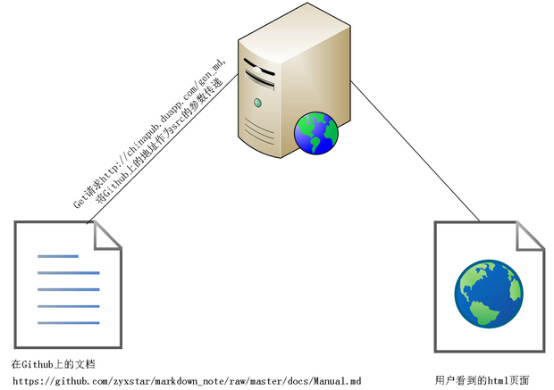
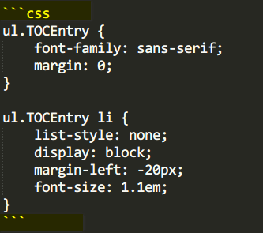

> 2014-01-08

为什么有它
==========
本工具能对Markdown格式的文档，针对文中的标题自动生成 __*目录结构*__，方便理清层次关系，帮助归纳推演；如果文档中包含代码小片断，还能在文档中 __*直接运行代码*__ ，不需要IDE，不需要<kbd>Ctrl</kbd> <kbd>C</kbd> + <kbd>Ctrl</kbd> <kbd>V</kbd>，直接在页面中就能得到反馈。

用它来做什么
==============

本文档也是用该工具展示的，在Github的[地址](https://raw.gitcafe.com/zyxstar/md_note/master/docs/Manual.md)

- 读书的整理
    - [编程范式与OOP思想(郑晖).md](http://chinapub.duapp.com/gen_md?src=https%3A%2F%2Fgitcafe.com%2Fzyxstar%2Fmd_note%2Fraw%2Fmaster%2Fdocs%2FDesign%2F%25E7%25BC%2596%25E7%25A8%258B%25E8%258C%2583%25E5%25BC%258F%25E4%25B8%258EOOP%25E6%2580%259D%25E6%2583%25B3%2528%25E9%2583%2591%25E6%2599%2596%2529.md)
    - [征服C指针(前桥和弥).md](http://chinapub.duapp.com/gen_md?src=https%3A%2F%2Fgitcafe.com%2Fzyxstar%2Fmd_note%2Fraw%2Fmaster%2Fdocs%2FLanguage%2FC%2F%25E5%25BE%2581%25E6%259C%258DC%25E6%258C%2587%25E9%2592%2588%2528%25E5%2589%258D%25E6%25A1%25A5%25E5%2592%258C%25E5%25BC%25A5%2529.md)
    - [RubyProgramming.md](http://chinapub.duapp.com/gen_md?src=https%3A%2F%2Fgitcafe.com%2Fzyxstar%2Fmd_note%2Fraw%2Fmaster%2Fdocs%2FLanguage%2FRuby%2FRubyProgramming.md)

- 课堂的笔记
    - [需求分析训练营(徐锋).md](http://chinapub.duapp.com/gen_md?src=https%3A%2F%2Fgitcafe.com%2Fzyxstar%2Fmd_note%2Fraw%2Fmaster%2Fdocs%2FAnalysis%2F%25E9%259C%2580%25E6%25B1%2582%25E5%2588%2586%25E6%259E%2590%25E8%25AE%25AD%25E7%25BB%2583%25E8%2590%25A5%2528%25E5%25BE%2590%25E9%2594%258B%2529.md)
    - [编程范式(stanford_cs107).md](http://chinapub.duapp.com/gen_md?src=https%3A%2F%2Fgitcafe.com%2Fzyxstar%2Fmd_note%2Fraw%2Fmaster%2Fdocs%2FLanguage%2FC%2F%25E7%25BC%2596%25E7%25A8%258B%25E8%258C%2583%25E5%25BC%258F%2528stanford_cs107%2529.md)


- [更多...](http://chinapub.duapp.com/gen_md?src=https%3A%2F%2Fgitcafe.com%2Fzyxstar%2Fmd_note%2Fraw%2Fmaster%2FREADME.md)


快速使用(只需2步)
=================

## 第1步：创建文档
在网络上一个可访问的地址空间，如在[github](https://github.com/)上创建文档，使用[Markdown](http://zh.wikipedia.org/wiki/Markdown)来编写

> 可由gibhub来支持相应的版本控制

## 第2步：查看文档
取得第1步的url地址，将其urlencode编码，作为"http://chinapub.duapp.com/gen_md"的"src"参数，进行GET请求

如[我就是一个查看文档的链接](http://chinapub.duapp.com/gen_md?src=https%3A%2F%2Fraw.gitcafe.com%2Fzyxstar%2Fmd_note%2Fmaster%2Fdocs%2FManual.md)

> 不知道什么是urlencode? [看这里](http://tool.chinaz.com/Tools/URLEncode.aspx)；还需要更详细的参数说明，请[移步这里](http://chinapub.duapp.com/usage)

## 测试一下

<form  method='get' action='http://chinapub.duapp.com/gen_md' target='_blank'>
<label for='txt_src'>填入一个网络地址，比如Python-Markdown在Github上的说明</label><br/>
<input type='text' name='src' id='txt_src' style="width:80%" value='https://raw.githubusercontent.com/trentm/python-markdown2/master/README.md'/>
<input type='submit' value="生成"/>
</form>

看看它有什么特性
================
## 可缩放的层级目录
生成的html文件，会自动根据Markdown中标题(h1~h6)生成层级目录，支持目录的展开与收缩，并能提示当前浏览部分在目录中的定位


## 支持table编写

原生的Markdown需要描述table时，只能使用html来编写，十分不便，于是遵循
[Adam Pritchard的Markdown-Cheatsheet](https://github.com/adam-p/markdown-here/wiki/Markdown-Cheatsheet#wiki-tables)中的table规则：

- 支持列的对齐方式
- table中支持内联的Markdown语法

编写示例，使用<code>```table</code>：


生成效果如下(你见到的效果就是生成出来的)：

```table
Name  | Lunch order | Spicy    | Owes
------| ----------- |:--------:| -----:
Joan  | saag paneer | medium   | $11
Sally | vindaloo    | mild     | $14
Erin  | lamb madras | __*HOT*__| $5
```

## 代码语法高亮
[仿照github对代码高亮的处理](https://help.github.com/articles/github-flavored-markdown)，使用<code>```css</code>：



生成效果如下(你见到的效果就是生成出来的)：

```css
ul.TOCEntry {
    font-family: sans-serif;
    margin: 0;
}

ul.TOCEntry li {
    list-style: none;
    display: block;
    margin-left: -20px;
    font-size: 1.1em;
}
```

## 展示Web页面
使用<code>```web</code>

并且在每部分(html,css,js)代码起始前加相应的`comment`，如图：


以下是生成效果

```web
<!-- language: html -->
<div>
    <input id='txt_say' type='text'/>
    <input type='button' value='Say'/>
</div>

<!-- language: css -->
@import url(/static/css/normalize.css);
body{
    padding:20px;
}
input[type='button']{
    padding:3px 5px;
    font-size:14px;
    font-weight:bold;
    background-color:black;
    color:white;
}

<!-- language: js -->
//= require jquery.1.9.0
$(function(){
    $("#txt_say").val("hello, web")
    $("input[type='button']").click(function(){
        alert($("#txt_say").val())
    });
})
```

## 代码即时运行
使用时，与代码高亮一样，只是需要在代码段前增加一行`<!-- run -->`的comment，你看到的效果都是生成出来的：

### JavaScript
将`<!-- run -->`放在<code>```js</code>之前：

<!-- run -->

```js
function MyClass(name) {
    this.name = name;
    this.say = function() {
        return "hello, " + name;
    };
}
var m = new MyClass("javascript");
alert(m.say());
```

使用js库，在代码的首部使用`//= require «lib.ver»`的方式引入，如`//= require jquery.1.9.0`

<!-- run -->

```js
//= require jquery.1.9.0
$(function(){
    alert($().jquery);
});
```

### Python
将`<!-- run -->`放在<code>```py</code>之前：

<!-- run -->

```py
#coding:utf-8
class MyClass(object):
    def __init__(self, name):
        self.name = name

    def say(self):
        return "hello, %s" % self.name

m = MyClass("python")
print m.say()
```

> <del>细心的你可能发现，有一个"►applet"的按钮，这是通过java编写的applet来调用本地的语言解析器，并将运行结果返回至applet，再显示到页面上。所以，如果你需要看到编写的代码运行在本机上的效果时，可以点此按钮。使用它之前有几点特殊要求（当然，你可以忽略它，直接点此"►"）：</del>

> - <del>安装java，并在浏览器上启用java，如chrome，在地址栏输入`chrome://plugins/`，查看`Java(TM)`是否启动</del>
> - <del>打开 控制面板 - Java (32bit) - Security，设置为Medium</del>
> - <del>在Java\jre7\lib\security\java.policy文件(请确定该java版本是浏览器使用的版本)里最后加上`permission java.security.AllPermission;`，修改该文件时，修改者首先需要具备可修改的权限(以上权限的修改，由可能引起安全隐患，使用者可在运行完文档后，酌情还原)</del>
> - <del>语言的编译器(解析器)工具需要在环境变量中配置，如python.exe、ruby.exe、java.exe、javac.exe、csc.exe（目前只支持这几种语言） __所在的目录__ 需要添加到环境变量PATH中</del>

### Ruby
将`<!-- run -->`放在<code>```rb</code>之前：

<!-- run -->

```rb
#coding:utf-8
class MyClass
    def initialize(name)
        @name = name
    end

    def say
        return "hello, #{@name}"
    end
end

m = MyClass.new "ruby"
puts m.say
```

### C
将`<!-- run -->`放在<code>```c</code>之前：

<!-- run -->

```c
#include <stdio.h>

typedef struct MyStruct_tag {
    char* name;
    char* (*pSay)(struct MyStruct_tag*);
} MyStruct;

char* Say(MyStruct* ins) {
    return ins->name;
}

int main(){
    MyStruct myIns;

    myIns.name = "c language";
    myIns.pSay = Say;

    printf("hello, %s", myIns.pSay(&myIns));
    return 0;
}
```

### C++
将`<!-- run -->`放在<code>```cpp</code>之前：

<!-- run -->

```cpp
#include <iostream>
#include <string>

using namespace std;

class MyClass{
    public:
        MyClass(string name){
            _name = name;
        }
        string say(){
            return string("hello, ") + _name;
        }
    private:
        string _name;
};

int main(){
    cout << MyClass("cpp").say() << endl;
    return 0;
}
```

### CSharp
将`<!-- run -->`放在<code>```csharp</code>之前：

<!-- run -->

```csharp
using System;

class Program {
    static void Main(string[] args) {
        Console.Write(new MyClass("csharp").say());
    }

    public class MyClass {
        private string name;
        public MyClass(string name) {
            this.name = name;
        }
        public string say() {
            return string.Format("hello, {0}", name);
        }
    }
}
```

### Java
将`<!-- run -->`放在<code>```java</code>之前：

<!-- run -->

```java
import java.io.*;
import java.text.*;
public class Program {
    public static void main(String[] args) {
        try {
            System.out.print(new Program().new MyClass("java").say());
        } catch (Exception e) {
            e.printStackTrace();
        }
    }

    public class MyClass {
        private String name;
        public MyClass(String name){
            this.name=name;
        }
        public String say(){
            return MessageFormat.format("hello, {0}", name);
        }
    }
}
```


给我反馈
========
zyxstar2013 at 163.com


<script>

(function(){
    if(typeof expand_toc !== 'function') setTimeout(arguments.callee,500);
    else expand_toc('md_toc',6);
})();

</script>

<!--
    ┌─┬─┬─┬─┐
    ├─┼─┼─┼─┤
    │ │ │ │ │
    ├─┼─┼─┼─┤
    │ │ │ │ │
    └─┴─┴─┴─┘

- [SyntaxHighlighter](http://alexgorbatchev.com/SyntaxHighlighter)
- [CodeMirror](http://codemirror.net/)
- [JsFiddle](http://jsfiddle.net/)
- [CompileOnline](http://compileonline.com)


-->
