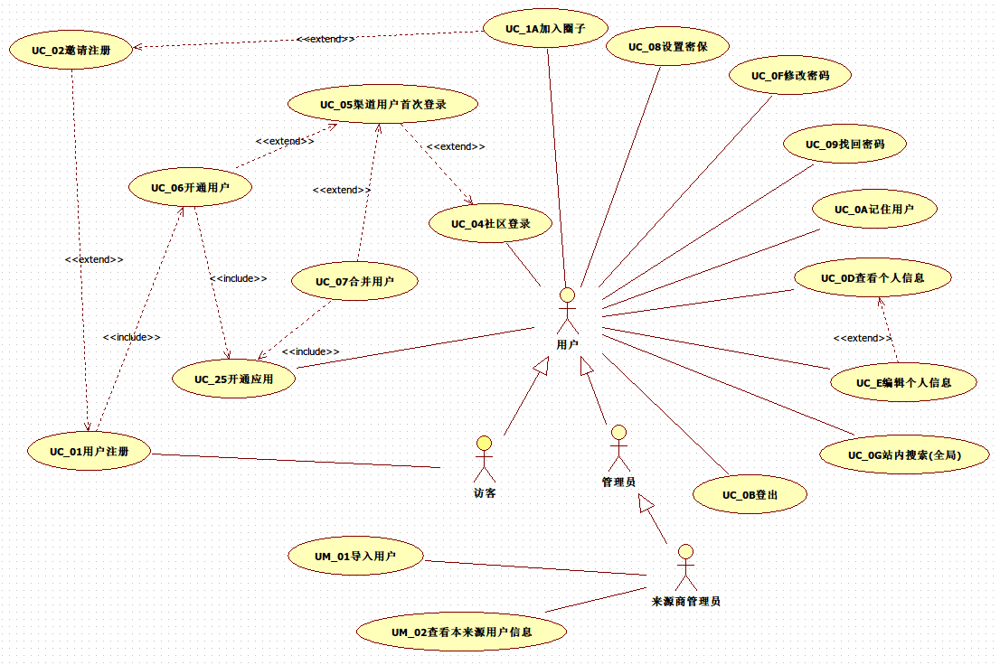
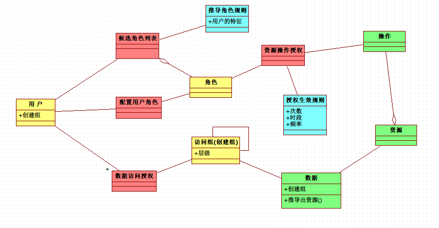

> 2014-09-20

项目说明
========
人人健康社区的基础部分相关系统分析，因为是一个互联网社区类项目，不存在复杂的业务方面的建模（即涉众、组织与流程方面的分析，商城部分将会有），故从以下几个方面来进行相关分析与设计

项目范围(第一阶段)
==================
社区本阶段开发包含的子系统有：

- __用户相关__（注册、登录）；
- __社交__（圈子、评论）；
- __应用商店__（上架、开通、配置）；
- __典型应用__（？）

包括的系统级机制有：

- __全局的提醒机制__（支持提醒中操作）
- __权限管理机制__

目前 __不__ 包括商城部分与其它具体应用的部分

## 参考资料
- [社区页面原型](http://www.susns.net/renjk/)
- [UBI项目原型(IOS)](http://jkb.yyywb.com/app.html)
- [现有健行社区](http://sport.renjk.com/)
- [uml文档](../../data/ren_health.uml)（由staruml绘制）

## 全局用例图

## 全局领域模型

## 需要验证的
- UBI项目是否能适用
    - 互联网社区直接使用本社区
    - 保险购买流程？
    - 商品信息来源、维护？
    - 商品订单流程的执行？
- 瑞斯坦、眼健康等项目是否适用
- 365现有用户能否正确迁移
- 补给站用户能否正确迁移
- 补给站商户转化为用户来源商（登录者为本来源商管理员）
- 用户具有多来源时（同时是两个或以上渠道发展的用户）
- 访客这个角色可以执行的用例是什么？

子系统：用户相关
===============
## 场景概述
描述站在用户视角描述的应用场景，如何从用户视角切换到系统视角，就是我们要做的

### UC_01用户注册
__流程__

1. 用户输入必要的信息（？）进行注册
2. 系统根据信息进行验证，通过后保存该用户信息，设置用户为新注册未激活状态
    - 验证不通过，提示用户核实信息后再提交，回到 （流程1）
3. 系统给用户发送激活码（手机或邮件），用户提交相应激活码，系统进行验证有效与时效，通过后设置用户状态为激活状态
    - 验证无效，如果当前session存在，可重发激活码
        - session不存在，提示激活失败，不予处理
4. [扩展]如果用户是被邀请注册的（url或填写邀请码），执行 《邀请注册》 的用例
5. 执行 《开通用户》 的用例，提示用户注册完成

__规则__

- 用户信息的验证规则：呢称格式，邮箱格式，密码强度要求，邮箱未被有效用户注册，手机未被有效用户注册

__页面流转__

### UC_02邀请注册
__流程__

1. 系统验证邀请注册的有效性，如有效，系统记录该次邀请，并更新邀请人所关注的动态
    - 如无效，不影响被邀请人的注册
2. [扩展]如果邀请人是在圈子内邀请注册的，被邀请人将执行《加入圈子》用例

__规则__

- 邀请注册的有效性：邀请人所拥有邀请名额的限制（社区内邀请名额、圈子内邀请名额）

### UM_01导入用户(来源商)
__流程__

1. 来源商管理员依据系统的要求，单一或批量导入用户数据至系统中
2. 系统检查是否符合相关格式要求，记录这些用户数据，并标识这些用户的来源
    - 不符合时，返回（流程1）

__规则__

- 用户数据格式要求：姓名，性别，手机号... 会员级别
- 先行同来源商导入的用户必须是唯一的

### UC_04社区登录
__流程__

1. 用户根据登录方式要求，输入必要信息，进行登录
2. 系统验证信息的有效性，成功后，进入个人主页
    - 无效登录信息时，记录失败次数，返回（流程1）
        - 超过N次后，必须等待M时间，系统再做响应
3. [扩展]系统判断，如果用户是渠道用户，并且是首次登录，则进入 《渠道用户首次登录》 用例

__规则__

- 登录方式要求
- N，M的设置

### UC_05渠道用户首次登录
__流程__

1. 系统对该用户的相关信息，与系统中现有用户的信息进行比对
    - 如果信息比对不匹配，直接进入《开通用户》 用例，执行完成后，进入个人主页
    - 如果存在匹配手机号或邮箱，系统向匹配的手机或邮箱发送验证码，并提示用户进行验证
        - 用户验证成功后，系统提示，在系统内找到另一用户，将合并成一个用户，执行《合并用户》用例
        - 验证不成功（以后也没有机会再合并用户[后台支持合并？]），直接进入《开通用户》 用例，执行完成后，进入个人主页

__规则__

- 同人比对规则：姓名、手机、邮箱？对比几项？

### UC_06开通用户
__流程__

1. 系统将用户状态置为开通，根据相关规则，为用户开通相应的应用，进入 《开通应用》 的用例
2. 根据相关规则，为用户加入相关的圈子，执行《加入圈子》用例

__规则__

- 可开通应用的依据：来源商对应用的分配设置
- 可加入圈子的依据：渠道用户
- 开通权限由管理员来分配（？）

### UC_07合并用户
__流程__

1. 系统找到被合并的用户，将新用户（渠道用户）的来源，新增一条到被合并的用户来源，将新用户状态置为跳转状态，refid指向被合并用户，将新用户可开通的相应应用，开通给被合并的用户，执行《开通应用》 的用例

__规则__

- 可开通应用配置依据：渠道用户

__讨论__

- 用户已具有该默认应用，且存在有效期限？
    - 建议不使用有效期，当需要时，做个各个应用中，而不是基础机制中
- 新默认应用与用户已拥有应用互斥时？

### UC_0D查看个人信息

### UC_0E编辑个人信息
### UC_08设置密保
### UC_0F修改密码
### UC_09找回密码

### UC_0A记住用户

### UC_0B登出
### UC_0G站内搜索(全局)

### UM_01查看本来源用户信息(来源商)

## 领域模型
使用四色来标识不同的类图，红色为过程化数据，跟时间维度相关，可用于踊跃，蓝色代表规则与配置，黄色代表角色（一个人可在不同角色间切换），绿色代表具体的人、地点、物等

本图只概念设计的一部分，更多的关注的是类型之间的关系，而不是具体类的属性与行为

子系统：社交
===============
## 场景概述

### UC_11关注好友
### UC_1E查找用户
### UC_1K拉入黑名单
### UC_12查看好友
### UC_13写留言
### UC_14写私信
### UC_15写发布
### UC_1I分享到

### UC_16写回复
### UC_17查看动态
### UC_1F设置动态偏好
### UC_18查看推荐列表
### UC_1G设置推荐偏好
### UC_1J查看系统提醒

### UC_19邀请好友
__流程__

1. 用户邀请好友注册，系统生成带有邀请人标识的链接，或邀请码，供用户通过分享、短信等方式传播
2. [扩展]如果用户是在某圈子邀请的，则还将圈子的标识给加上

__规则__

- 邀请的人数限制

### UC_1A加入圈子
__流程__

1. 系统为验证圈子对用户的限制，如通过，记录用户加入时间，并作为消息广播
    - 不成功，提示用户原因

__规则__

- 限制：时间、用户来源、用户特征

### UC_1H退出圈子

### UM_11发布公告(管理员)
### UM_12审核评论(评论管理员)
### UM_13发布本来源用户消息(来源商)

子系统：应用商店
================
## 场景概述

### UC_21浏览应用商店
### UC_2A应用分类

### UC_22查看应用
### UC_23试用应用
### UC_24购买应用

### UC_25开通应用
__流程__

1. 系统判断用户是否具有开通本应用资格，并根据配置说明，给用户分配该应用的相关权限，记录开通时间，广播消息
    - 违反资格时，系统记录，考虑补偿流程？

__规则__

- 应用开通资格：开通时间、用户特征、应用互斥...
- 应用权限配置

### UC_26使用应用
__流程__

1. 用户打开某个应用，验证当前是否可以使用，能使用时，进入应用
    - 不能使用时，提示用户原因
2. [扩展]如果是首次使用该应用，根据应用要求的数据采集，提示用户输入必要数据，直到成功收集到，进入应用
3. 使用应用后，广播消息

__规则__

- 应用使用限制：时间、频率
- 应用要收集的数据描述

### UC_27设置应用提醒
### UC_28应用评论评级
### UC_29退订应用

### UM_21上架应用

### UM_22设置应用规则
### UM_23下架应用
### UM_24设置排名规则
### UM_25查看应用使用情况
### UM_26配置用户应用权限

系统机制
========
## 全局提醒机制
适用于任务、@我、私信、留言、挑战、物流等场景

- 全局配置
- 个人设置

## 动态广播机制
适用于好友动态(关注、开通应用、领取任务、发表话题)、应用动态

<!--
设计要求：

- 广播消息的格式定义：事件发生源、事件参数
- 事件的注册与管理（比如健康数据更新事件）
- 激发事件的动作设计为非主动激发
- 监听程序的注册与管理（程序可单独编写，放到指定文件夹下即可）
- 监听程序执行情况反馈，监听程序出错不影响消息的传播
- 避免消息传播死循环

> 除监听程序必须放到指定文件夹下，其他部分，应做成数据表的配置 -->

## 权限设计
### RBAC的方式

[参考](http://chinapub.duapp.com/gen_md?src=https%3A%2F%2Fraw.github.com%2Fzyxstar%2Fmd_note%2Fmaster%2Fdocs%2FSkill%2FDataBase.md#TOC6)

## 规则描述
领域类中具有许多规则描述的类，必须被单独标识，而不是作为某个类中的某个方法的片断

<!-- 设计要求：

- 规则描述是单独表示的
- 规则是可增加与修改的
- 规则基本上描述的是谓词演算
- 规则具有优先级
- 规则可以组合使用 -->

### 应用开通规则
### 应用互斥规则

## 计划任务
适用于：

- 业务功能可以被定时的调用
- 长时间或影响性能的任务，但实时性要求不强的

设计要求：

- 可视化的计划任务管理
- 任务执行情况的反馈，必要时的补偿流程

## 缓存设计
- 缓存的API设计
- 缓存的更新策略
- 缓存命中率统计
- 可视化缓存中数据管理

## 外部接口
- 第三方登录OAuth2.0
- 使用第三方服务
    - 做好访问日志，记录访问时间，参数，返回值
    - 设计好服务接口，使第三方服务方便被替换

实现层建议
=========

## mongodb的使用
### 缓存要求
依据mongodb来实现述缓存设计

### 过程化数据
- 设备数据采集
- 评论\动态\消息
- 日志部分

## 标准化
- @用户、#话题 相关设计
- 标准表情

## 其它
常用数据表 省份、民族 移植

<!--
需求方面明确
    用例文档
    页面流转
    可构建类与方法？
    与UI设计人员同步？？

开发方面估算要素
    数据表设计
    页面开发
    单元测试
    BUG修复

难点、可行性分析
    单独作为任务，完成时间为一天，然后给出建议

不进入估算
    环境搭建
    项目构建

任务描述
    以用户视角来描述的功能点，可单独交付

看板
    未分解，总todos，个人todos，进行中，完成

规则
    刺激反应 STT
    契约式
    结构关联

 -->
