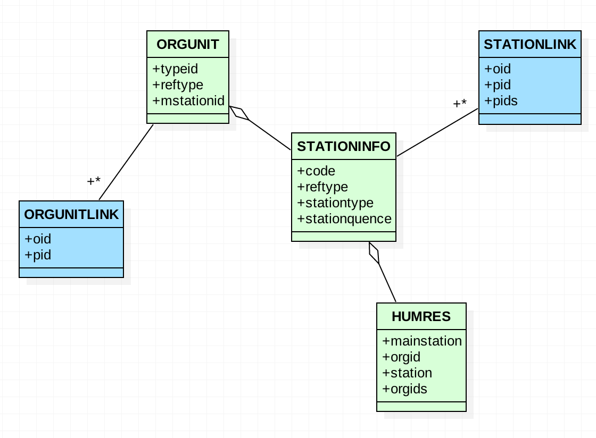
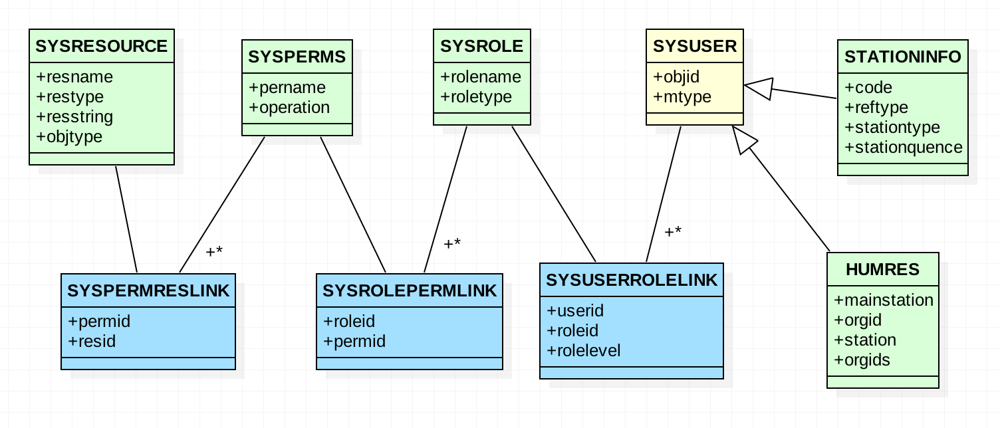
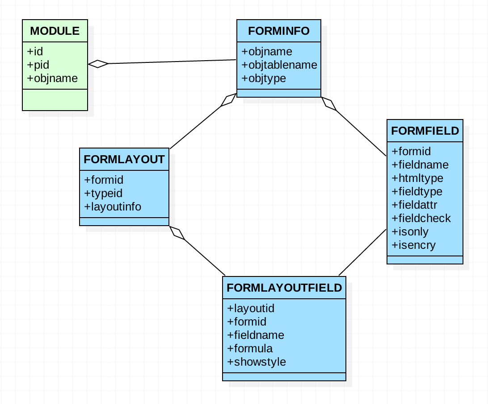
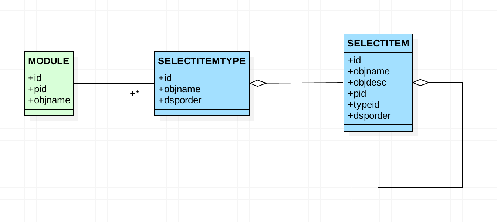

Seaz摘要
=============


# 组织单元

## 数据表设计



### 组织

```ruby
#组织类型 [集团|单位|部门|事业部]
class ORGUNITTYPE 
    attr_accessor :id, :objname, :dsporder,
                  :col1, #是否公司类型
                  :col3, #颜色值
end

#组织结构上下级关联
class ORGUNITLINK
    attr_accessor :id,
                  :oid, #组织部门id, browser`ORGUNIT`
                  :pid, #上级组织id
                  :typeid, #何种维度下的上下级关系, 解决不同维度的划分 [行政|财务|党政|...]
                           #select`人事管理.组织维度`
                  :pmstationid, #上级管理岗位id，方便解决行政上级和财务上级的管理岗位不同
end

#组织结构 存放系统中所有组织单元数据，包括公司、分部、部门
class ORGUNIT
    attr_accessor :id, :objname, 
                  :typeid, #browser`ORGUNITTYPE`
                  :merid,  #上级组织单元[已作废]
                  :mstationid, #组织负责岗位id, browser`STATIONINFO`
                  :unitstatus, #组织状态，select`基础设置.组织单元状态`[活跃|不活跃]
                  :reftype, #所属组织维度, 同一组织则不能在不同维度下?
                  :isroot,
end

```

### 岗位

```ruby

#岗位信息 并对应不同的岗位级别，实现一岗多人、一人多岗
class STATIONINFO
    attr_accessor :id, 
                  :code, #未用
                  :orgid, #所属组织 browser`ORGUNIT`
                  :objname, #岗位名称
                  :parentobjid, #上级管理岗位(形成岗位树 or 冗余)
                  :maxnum, #定编 根据定编与在编, 可计算缺编超编
                  :curnum, #在编
                  :stationstatus, #岗位状态
                  :reftyp, #所属组织维度
                  :stationtype, #岗位类别，select`人事档案.岗位类别`
                  :stationquence, #岗位等级，select`人事档案.岗位等级`
                                  #系统有另一个表`STATIONLEVELLINK`，应主要使用
                  :minlevel,
                  :maxlevel, #岗位等级上下限，用于权限等级
                  :position1, #兼岗人员?
end

#岗位上下级关系. #通过STATIONINFO.parentobjid本身能形成岗位树 or STATIONLINK?
class STATIONLINK
    attr_accessor :id, 
                  :oid, #岗位id
                  :pid, #上级岗位id
                  :typeid, #所属组织维度
                  :pids, #上级岗位id列表，所有祖先

end

#岗位级别关系表，一个岗位只能属于一个岗位级别
class STATIONLEVELLINK
    attr_accessor :levelid, #岗位级别id
                  :stationid #岗位id

end

```

### 人员

```ruby

#人员信息 
class HUMRES
    attr_accessor :id, 
                  :objno, #未用
                  :objname, 
                  :mainstation, #岗位id
                  :orgid, #所属组织id
                  :station, #兼岗列表
                  :orgids, #兼岗组织列表

                  :ext10, #计算出的具有公司类型的上级组织
end

```


## 展示与操作
- 组织维度维护（select框）
- 组织类型
    + 列表展示
    + 新增与编辑
- 树型组织单元
    + 节点信息展示，并展示上级组织单元
    + 节点信息编辑
    + 新建下属组织
    + 新建岗位
- 岗位树的展示（根据上述新建自动形成）
    + 定编、在编、超编、缺编显示
    + 节点信息展示
    + 节点信息编辑
    + 新建人员
    + 添加移除兼岗人员（browser组织单元树，再选人）
- 岗位查询列表

## 其它
- 组织可按多个层次和维度`[行政|财务|党政|...]` 进行划分
- 
- 岗位的树型结构，岗位具有定编，安全等级（权限设计的补充）
- 人员可兼岗，方便一岗多人，一人多岗


# 权限控制

## 数据表设计



```ruby

#资源信息 存放系统中所有需要管理的资源，包括URL资源与业务类方法
class SYSRESOURCE
    attr_accessor :id, 
                  :resname,
                  :restype, #资源类型 [URL|FUCTION]
                  :resstring, #资源串 程序中的标识？[url|package.class.method]
                  :resdesc, #资源描述
                  :logtype, #日志类型 [query|view|new|edit|del|...]
                  :pid, #?
                  :objtype, #资源分类 

end

#权限信息 存放系统中所有功能权限，一个权限绑定多个资源，并且角色与权限相关联
class SYSPERMS
    attr_accessor :id, 
                  :permname, #程序用标识
                  :operation, #操作名称
                  :premdesc, 
                  :objtype, #资源分类 

end

#权限资源关联表
class SYSPERMRESLINK
    attr_accessor :permid, 
                  :resid
end

#角色信息表
class SYSROLE
    attr_accessor :rolename, 
                  :roletype #select [领导|财务|行政|系统|销售|采购|...] 方便分类

end

#角色权限关联
class SYSROLEPERMLINK
    attr_accessor :roleid, 
                  :permid 
end

#系统用户表 
class SYSUSER
    attr_accessor :id, 
                  :objid, #人员或岗位id
                  :mtype, #为1则objid关联到`HUMRES`，为2则关联到`STATIONINFO`
                  :belongto, #?
    
end

#角色、系统用户关联表
class SYSUSERROLELINK
    attr_accessor :id, 
                  :userid,
                  :roleid,
                  :rolelevel, #在树型组织中的节点，实现同角色，不同人，可查数据不同
end

```


## 展示与操作
- 资源列表展示与编辑（资源的注册）
- 权限管理展示，一对多展示对应资源（资源集合）
    + 权限本身的编辑
    + 对应资源的添加与移除
- 角色列表查询与展示
    + 行信息的新建与编辑
    + 展示相关的权限列表（资源集合），并可增减
    + 展示相关的 __岗位__ 或 __人员__，并可增减
- 人员权限查询
    + 查到角色、资源

## 其它
- 角色可到岗位，能减少赋权行为
- 因岗位有层级，加之`SYSUSERROLELINK`有`rolelevel`，能实现数据过滤
- 授权
    + 特定的操作者  
    + 特定安全级别范围内的操作者  
    + 特定的岗位  
    + 特定矩阵关系下的组织单元  
    + 特定矩阵关系下的岗位体系  
    + 特定岗位级别的岗位  
    + 角色条件


# 模块管理

## 数据表设计

```ruby

#模块信息
class MODULE
    attr_accessor :id, 
                  :pid,
                  :objname, 
                  :dsporder,
                  :desc, 
end

```


## 展示与操作
- 树型的模块展示
    + 节点信息展示与编辑（可以只编辑）
    + 新增节点与删除节点
- 节点关联到`select`（下拉框）
- 节点关联到`browser`（弹窗引用）
    + 报表展示
    + 树形展示
- 节点关联到`表单`
    + 实际表单（具体的数据表）
    + 抽象表单（主从关联表）
    + 虚拟表单（数据库视图）
    + 字段管理（具体的表字段）
    + 设置不同的布局
- 节点关联到`分类`
    + 发布到菜单
    + 设置权限与提醒
- 节点关联到`流程`
- 节点关联到`报表`
    + 发布到菜单
    + 设置查询限制
    + 设置权限
- 节点关联到`页面扩展`（定制页面功能）


# 表单元数据

## 数据表设计
- 此处全是元数据配置信息




```ruby

#表单基本说明 
class FORMINFO
    attr_accessor :id, 
                  :objname, #表单名称
                  :objdesc, 
                  :objtablename, #真实数据表名
                  :objtype, #表单类型 [实际0|抽象1|虚拟4]
                  :moduleid, #所属模块
                  :selectitemid, #可以关联到`SELECTITEM`
                  :col2, #当虚拟表单时，用于指定数据源
end

#表单中的详细字段 具体字段还是被创建到相应的表里，此处是元数据
class FORMFIELD
    attr_accessor :formid, 
                  :fieldname, #字段名 不能与关键字重名(内建关键字表)
                  :htmltype, #[单行文本1|多行文本2|带格式的文件3|checkbox4|选择项5|关联选择6|附件7|checkbox多选8]
                  :fieldtype, #[文本1|整数2|浮点3|日期4|时间5|日期时间6]，
                              #[附件|文档|图片]，如为`选择项`或`关联选择`时，则是相关引用
                  :fieldattr, #长度、精度等限制
                  :fieldcheck, #正则验证 或 关联时sql的限制 或 级联选择
                  :labelname, #显示名称
                  :isonly, #是否唯一（修改时需验证表里已有数据是否唯一）
                  :needlog,
                  :isdefault,
                  :ismoney, #是否金额
                  :isencryption, #是否加密
                  :ordernum, #导出时顺序（可在报表导出时再设置）
end

#表单布局
class FORMLAYOUT
    attr_accessor :formid,
                  :typeid, #布局类型 [显示1|编辑2(含新建)|打印3]
                  :layoutinfo, #布局代码
                  :layoutformatted, #格式化后布局
                  :layoutname, #布局名称
                  :isdefault,
end

#在某布局下的字段属性设置
class FORMLAYOUTFIELD
    attr_accessor :layoutid,
                  :formid, 
                  :fieldname, 
                  :formula, #字段属性 [公式|sql|占位符] 
                  :defaultvalue,
                  :showstyle, #是否显示，只读或编辑，是否必须输入

end

#表单关联设置
class FORMLINK
    attr_accessor :oid, #表单id
                  :pid, #只为主表或抽象表 才有意义
                  :typeid, #如pid为抽象表，则为包含关系，如为主表，则关系类型为[主从1|扩展2]
                  :fieldmap

end


```


## 展示与操作
- 表单带checkbox列表展示（树型、列表）
    + 节点信息新建与修改
        * 三种表单[实际0|抽象1|虚拟4]
        * 选中几个实际表单，快速创建抽象表单（快捷性考虑）
    + 字段列表展示
        * 新增与编辑
        * 级联select选择时，父选择项的 `字段验证` 填写子选择项的uuid P119(似乎放到布局中作为表达式更好)
        * browser时，`字段验证`填写`sqlwhere=cname='客户1'`，则过滤
    + 表单关系列表展示（主从|扩展|包含）
        * 新增与删除
        * 具体表的关联应是通过`requestid`?
    + 表单布局列表展示
        * 新建某布局，可根据表单去设置不同的布局，功能方向`[新建|编辑|打印|显示|...]`，设备方向`[PC|手机|...]`，角色方向`[个人使用|上级使用|行政备案|...]`，流程方向`[各节点不同展示]`
        * 编辑某布局
        * 布局的复制（快捷性考虑）
        * 该布局上的字段设置
            - 顺序、是否显示、可编辑、必须输入、默认值
            - 数据提醒功能：输入某字符，该列已存在的该字符开头的显示在下方供选择（选择后还能编辑）
            - 某字段公式表达式解析
                + 参数
                    * `当前日期`、`当前时间`、`当前用户`、`当前部门`、`url参`
                    * 关联表的相关字段
                + 表达式
                    * bool表达式：`=`,`!=`,`<`,`<=`,`>`,`>=`
                    * 人民币大写
                    * 子表聚合：`SUM`,`MAX`,`COUNT`
                + 语句
                    * SQL代码
                        - 默认数据源
                        - 其它数据源
                    * JS函数
                        - 可选择运行时机
                + 自定义序列（表`SEQUENCE`），序列不直接跟字段列关联，而是与布局上的字段关联，增加了灵活性
                    * 提交前生成（表达式`no()`)
                    * 提交后生成（表达式`NO()`)
        * 抽象表单布局中，子表可增加`查询条件`进行过滤


# 选择框
- 在表单字段管理时，当字段表现形式为`选择框`时，则需要在`字段类型`中检选`select`列表

## 数据表设计



```ruby

#选择项类型（grp)
class SELECTITEMTYPE
    attr_accessor :id, 
                  :objname, 
                  :dsporder，
                  :moduleid
end

#选择项
class SELECTITEM
    attr_accessor :id, 
                  :objname, 
                  :objdesc,  #充当描述 或 参数
                  :pid, #能形成类似级联下拉框效果
                  :typeid, #属于某`SELECTITEMTYPE`
                  :dsporder
end

```

## 展示与操作
- select项列表展示
    + 节点新建与编辑
    + 下拉项的新建
        * 级联(联动)下拉项新建


# 自定义序列

## 数据表设计

```ruby

class SEQUENCE
    attr_accessor :id, 
                  :name, 
                  :description,
                  :startno, #初始值
                  :incrementno, #增量
                  :looptype, #周期 [无|年|月|日]
                  :currentno,
end

```

## 展示与操作

- 所有序列的列表展示
    + 新建与编辑
- 在布局的某个字段上进行公式设置`no()`|`NO()`，该布局的上表单提交时，就是使用该序列

# 报表

## 数据表设计

```ruby

class REPORTDEF
    attr_accessor :id, 
                  :formid,  #对应表单
                  :objname, #报表名称
                  :objtype, #报表类型
                  :objdesc,
                  :objopts, #多表单SQL
                  :objmodelname, #模板文件名
                  :objsavepath, #报表保存路径
                  :objtype2, #报表分类？
                  :vitetype, #显示模式 [分页|分组|多级分组|上下级]
                  :groupby, #默认分组字段
                  :groupby1, #用于多级分组
                  :groupby2, #用于多级分组
                  :selectconditions, #查询限制字段 填写`where`后面的语句
                  :treeby, #显示模式为上下级时 自身关联字段 如pid
                  :groupbytree, #显示模式为上下级时 树关联显示字段 如name
                  :isrefresh, #是否实时刷新
                  :isexpexcel,
                  :defaulttime, #?
                  :isbatchupdate,
                  :jscontent, #js脚本
                  :secformid, #?
                  :isformbase, #?
                  :reportusage, #?
end

```

## 展示与操作


# 树型设置

# browser框

## 数据表设计

```ruby

class REFOBJ
    attr_accessor :id, 
                  :objname, #browser关联对象名称
                  :refulr, #关联对象地址
                  :reftable, #关联对象对应数据表(或视图)名，如果是视图，最好创建`objname`字段
                  :keyfield, #主字段 `[id|requestid]`，将来进入被引用表单时存储的值
                  :viewfield, #显示字段 `[objname|other]`，将来进入被引用表单时显示的值
                  :viewurl, #显示地址url？
                  :filter, #过滤条件 
                  :ismulti, #是否多选（方便一次参考引入多条记录）
                  :isrefobjlink, #是否业务协同？
                  :ispermobj, #是否授权对象？
                  :selfield, #直接录入查询字段？
                  :isdirectinput, #是否直接录入？
end

```

- 所有browser框的带checkbox列表展示
    + 新建向导，帮助复杂的创建过程
        * 可选 [报表|树型] 设置
        * 报表设置中，需填写关联对象名称`objname`，选择相关联报表，则自动填充了`refulr`，并带出了关联数据表`reftable`；为系统表时，主字段`keyfield`是`id`，而自己创建表的主字段为`requestid`（`viewfield`同理）；过滤条件直接编写where后面的语句，可使用`$占位变量$`
    + 普通新建与编辑
    + 预览
    + 选中行删除


# 分类体系

```ruby

class FORMBASE

end

```

# 流程

# 菜单


<!-- 

1. 关于tab嵌平台现成表单，可以实现
    + 但现有原型所表现的功能，平能现成表单不能实现，还需要二次开发
    + 需要二次开发的主要原因在于，报表的查询功能偏弱，但报表的可定制性不强：
        * 目前只能针对报表已有字段进行查询
        * 报表呈现形式不能修改（据我了解）

2. 关于按钮后端逻辑运行时间过长的问题
    + 针对具体问题进行解决的思路
        * 无论.net或java平台，在线程池另起一个线程处理后端需要长时间处理的逻辑，主线程直接返回
        * 页面在点击后，启动一个ajax轮询机制（setinterval），轮询后端的共享内存（可以是session），来判断该任务是否处理完成
        * 后端的任务线程处理完成，向共享内存写入需要返回的信息
        * ajax轮询到，呈现到页面（如果该页面已关闭，需要在新打开时判断共享内存中数据，并进行呈现）
    + 形成框架的解决思路
        * 使用消息队列，长时间的任务的执行逻辑在消息侦听端，页面点击只是创建一个任务，并入消息队列
        * 消息的侦听端在完成任务时，再向消息队列发送一个消息完成的通知
        * 应用程序接收到该消息，决定如何向用户呈现（也许还需要上面的ajax方式）


- 会议议程
- 平台优缺点讨论
    + 优点
        * 标准功能快速开发（表单CURD、流程、组织、权限）
        * 标准功能质量稳定
    + 缺点
        * 需要二开的工作量反而增加，且维护困难
        * 使用平台开发，对开发人员吸引力不大


- 改善平台的思路
    + 主要使用平台的功能点整理（表单CURD、流程、组织、权限）
        * 只需标准配置+存储过程就能实现逻辑的部分
        * 负责人：开发与实施人员
    + 使用平台的二次开发的场景整理
        * 可被二次开发（各种接口、回调、参数化）的地方的整理，并形成示例代码
        * 常用的二次开发能不能形成一些模式（如一个主表多个从表）
        * 负责人：二开人员、平台改进人员    
    + 探讨对平台报表功能的改进，使其能增加自定的查询条件（包含UI呈现自定义）
        * 负责人：平台改进人员
    + 对平台展现层重构做可行性分析
        * 负责人：平台改进人员
    + 平台编写的js代码也必须做版本管理，否则容易丢失
        * 负责人：二开人员
    + 平台通用型组件（如异步消息队列）
        * 负责人：平台改进人员


- 研发平台的思路
    + 将现有平台主要功能点做研发，不常用的暂时不做
    + 采用语义来表示表单与流程，这样不被UI所束缚，等新UI框架出来了，重新做UI解析器，但语义不会变
    + 预留二开的接口，但在配置文件中配置，而不是页面配置，留给开发人员一定自主性
    + 业务逻辑部分只做在java层或存储过程，js最多做视图逻辑，提高安全性与可维护性


- 基于对平台的研究，并收集现有开发范例，共性问题形成一套标准处理方式并长期维护
- 调整对select的依赖，所有选项统一分组编码，旨在代码层可读性增强，也利于将来开发手机客户端
- web展现层的兼容性，主要是功能方面，比如弹窗的修改
- 明确js职责，不负责业务逻辑处理，形成统一的编码规范
- js与sql形成版本控制
- 工具类库开发
- 手机端方向（页面？客户端？）

 -->
